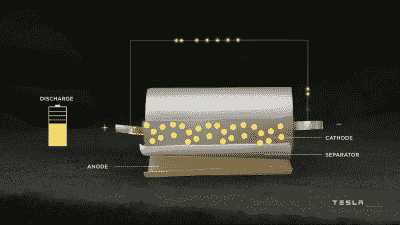
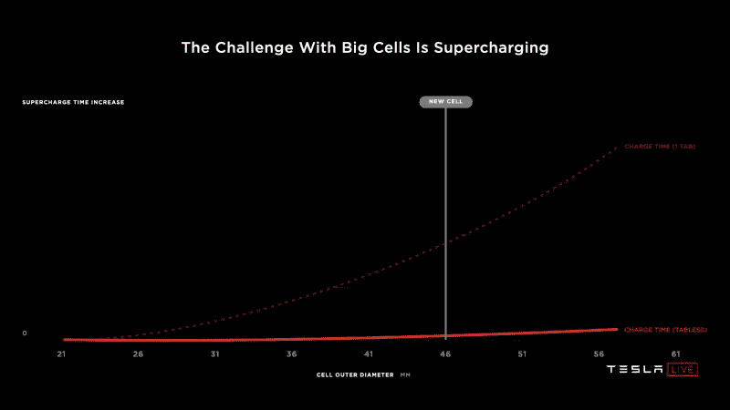
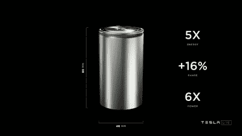

# 特斯拉新型平板电池开启性能新境界

> 原文：<https://hackaday.com/2020/10/05/teslas-new-tabless-batteries-unlock-new-levels-of-performance/>

通过与松下、LG 和 CATL 等制造商的合作，Telsa 是世界上最大的电池采购商之一。他们对更多电池的无尽渴望不太可能很快得到满足，因为对电动汽车和电力储存的需求持续上升。

[正如在电池日主题演讲](https://www.youtube.com/watch?v=l6T9xIeZTds)中宣布的那样，特斯拉一直在努力开展一系列项目，将电池技术提升到一个新的水平，以实现到 2030 年年产 3 TWh 的目标。其中最有趣的一个方面是特斯拉新推出的 tabless 4680 电池，该电池将由该公司自己制造。让我们来看看是什么让 4680 如此令人兴奋，以及为什么去 tabless 是如此重要。

## 卷起，卷起

A diagram showing a typical cylindrical cell design, with tabs to connect the anode and cathode to the cell casing. Source: Tesla

特斯拉在电动汽车制造商中有些独特，因为他们坚决坚持在电池组中使用圆柱形电池，而其他制造商大多使用棱柱形设计。从备受笔记本电脑制造商和手电筒制造商欢迎的古老的 18650 开始，特斯拉后来转向使用更大的 21700 电池，更大的外形意味着每个电池都有更大的容量。为了制造这种电池，将长而薄的阳极和阴极材料叠放在一起，中间用隔离材料隔开，然后卷成一个“果冻卷”放入圆柱体内。阳极和阴极各有一个小接头，通常在卷起的薄片的中心，它将电能传递给电池外壳上的端子。

这些小标签以多种方式阻挡圆柱形电池。它们是电流流入和流出电池的瓶颈，因为尽管阳极和阴极面积巨大，但所有流入和流出电池的电流都必须通过一对只有几毫米宽的插片。来自果冻卷外部区域的电子必须经过相当长的距离才能到达电池终端，在 21700 个电池中，电子路径长度可达 250 毫米。更长的路径意味着更大的阻力，对热性能有相应的影响。此外，翼片阻碍了快速有效生产阳极和阴极片的努力，生产机械不得不反复停止和启动以处理突出的特征。

Tesla modelled the impact of cell size on charging times, which is a major problem with classical batteries using tabs. The new tabless design helps solve this issue thanks to improved thermal performance. Source: Tesla

特斯拉之前从 18650 电池转移到更大的 21700 设计时，性能有所提高，但进一步增加电池尺寸的努力遇到了阻力。虽然更大的电池可以存储更多的能量并节省生产成本，但热量问题意味着充电时间和放电速率将受到负面影响。更大的电池意味着更长的路径长度，更高的电阻意味着每个电池更少的功率输出和更慢的充电。即使有了特斯拉的快速充电技术，许多人仍然认为电动汽车充电太慢，所以这是一个不值得做的权衡。

The “shingled spiral” of the jellyroll in a tabless battery. Instead of one tab in the center of the jellyroll, the entire base enables current to flow to the active material. Source: Tesla

输入“tabless”电池。整个阳极和阴极箔被激光图案化并加工成沿着它们的长度具有本质上许多微小的翼片，而不是具有分别连接到阳极和阴极的小电池翼片。取代了在制造过程中稍后手动连接单独拉环的步骤。

当阳极、阴极和隔膜都卷在一起时，这些较小的凸片变平，形成“瓦片状螺旋”，在活性电池材料和外壳之间形成更大的接触面积。这意味着电子行进的路径长度大大缩短；与以前的设计相比，特斯拉的报价降低了 5 倍。这是因为电子现在可以直接向电池端子移动，而不是必须首先采取更迂回的路径到达板的中心，以到达单翼片连接。

最终结果是 4680 细胞，因其 46 毫米直径和 80 毫米长度而得名。这偏离了五位数的命名法，但特斯拉没有人能弄清楚为什么 18650 电池有尾随零，所以该公司在新电池的名称中删除了它。据称，由于尺寸更大，新电池的能量是早期设计的 5 倍。更好的是，特斯拉声称他们可以提供高达 6 倍的功率，因为 tabless 结构的电气路径长度缩短，从而实现更好的热性能。据估计，特斯拉汽车电池组改用 4680 电池可能会使续航里程增加 16%——鉴于该汽车制造商在这一领域已经取得的令人印象深刻的数字，这是一个令人印象深刻的数字。例如，即将推出的 [*Model S Plaid* 声称使用 4680 电池的续航里程为 520 英里](https://www.cnet.com/roadshow/news/tesla-model-s-plaid-orders-range-acceleration/)。

The new 4680 cell from Tesla. It follows the naming scheme of the 18650, except dropping the trailing zero as nobody at the company could determine what it meant. Source: Tesla

新的设计也给生产带来了好处。通过激光图案化阳极和阴极以直接连接，而不是连接单独的接头，材料可以通过连续的辊处理，这与纸张生产中的技术没有什么不同。这预示着生产速度的巨大收益，机器能够以连续的高速移动，而不是为了将接头连接到每个阳极和阴极片而必须不断加速和减速。特斯拉生产更多电池以满足需求的目标在目前的生产技术下实际上是无法实现的，因此提高加工和生产速度是解决这个问题的关键。这也将导致成本的降低，这是该公司努力生产 25，000 美元价位的更容易获得的电动汽车的主要部分。

这些新电池具有更高的能量密度和高功率输出，将吸引黑客和制造商的巨大市场。然而，贯穿特斯拉主题演讲的持续主题是，他们根本无法获得足够的电池来满足他们的需求。我们怀疑，tabless 电池进入公开市场还需要几年时间，因为特斯拉将全部供应留给自己内部使用。由于所提供的收益，其他制造商可能会争相开发类似的技术，但这需要时间，与此同时，想要最好的圆柱形电池的个人将不得不等待新的 Teslas 出现在他们当地的拆解场。

tabless 技术公告只是特斯拉电池日公告的一部分。为了实现公司提高电池产量以满足全球需求的崇高目标，我们正在努力在其他领域取得进展，如阳极和阴极化学以及生产技术。如果电动交通和 Powerwall 电网存储要真正改变世界，像这样的项目必须要有回报——否则我们根本就没有电池放在汽车里！