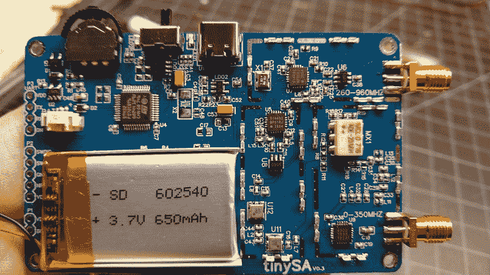
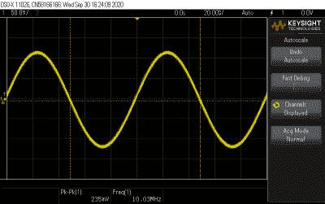
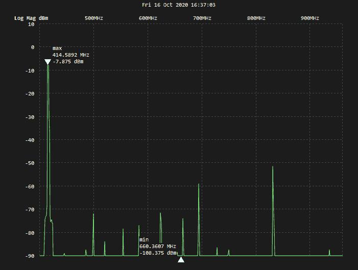
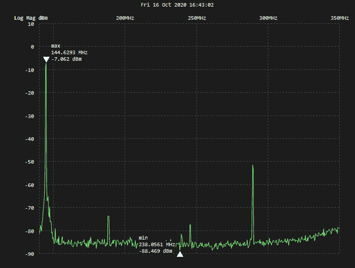

# 产品评论:TinySA，一个衬衫口袋大小的频谱分析仪

> 原文：<https://hackaday.com/2020/11/09/product-review-the-tinysa-a-shirt-pocket-sized-spectrum-analyzer/>

我想我们大多数人都有过这样的经历:走到邮箱前，看到白色塑料袋里那个泄露秘密的包裹，这标志着某样东西刚刚从中国到达。前几天我就遇到了这种情况，和你们许多人一样，这也是我困惑自己的时候之一:“我想知道这次我买了什么？”

从你冲动地点击全球速卖通或易贝的“立即购买”按钮到从中国开来的慢吞吞的船把包裹送到你家门口，中间隔了这么多周或几个月，你很容易忘记每个包裹里到底装了什么。随着商品价格如此之低，点击后就忘记的倾向变得更加容易。这不一定是一件好事，但我和其他人一样喜欢惊喜，所以我很高兴得知我现在是 tinySA 频谱分析仪的所有者。是时候看看这个小东西能做什么了。

## 第一印象

警告:我绝不是频谱分析仪专家。事实上，这是我第一次使用它，除非你算上在我的数字示波器中使用 FFT 功能，你可能不应该这样做。因此，在我进行的测试中，对于频谱分析仪的功能，操作人员可能会有很多错误和误解，但我仍然认为这是一个很有价值的例子，说明像这样的工具在热情的新手手中可以做什么。

任何熟悉 NanoVNA T1 的人都会发现它和 tinySA 在硬件和软件方面有很强的家族相似性，NanoVNA T1 是一种小型但功能齐全的矢量网络分析仪，我们在本文中多次介绍过它。这是有充分理由的——tinySA 背后的代码是 NanoVNA 代码库的分支，NanoVNA 的主要开发者 edy555 是 tiny sa 项目的贡献者，该项目由 Erik Kaashoek 所有。

tinySA 装在一个出奇漂亮的“展示质量”盒子里，盒子顶部有一个烫金标志。埃里克煞费苦心地指出，这是一种方式来告诉你，你得到的是一个原始的 tinySA，而不是一个不可避免的仿制品，很快就会充斥市场。我不确定仅凭这一点就能阻止海盗，但这至少是一种尝试，而且是一种不错的尝试。

除了大约一副扑克牌大小的 tinySA 之外，盒子还包含一对 SMA 跳线电缆、一个小型伸缩鞭状天线、一个母到母 SMA 适配器、一个腕带和一条 USB-C 电缆。tinySA 的外壳是注射成型的 ABS，在外观和手感上比 [NanoVNA](https://hackaday.com/2019/08/11/nanovna-is-a-50-vector-network-analyzer/) 的开放式电路板设计有了很好的提升。tinySA 的正面没有任何控件，只有 2.8 英寸 320×240 的电阻式触摸屏显示器。顶部有一个电源开关和一个点动控制。左侧有两个 SMA 插孔，标记为高和低。它很轻，但握在手中感觉很结实。

A look inside the tinySA, with the RF shields removed.

当然，我做的第一件事是打开箱子，看看里面。一开始没什么可看的——大多数有趣的射频材料都被安全地藏在屏蔽罩下。我想我必须敲出 Hakko 来取下这些罐子，但幸运的是，它们都被弹簧夹在接地层上，所以只需要一把小螺丝刀就可以取下它们。下面是预期的射频魔法，包括预期的硅实验室芯片。我发现了两个 Si4432 ISM 收发器芯片，大概分别用于 tinySA 的高频段和低频段。还有一个似乎是 Peregrine 半导体 PE4302 射频数字衰减器，以及一堆其他好东西。布局很好，有大量的过孔缝合，组装质量真的很好。

对内部感到满意后，我继续进行下面视频中列出的“第一步”，以熟悉这款设备。Erik 选择依靠 tinySA wiki 和一些操作视频来获取大部分文档，虽然这是可以理解的，但也留下了一些漏洞，需要用户来填补。对于我们这些喜欢真正手册的人来说，Kurt Poulsen，一个来自丹麦的火腿，写了[一个全面的操作文档](https://www.hamcom.dk/TinySA/Description_of_TinySA_a_real_Spectrum_Analyzer_for_little_money.pdf)，可能会有所帮助。

 [https://www.youtube.com/embed/k_rNLdZBuxo?version=3&rel=1&showsearch=0&showinfo=1&iv_load_policy=1&fs=1&hl=en-US&autohide=2&wmode=transparent](https://www.youtube.com/embed/k_rNLdZBuxo?version=3&rel=1&showsearch=0&showinfo=1&iv_load_policy=1&fs=1&hl=en-US&autohide=2&wmode=transparent)

任何使用过 NanoVNA 的人都会在 tinySA 界面中感觉很自在。tinySA 的校准是通过内置的信号发生器完成的，更多信息请见下文。校准本身很简单:将跳线同轴电缆挂在两个 SMA 插孔之间，并从配置菜单中选择 LEVEL CAL。然后校准会自动进行。同一个菜单还提供了自测功能，循环进行一系列 10 个测试，大约需要 15 秒钟完成。

## 好东西

至于它的主要目的，tinySA 在我有限的测试中表现得令人钦佩。我查看了示波器内置波形发生器产生的信号频谱，一切看起来都很好——一个 10 MHz 的正弦波表现为一个强基波尖峰和一个低约 50 dBm 的谐波。将波形切换为相同频率的方波，结果如我所料——基波处出现一个大峰值，奇数基波处出现一串杂散。

Output from the tinySA on my scope – solid, clean 10-MHz sine signal.

了解了基本知识之后，我看了一下 tinySA 的内置信号发生器。如上所述，信号发生器用于校准，但它本身也是一个非常有用的工具。它实际上更像是一个函数发生器，因为它不仅可以在 100 kHz 和 350 MHz 之间的低输出上输出清晰的正弦波，还可以调制信号(AM、窄 FM 和宽 FM)并在整个频率范围和幅度上进行扫描。在高输出端，信号发生器产生 240 MHz 至 960 MHz 的方波输出，具有可配置、不可扫描的幅度、窄 FM 或宽 FM 调制以及频率扫描。

我试了一下信号发生器，用我的是德科技 DSOX1102G 看了看它的输出。在额定带宽范围内，低输出端产生的正弦波看起来很干净，频率也很准确。我试着玩了一下调制功能，它的效果和我预期的差不多。商店周围有另一个信号发生器就好了。

My janky test setup: UV-5RA, homebrew 40 dB attenuator, and the tinySA.

寒暄过后，我开始着手一项几乎每个火腿都想打开频谱分析仪的任务:找出一部便宜的对讲机的信号有多差。我在我的一篇价值 50 美元的火腿文章中谈到了这一点，我们已经看到了对这些无线电杂散发射的全面分析，这些分析比我使用 tinySA 得出的任何结果都更深入。但是，我还是想试一试。我拿起我的宝丰 UV-5RA，一个自制的 40 分贝衰减器，还有一大堆笨重的适配器来连接所有的东西。

在我的印象中，宝丰的杂散发射在 UHF 频段往往更差，我首先尝试了 420 MHz。我注意到的第一件事是，基础偏离了它应该在的位置。我还注意到一小片杂散森林，从 500 MHz 开始，一直延伸到 800 MHz 以上。最强的杂散比基波低约 43 dBm。[FCC 关于杂散发射的规定](https://www.ecfr.gov/cgi-bin/text-idx?node=pt47.5.97#se47.5.97_1307)似乎并未涵盖这一频段，但规定在 30 至 225 MHz 之间，杂散必须比基波低至少 40 dBm。因此，在我的测试设置范围内，宝丰似乎只是勉强符合要求。

Spurious emissions from a Baofeng UV-5RA at 420 MHz. The big spur at about 825 MHz is the only one that comes close to exceeding the limits.

为了完整起见，我在 2m 波段上重复了同样的测试。这里的信号要干净得多，只有几个杂散，最大的一个在 270 MHz 左右。同样，这比基波低了约 43 dBm，这意味着它可能符合要求。同样，这只是一个粗略的测试，测试设置还有很多不足之处。但是，tinySA 仍然是一个很好的方式来看看你实际上向以太网排放了什么，至少可以大致了解你的操作有多干净。

A much cleaner signal from the same radio on the 2-m band.

## 不太好的东西

和之前的 NanoVNA 一样，tinySA 也有电脑控制的能力。Python 程序[tinySAver](https://github.com/erikkaashoek/tinysa-saver)主要用于保存来自 tiny sa 的扫描，但也提供额外的功能，如分段进行频率扫描和导出数据以供进一步分析。它还采用时域反射仪(TDR)来测量电缆长度和发现故障。遗憾的是，尽管我尽了最大努力，我还是无法让 TinySASaver 在我的 Ubuntu 机器上运行。Erik 很清楚代码仍然很粗糙，我也不是 Python 专家，所以我可能会遇到一些库问题，这些问题对于更有经验的人来说很容易解决。幸运的是，我能够找到一台破旧的 Windows 笔记本电脑，并运行另一个程序的编译版本，所以我不必求助于手机图片来截图。

我已经注意到了一些其他恼人的问题。最大的问题是，当你点击其中一个菜单时，tinySA 会崩溃。这很烦人，因为我经常发现自己被困在一个没有明显“返回”按钮的菜单中，点击背景似乎是返回到另一个菜单的直观方式。但这只是在屏幕上显示了所有寄存器的转储，并锁定了它。恢复起来没什么大不了的——打开电源，它会马上启动——但这可能很烦人。我还发现触摸屏有点挑剔，这是 NanoVNA 的常见抱怨。屏幕对我的肉钩来说太小了，但是没有合适的手写笔，我求助于一个只能在大部分时间工作的塑料土豆。当然，就在那时，我看了看盒子，注意到了附有吉他拨片状唱针的腕带——一个真正体贴的配件。

## 裁决

我不完全确定我为 tinySA 付了多少钱——就像我说的，我倾向于点这些东西，然后就把它们忘了。但我认为它大约是 60 美元，在这个价格上，我认为在您的工具包中添加 tinySA 是显而易见的。它永远不会取代更大的全功能仪器，但如果您对频谱分析仪的唯一需求是设计临时滤波器或检查信号质量，tinySA 是一个非常好的选择。