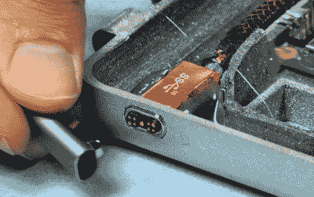

# 3D 打印的迷你 MacBook，带有树莓皮心形图案

> 原文：<https://hackaday.com/2020/10/08/3d-printed-mini-macbook-with-a-raspberry-pi-heart/>

你喜欢苹果笔记本电脑的时尚外观吗？你是树莓派的粉丝吗？对热熔胶和 3D 打印塑料情有独钟？那么你是幸运的，因为这个由 serial minimizer[Michael Pick]制造的微型“MacBook”在一个手掌大小的封装中具备了上述所有功能(以及更多功能)。(视频链接，嵌入下方。)

让 LCD 面板和 Raspberry Pi 4 适合轻薄的 3D 打印外壳需要相当多的哄骗。在广告之后的视频中，你可以看到[迈克尔]去掉了任何阻碍他的不必要的组件。LCD 面板不得不失去它的扬声器和按钮，Pi 已经移除了它的以太网和 USB 端口。虽然空间有限，但他还是设法在笔记本电脑的盖子上挤了一个发光的树脂印刷的苹果标志，以帮助销售整体外观。

 机器的下半部分有许多非常漂亮的细节，比如从金属硬件布切割的风扇格栅和由磁性 USB 电缆制成的功能性“MagSafe”连接器。键盘的印刷电路板和薄膜是从市场上可买到的单元中解放出来的，所有[迈克尔]需要做的就是在按键的开口处建模。由于键盘已经自带了小触控板，下面的触控板只是为了美观。

说到这里，为了真正体现苹果的美学，[迈克尔]做出了一个大胆的举动，在组装后用机身填充物盖住了所有的螺丝。我们不一定会推荐这种技术，但是把它粘住可能会使它更难回到生产线上。

我们之前已经看到[【迈克尔】用许多相同的部件和技术创造了 iMac](https://hackaday.com/2020/08/27/tiny-raspberry-pi-mac-nails-the-apple-aesthetic/) 和[一台配备 RGB LED 的“游戏”电脑](https://hackaday.com/2020/06/29/mini-gaming-pc-nails-the-look-streams-the-games/)的微型再现。他将不得不开始分支到不太常见的机器上进行复制，这提醒我们[我们即将迎来另一个小 Cray X-MP](https://hackaday.com/2012/01/10/help-chris-boot-his-cray-1-supercomputer/) 。

 [https://www.youtube.com/embed/ynMTYhy2L8I?version=3&rel=1&showsearch=0&showinfo=1&iv_load_policy=1&fs=1&hl=en-US&autohide=2&wmode=transparent](https://www.youtube.com/embed/ynMTYhy2L8I?version=3&rel=1&showsearch=0&showinfo=1&iv_load_policy=1&fs=1&hl=en-US&autohide=2&wmode=transparent)

