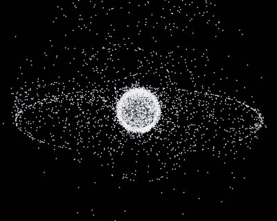
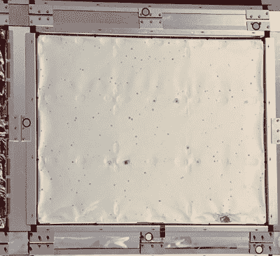
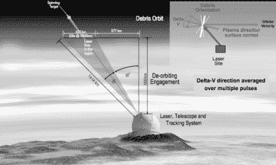

# 清除地球后院的所有太空垃圾

> 原文：<https://hackaday.com/2020/10/15/getting-rid-of-all-the-space-junk-in-earths-backyard/>

空间，顾名思义，大部分是空的。然而，自 1957 年第一颗卫星发射以来，人类开始在地球轨道上部署各种航天器。不利的一面是，太空也变得越来越杂乱，堆满了废弃的或破碎的火箭级和卫星的垃圾。以接近 30，000 公里/小时的速度移动，即使是最小的物体也能在你的航天器上穿出一个洞。因此，太空垃圾对载人和无人航天器都构成了真正的威胁，这就是为什么太空机构正在加大努力跟踪、避免和消除它。

## 地球轨道越来越拥挤

A computer-generated image of the space debris around Earth. The two main debris fields are the ring of objects in geosynchronous Earth orbit and the cloud of objects in low Earth orbit.
Credit: [NASA image](https://upload.wikimedia.org/wikipedia/commons/a/a1/Debris-GEO1280.jpg), Public Domain

据美国宇航局[轨道碎片项目办公室](https://orbitaldebris.jsc.nasa.gov/) (ODPO)称，地球轨道目前拥有大约 50 万个大理石大小的碎片物体和多达 1 亿个 1 毫米或更小的物体。如图所示，有两个主要的碎片区域。虽然大多数碎片位于 2000 公里<高度的低地球轨道(LEO)，但在大约 36000 公里高度的地球同步轨道(GEO)上也有一圈太空垃圾。

太空垃圾包括废弃的航天器，如先锋 I 号卫星，它已经在轨道上运行了 60 多年，因此保持着太空中最古老的人造物体的记录。其他罪魁祸首是解体或爆炸的火箭末级，这就是为什么现在它们通常通过排放未燃烧的燃料来“钝化”。

2007 年，中国因在导弹测试中炸毁风云-1C 气象卫星而饱受批评。加上 2009 年美国通信卫星 Iridium-33 和已经报废的俄罗斯 Kosmos 2251 卫星的意外碰撞，这些事件是目前位于轨道上的大部分大型碎片的原因。

为了保护自己免受微陨石和轨道碎片(MMOD)的伤害，航天器使用所谓的惠普尔防护屏，由几个间隔开的薄层组成。在撞击时，最外层打碎射弹，从而在射弹穿过时将其动能分散到大面积上。为了避免与已知的较大物体相撞，航天器有时不得不进行规避动作。

对于国际空间站来说，如果撞击的几率大于 1/10，000(平均每年发生一次),就需要进行这样的机动。2012 年，不得不进行创纪录的四次此类转移，由于需要消耗大量燃料，这些转移总是成本高昂。美国宇航局的航天飞机经常被 MMODs 刺穿，但幸运的是，迄今为止所有的灾难性碰撞都局限于无人驾驶的航天器。一个例子是法国卫星 Cerise，它于 1996 年被阿丽亚娜火箭助推器的一部分击中。我们已经提到了 Iridum-Kosmos 坠毁事件。

## 记录所有的垃圾

至关重要的是，要对漂浮在轨道上的所有垃圾进行编目和跟踪，以防止未来的碰撞，并防止未来的碰撞进一步加剧太空垃圾问题。美国太空监视网络(SSN)拥有最全面的太空垃圾目录。目前，他们跟踪了超过 22，000 个绕地球运行的直径大于或等于 10 厘米的人造物体。

根据它们的高度，足够大的物体可以被地面雷达和光学望远镜探测到。光学望远镜测量碎片反射的太阳光，而距离可以通过激光测距精确确定。该方法基于测量从地面发射并被物体反射的短激光脉冲的往返时间。这项技术长期以来一直被用于跟踪装有回射器的卫星。由于空间碎片的漫反射要弱得多，测量就困难得多。到目前为止，这项技术只能在黄昏时使用，当时地球上的激光测距站处于黑暗中，但碎片物体仍然被太阳照亮。随着成像技术的改进，[奥地利科学家最近成功地在白天使用空间碎片激光测距，将观察窗口扩大了一倍。](https://www.nature.com/articles/s41467-020-17332-z)

A panel from the Long Duration Exposure Facility (LDEF) spacecraft showing numerous holes from orbital debris.
Credit: [NASA JSC](https://www.orbitaldebris.jsc.nasa.gov/photo-gallery/)

美国国家航空航天局的长期暴露设施(LDEF)教给了我们很多关于太空垃圾的知识。它基本上是一个目标，在 1990 年被哥伦比亚号航天飞机回收之前，它被留在太空中大约六年。LDEF 主办了 57 项单独的科学实验，旨在研究外层空间环境对不同材料、电子产品和生物样品的长期影响。由于其表面积大，暴露时间长，所以通过研究其表面形成的瑞士奶酪图案，获得了许多统计信息，如图所示。

## 清理轨道

自 2002 年以来，所有主要的太空机构都在遵循一些共同的准则来减少太空垃圾的增长。地球同步轨道上的航天器被要求在完成任务后移动到更高高度的墓地轨道。穿过低地球轨道区域的物体应脱离轨道或至少放入寿命缩短的轨道。

由于大气阻力，所有轨道碎片将*最终*落回地球。然而，在 800 公里的高度，这可能需要几十年的时间，而 1，000 公里以上的轨道碎片通常将继续围绕地球飞行一个世纪或更长时间。我们添加太空垃圾的速度比下雨还快。因此，从长远来看，我们不仅需要停止正在进行的空间污染，还需要积极清除一些已经在轨道上的空间垃圾。否则，碎片的密度可能会变得足够大，产生级联效应，碰撞产生的碎片引发新的碰撞。这种情况被称为凯斯勒综合症，唐纳德·凯斯勒在[的这段视频](https://youtu.be/fajxaDxmu_4)中对此做了很好的解释。

## 太空激光器

Concept for the de-orbiting of space junk using a high-power laser.
Credit: [C. R. Phipps et al.](https://arxiv.org/abs/1110.3835)

主动清除空间碎片的计划包括瑞士初创公司 [ClearSpace](https://clearspace.today/) 的 ClearSpace-1 任务，该任务由欧空局资助，计划于 2025 年发射。ClearSpace-1 将使用机器人手臂捕获以前欧空局任务遗留在轨道上的 Vespa(织女星二级有效载荷适配器)上面级的一部分。两个航天器都将脱离轨道，在大气层中烧毁。最终，目标是在太空中有一辆[【拖车】](https://hackaday.com/2020/03/17/northrop-grumman-tests-space-tow-truck/)，它可以在一次任务中捕获并移走多个物体。

用于追踪太空垃圾的激光也可能被用于清除太空垃圾。有几个概念，使用高功率[地面](https://arxiv.org/abs/1110.3835)或[天基激光系统](https://www.sciencedirect.com/science/article/pii/S1000936114001010#f0005)从低地球轨道空间清除 1-10 厘米大小的碎片。激光蒸发物体上的物质，形成射流，使目标减速，从而使其更快地重返大气层。

在我们已经把地球污染到毁灭性的程度之后，如果在太空中没有看到同样的事情发生就好了。如果太空任务带来的科学进步和通信技术因凯斯勒综合症而停滞不前，那将是一种耻辱。随着未来像 Starlink 项目这样的新的巨型卫星群的出现，这种风险迫在眉睫。