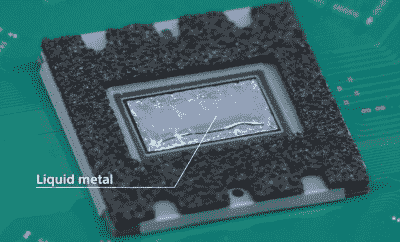

# 官方拆卸给 PS5 一个意想不到的外观

> 原文：<https://hackaday.com/2020/10/07/official-teardown-gives-unexpected-look-into-ps5/>

索尼和微软距离公开发布下一代游戏机还有一个月的时间，你可能会认为他们各自系统的技术细节仍处于保密状态。但这一代，两家公司看起来都有所不同，因为越来越明显的是，现代消费者对他们的设备如何运转感兴趣。今天，索尼真的挑战了科技媒体，在新的 PlayStation 5 上发布了他们自己的深度拆解。

不出所料，休息后的视频几乎全是日语。但是即使你不懂这门语言，也有很多有趣的细节。首先，冷却 PS5 的 AMD CPU 和 GPU 的散热器和风扇集体如此巨大，以至于它们似乎占据了主机的大部分内部体积。

 事实上，散热片本身是如此之大，以至于主板实际上是安装在*到*上，而不是相反。所以，如果你想取出主板，你必须先把它从散热器上卸下来。在这个过程中，你会发现索尼专门为这种应用开发的独特的液态金属热化合物。如果那个看起来很贵的东西里有灰尘，祝你好运。

有趣的是，与前两代索尼游戏机不同，PS5 没有独立硬盘。相反，带有定制控制器的板载闪存用于为软件提供 825 GB 的存储空间。希望索尼已经把必要数量的 R&D 纳入他们的磨损均衡，因为一个镜头闪存芯片将意味着一个全新的主板。也就是说，拥有大量收藏的游戏玩家会很高兴看到似乎有一个扩展舱，你可以在那里安装自己的 M.2 驱动器。

在这和最近的 PS4 装配线之旅之间，看到像索尼这样的公司变得更加透明令人耳目一新。在多年受到科技巨头的敌对对待后，我们几乎忘记了顾客才是王道。

 [https://www.youtube.com/embed/CaAY-jAjm0w?version=3&rel=1&showsearch=0&showinfo=1&iv_load_policy=1&fs=1&hl=en-US&autohide=2&wmode=transparent](https://www.youtube.com/embed/CaAY-jAjm0w?version=3&rel=1&showsearch=0&showinfo=1&iv_load_policy=1&fs=1&hl=en-US&autohide=2&wmode=transparent)

