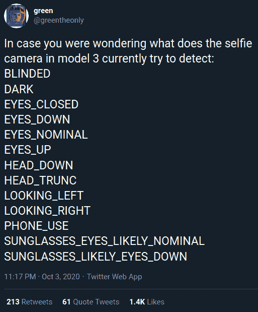
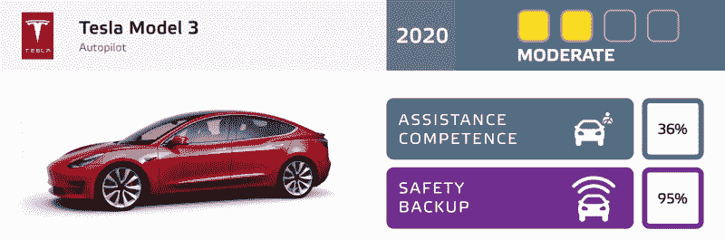

# 固件提示特斯拉的司机摄像头正在观看

> 原文：<https://hackaday.com/2020/10/13/firmware-hints-that-teslas-driver-camera-is-watching/>

目前，如果你想在特斯拉汽车上使用自动驾驶或自动驾驶模式，你需要一直把手放在方向盘上。这是因为，最终，人类司机仍然是负责任的一方。特斯拉坚信这样一个事实，即允许汽车在车道内自动驾驶、避开障碍物、智能调整速度以适应交通状况的功能[都构成了驾驶员*辅助*系统](https://www.tesla.com/support/autopilot)。如果有人知道如何骗过车轮传感器，在他们闪亮的新电动汽车在高速公路上飞驰时小睡一会儿，他们不想参与其中。

因此，该公司关于 Model 3 和 Model Y 中面向驾驶员的摄像头的官方说法是，它记录了驾驶员在撞击发生前几秒钟内的行为，这是有道理的。正如 2020 年 6 月固件更新的[发布说明中所解释的，特斯拉车主可以选择提供这些数据:](https://teslascope.com/teslapedia/software/2020.24.6.4)

> 通过共享您车辆的摄像头数据，帮助特斯拉继续开发更安全的车辆。此更新将允许您启用后视镜上方的内置驾驶室摄像头。如果启用，特斯拉将在碰撞或安全事件发生前自动捕捉图像和视频短片，以帮助工程师在未来开发安全功能和增强功能。

 但是[格林]在过去几年里一直在研究特斯拉的固件和自动驾驶功能，最近他发现了一些令人信服的迹象，表明事情并不简单。作为车辆图像识别系统的一部分，该系统通常负责拍摄其他车辆或行人，他们发现了几个有趣的类别，鉴于官方对机舱摄像头正在做什么的解释，这些类别似乎没有必要。

如果特斯拉想要的只是每当他们的一辆汽车发生事故时，上传到他们办公室的几秒钟视频，他们就不需要运行配置为实时检测分心司机的图像识别。虽然你可以说这些数据对他们有用，但当这些数据可以作为事故调查的一部分进行分析时，仍然没有理由在车上进行分析。似乎更有可能的是，特斯拉正在为一个系统奠定基础，该系统可以为车辆提供另一种确定司机是否注意的方法。

## 凯迪拉克竞赛

虽然特斯拉肯定吸引了公众的目光和互联网的关注，但他们并不是唯一一家试验自动驾驶技术的汽车制造商。通用汽车公司在其高端凯迪拉克豪华轿车和 SUV 上提供了一种称为超级巡航的功能，该功能提供了许多非常相似的功能。虽然特斯拉的汽车无疑知道一些凯迪拉克无法做到的技巧，但 Super Cruise 确实比竞争对手有一个非常明显的优势:免提驾驶。

为了实现这一目标，超级巡航使用了一个面向司机的摄像头，专门用来确定司机在看哪里。如果名副其实的“驾驶员注意力摄像头”注意到驾驶员没有注意到道路，它会闪烁绿灯，然后是嵌在方向盘顶部的红灯，希望引起他们的注意。

如果这不起作用，汽车将播放语音提示，告诉司机超级巡航即将关闭。最后，如果这些都没有引起他们的注意，汽车就会停下来，联系安吉星代表；在这一点上，它被认为是司机睡着了，喝醉了，或遭受某种医疗事件。

通过 Super Cruise，通用汽车表明，面向驾驶员的摄像头在对自动驾驶技术感兴趣的客户中是可以被社会接受的。更重要的是，它展示了相当大的现实世界的好处。物理方向盘传感器提供了一个有价值的数据点，但通过观察驾驶员并研究他们的行为，该系统变得更加可靠。

## 落后了

鉴于用户愚弄特斯拉车轮传感器的高调案例数量，很明显该公司需要加大努力。当警察让超速行驶的车辆靠边停车时，却发现他们的“司机”睡得很熟，显然出了大问题。即使这些情况在宏观上是统计上的异常，不可否认这个系统是可利用的。为了让自动驾驶汽车成为主流，汽车制造商需要证明他们几乎不会犯错；像这样令人尴尬的失误只会拖整个行业的后腿。

特斯拉未能让他们的司机参与进来，这当然不会被忽视。在[欧洲新车评估计划最近发布的对几款配备驾驶辅助系统的汽车的评级](https://www.euroncap.com/en/ratings-rewards/assisted-driving-gradings/)中，特斯拉 Model 3 在辅助能力方面的得分仅为 36%。该报告解释说，尽管 Model 3 提供了令人印象深刻的一系列功能，但它在与人类驾驶员的协作方面做得很差。它接着说，特斯拉的自动驾驶营销使这种情况变得更糟，因为它培养了一种信念，即车辆可以在没有用户干预的情况下自动驾驶。事实上，Model 3 有一个内置摄像头，但目前没有用它来监控司机，这也是该系统的一个缺点。

虽然特斯拉是该领域的早期先驱，但传统汽车制造商现在正在加紧努力开发自己的驾驶辅助系统。随着这种新的竞争而来的是监管的加强、媒体的更多关注，当然还有更高的客户期望。虽然迄今为止，特斯拉似乎不愿意将镜头对准自己的用户，但很快就会有一天，来自行业其他人的压力意味着他们不再有选择。