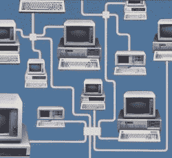
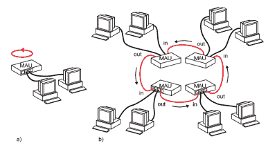
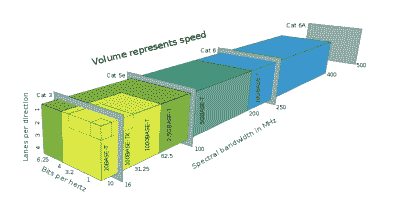
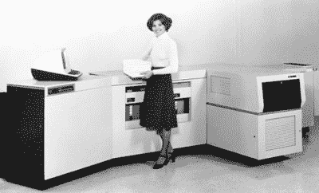
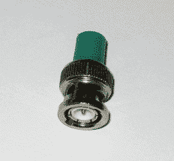

# 40 岁的以太网:从一张餐巾纸草图到数千兆链路

> 原文：<https://hackaday.com/2020/10/19/ethernet-at-40-from-a-napkin-sketch-to-multi-gigabit-links/>

1980 年 9 月 30 日是以太网首次商用的日子，到今年正好 40 年了。它在 1975 年由施乐提交的一项专利中首次被定义为 10 Mb/s 网络协议，1980 年推向市场，随后在 1983 年由 IEEE[标准化为 IEEE 802.3](https://en.wikipedia.org/wiki/IEEE_802.3) 。在接下来的 37 年里，这个标准经历了无数次更新和修订。

目前的以太网标准不仅包括从最初的 10 兆比特/秒到今天的最大 400 千兆比特/秒的不同速度等级，还包括对核心协议的无数改变，以支持这些更高的数据速率，更不用说以太网的新应用，如电力输送和背板路由。以太网的可靠性和成本效益导致了 1990 年的 10BASE-T 以太网标准(802.3i-1990)，该标准逐渐在台式 PC 上实现。

如今，以太网就像它被命名的那个假定的发光的以太一样存在，这似乎是一个很好的角度，来看看是什么让以太网与其他解决方案如此不同，以及它必须经历什么样的变化才能跟上日益互联的世界的需求。

## 连接计算机的新奇感

IBM PCs, connected.

如今，大多数电脑和电脑化的小玩意只要发现自己与全球互联网断开连接，就比昂贵的纸重好不了多少。早在 20 世纪 80 年代，人们刚刚开始了解人们可以用所谓的“局域网”做的事情。与 20 世纪 60 年代和 70 年代的大型机和终端系统不同，局域网需要连接微型计算机(IBM PCs、工作站等)。)在例如办公室或实验室。

在从 sneakernet 过渡到以太网的过程中，办公网络将很快包含成千上万的节点，从而形成美妙的集中管理的办公网络世界。通过网络可以获得任何文件，这个世界似乎已经为[无纸办公室](https://en.wikipedia.org/wiki/Paperless_office)做好了准备。虽然这从未发生过，但通过网络(局域网和广域网)交流和共享文件的能力现在已经成为日常生活中的一个重要部分。

## 传递令牌

The circuitous world of Token Ring configurations.

改变的是商品网络技术的快速变化。以太网早期的竞争对手是一些小型网络协议的松散集合。这包括 IBM 的[令牌环](https://en.wikipedia.org/wiki/Token_ring)。虽然在 20 世纪 80 年代形成了许多关于以太网的假定弱点的神话，由 1988 年 SIGCOMM 研讨会的[文档](http://www.hpl.hp.com/techreports/Compaq-DEC/WRL-88-4.pdf) (PDF)总结，最终以太网被证明是绰绰有余的。

令牌环网的主要优势是确定性，而不是以太网的多路访问冲突检测方法( [CSMA/CD](https://en.wikipedia.org/wiki/Carrier-sense_multiple_access_with_collision_detection) )。这导致了最持久的神话，以太网不能维持超过 37%的带宽饱和。

出于成本的原因，早期的以太网由哑集线器而不是更智能的交换机主导。这意味着以太网适配器必须解决冲突。正如任何使用过[以太网集线器](https://en.wikipedia.org/wiki/Ethernet_hub)的人可能都知道的那样，以太网繁忙的最可靠标志就是瞥一眼集线器上的“碰撞”LED。随着以太网交换机越来越便宜，集线器很快就消失了。因为交换机在两个不同的节点之间建立路由，而不是依靠 CSMA/CD 来解决问题，这就避免了整个冲突问题，而这个问题使集线器(以及以太网)成为许多笑话的目标，这个神话被终结了。

一旦以太网开始允许使用更便宜的 Cat。3 (UTP)适用于 10BASE-T 和卡特彼勒。5(e) UTP 电缆作为 100BASE-TX(及相关)标准，以太网成为从家庭和办公室到工业和汽车应用的主流网络技术。

## 选择之树

The increased spectral bandwidth use of copper wiring by subsequent Ethernet standards.

虽然 IEEE 802.3 下列出的标准列表可能看起来相当吓人，但在维基百科上也可以找到一个针对普通人的[更简短的列表](https://en.wikipedia.org/wiki/Ethernet_over_twisted_pair)。其中，最有可能在某个时候遇到的是:

*   10BASE-T (10 Mb，目录。3).
*   100BASE-TX (100 Mb，目录。5).
*   1000BASE-T (1 Gb，目录。5).
*   2.5 Gb base-T(2.5 Gb，目录。5e)。

虽然 5GBASE-T 和 10GBASE-T 标准也已经使用了几年，但目前 25 Gb 和 40 Gb 版本肯定是为数据中心保留的，需要 [Cat。8 根电缆](https://en.wikipedia.org/wiki/ISO/IEC_11801#Category_8)，最长可达 36 米。列表中的其余标准主要针对汽车和工业应用，其中一些标准适用于 100 Mbit 连接。

尽管如此，随着世界上一些地区的互联网连接实际上已经达到或超过了这个速度，整个千兆位不再足够的时代正在慢慢到来。谁知道在某个时候，千兆局域网会成为一个人互联网连接的瓶颈？

## 欢迎

The Xerox 9700, the world’s first Ethernet-connected laser printer.

早在 1972 年，施乐的帕洛阿尔托研究中心( [PARC](http://www.parc.com/) )的一些工程师，包括罗伯特“鲍勃”[梅特卡夫](https://en.wikipedia.org/wiki/Robert_Metcalfe)和大卫·博格斯，被分配了创建局域网技术的任务，为[施乐阿尔托](https://www.computerhistory.org/revolution/input-output/14/347)工作站提供连接激光打印机的方法，这也是施乐开发的。

这种新的网络技术必须允许数百台个人计算机同时连接，并以足够快的速度向打印机提供数据。在设计过程中，Metcalfe 利用了他在夏威夷大学开发的无线分组数据网络 ALOHAnet 的经验。

Metcalfe’s first Ethernet sketch.

ALOHAnet 背后的主要概念是使用共享介质进行客户端传输。为了实现这一点，实施了一种协议，可以总结为“发送前先听”，这就是所谓的“载波侦听多路访问”( [CSMA](https://en.wikipedia.org/wiki/Carrier-sense_multiple_access) )。这不仅激发了以太网，也激发了 WiFi 和许多其他技术。在以太网的情况下，前面提到的 CSMA/CD 形成了早期以太网标准的组成部分。

同轴电缆用于公共介质，这需要在每根电缆的末端使用精心设计的终端。添加额外的节点需要使用 tap，允许以太网接口卡上的 BNC 连接器连接到总线。由于使用了相当笨重的 9.5 毫米粗同轴电缆，以太网的第一个版本也被称为“thicknet”([10 base 5](https://en.wikipedia.org/wiki/StarLAN))。第二个版本( [10BASE2](https://en.wikipedia.org/wiki/10BASE2) )使用更细的同轴电缆(RG-58A/U)，因此被亲切地称为“thinnet”。

## 最好的情节转折

Don’t forget to terminate your bus.

最终，非屏蔽双绞线的使用使得以太网比令牌环网更有吸引力。随着较便宜的接口卡，它变成了一个显而易见的人谁想要一个局域网在家里或办公室。

任何曾经安装或管理过 10BASE5 或 10BASE2 网络的人可能都知道，总线上的干扰、窃听问题或擅离职守的终结器真的会毁掉一天。请注意，并不是说找出令牌从令牌环网上掉在哪里是一件愉快的事情。尽管以太网的普通媒介“以太”部分早已被交换机网络所取代，但我确信许多 IT 专业人员更喜欢星型结构。

因此，我们从阳光明媚的夏威夷来到为我们的家庭局域网和数据中心提供动力的技术领域。也许会出现其他东西来做今天以太网所做的事情，但就个人而言，我对事情的进展很满意。我记得我小时候在 90 年代末在家里安装的第一个局域网，首先是让我和弟弟共享文件(即局域网游戏)，然后是共享有线互联网连接。除了享受局域网聚会和成为整个家庭的系统管理员的乐趣之外，它还让我能够快速了解这个由 IPX/SPX、TCP/IP 和更多与网络相关的东西组成的世界。

生日快乐，以太网。为另一个 40 年的创新和革命干杯。