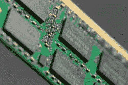

# 你的手机需要内存吗？

> 原文：<https://hackaday.com/2020/10/19/does-your-phone-need-a-ram-drive/>

电话曾经是电话。后来我们有了无绳电话，它既是电话又是无线电。然后我们有了手机。但是有了智能手机，我们有了一部既是收音机又是电脑的手机。微型电池操作的计算机通常有点贫血，但随着技术的进步，这些微型计算机增长到超过几年前的台式机的程度。这意味着越来越多的手机采用了我们过去只用于台式电脑和服务器的技术。例证:小米现在有了一款配备 RAM 驱动器的智能手机。这真的有必要吗？

虽然人们喜欢说你永远不会太富或太瘦，但记忆永远不会太大或太快。不幸的是，这一直是一个零和游戏。快速内存往往密度较低，而大容量内存往往速度较慢。最快的普通存储器是静态 RAM，但这需要每一位在芯片上有很大的面积，也消耗很多能量。这就是为什么大多数计算机和设备使用动态 RAM 作为主存储。由于每一位比一个电容器大不了多少，所以密度很好，功率要求也很合理。坏处呢？在内部，当读取时或者在微小电容放电之前周期性地，存储器需要重写。

虽然动态 RAM 密度很高，但闪存仍然是大多数手机的“磁盘驱动器”。它密度高、价格便宜，而且与 RAM 不同，它不需要电源就能保存数据。缺点是尽管有新的标准来提高吞吐量，但它的接口很麻烦且相对较慢。实际上，普通手机中使用的闪存类型不可能与 RAM 的访问速度相匹配。

那么，我们的手机会因为闪光灯的速度而停滞不前吗？他们是在呼唤一种尽可能利用 RAM 速度的新范式吗？让我们解开这个问题。

## 是的，但是…

 如果你的目标是速度，有一个答案一直是做一个 RAM 磁盘。在过去，当你有非常慢的磁盘驱动器的时候，这些是主食。Linux 经常使用 tmpfs 挂载瞬态数据，tmpfs 实际上是一个 RAM 驱动器。与普通驱动器相比，引用 RAM 而不是闪存(或任何较慢的东西)的磁盘将会非常快。

但这在这些手机上真的重要吗？我不是说你不希望你的手机运行得很快，特别是如果你试图做一些像游戏或增强现实渲染的事情。我要说的是:现代操作系统并没有在磁盘和内存之间做出如此重大的区分。它们可以将经常使用的数据从磁盘加载到 RAM 缓存或缓冲区中，并很好地管理这些数据。那么一直在 RAM 中存储东西有什么好处呢？如果你只是将一个闪存驱动器复制到 RAM，然后在关机前写回，这当然会提高速度，但你也会浪费很多时间去抓取你从来不需要的东西。

## 履行

据报道，相比闪存 1.7GB/s 的读取和 0.75 GB/s 的写入，小米手机中的 DRAM 最高可达 44GB/s。当然，这些都是理论上的最大值，所以要有所保留，但是即使有真实世界的测量，这个比率也应该是相似的。

根据小米的说法，游戏的安装和加载速度可以提高 40%到 60%。但这回避了一个问题:游戏是如何进入 RAM 的？起初，我们认为这种想法是将整个闪存复制到 RAM 中，但事实似乎并非如此。取而代之的是，将游戏直接从网络加载到 RAM 驱动器中，然后标记它们，这样用户就可以看到它们会在重启时消失。启动器会在主屏幕上显示一个特殊的图标，警告你这个游戏只是暂时的。

因此，除非你的手机从不关机，否则你会因为在网络上反复安装游戏而损失几秒钟的加载时间。我不认为这是一个很好的用例。我宁愿让设备智能地将数据固定在缓存中。换句话说，允许在游戏文件上保留一点，让它们留在缓存中，直到别无选择，只能驱逐它们，这样你就有了一个更好的系统。一次从闪存相对快速的加载，随后在后续执行中非常快速的启动，直到手机断电。不同的是，你不必每次重置手机时都重新安装。

## 这不是硬件 RAM 驱动器

已经有了硬件 RAM 驱动器，但那确实是一种不同的动物。软件 RAM 驱动器占用主存储器的一部分，并使其看起来像一个磁盘，它似乎是在 1980 年左右以用于 CP/M 和后来的 MSDOS 的硅磁盘系统的形式起源于英国。众所周知，那个时代的其他电脑也支持这项技术，包括苹果、康茂德和雅达利等。

1984 年，IBM 通过增加一个 RAM 磁盘驱动程序来区分 PCDOS 和 MSDOS，这是微软在 1986 年复制的。然而，所有这些机器的内存量都相对较低，无法为通用缓冲留出太多空间。让人们决定在 RAM 中保存一组特定的文件是有意义的，这在当时是一个更好的解决方案。

另一方面，小米的设计有一个重要的特点。这是个好消息。如果他们没有集成 RAM 驱动器，我们就不会谈论这款手机。我只是不确定这在现实生活中有多大关系。

我们已经看到 RAM 磁盘[缓存浏览器文件](https://hackaday.com/2008/11/20/faster-browsing-with-ram-disks/),这些文件在重启后存储起来并不重要，而且通常运行良好。这也是 Linux 中一个相当[的常见伎俩。即使这样，真正的优势也不是更快的内存，而是当缓存数据不需要持久存储时，不再需要将缓存数据写入慢速磁盘。](https://hackaday.com/2011/01/11/speed-up-web-browsing-in-linux/)