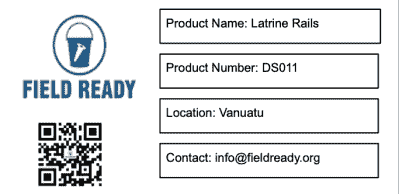
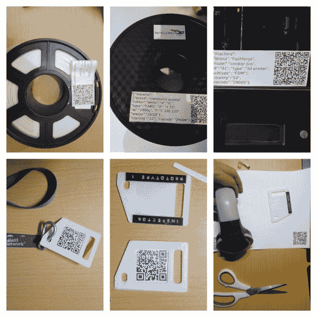

# 质量控制，在任何地方进行

> 原文：<https://hackaday.com/2020/10/13/quality-control-done-anywhere/>

现代社会给我们带来了各种各样的奇迹，包括快速的洲际旅行，轻松的信息获取，以及由于众多的供应链而降低的大多数消费品的成本。然而，当这些供应链因自然灾害或其他紧急情况而中断时，如果无法获得必要的供应，灾难的影响会更加严重。这就是 [Field Ready](https://www.fieldready.org/) 的重点，这是一家非营利组织，在没有供应链的地方，或者最近供应链中断的地方建立小规模制造。

作为今年 Hackaday 奖的一部分，我们的四个非营利合作伙伴都概述了成为设计和构建挑战目标的具体需求。Field Ready 是这些非营利组织之一，为了迎接挑战[，他们专注于分布式制造系统](https://hackaday.io/project/173455-2020-hdp-dream-team-field-ready)的质量控制。我们在六月份[参观了 Field Ready，以探索与他们的工作](https://hackaday.com/2020/06/09/the-hackaday-prize-field-ready-is-changing-the-face-of-humanitarian-relief/)相关的一些独特挑战，其中包括客户可能不知道他们购买的产品最初来自 Field Ready，导致对产品性能的反馈很少，并且在需要更换时无处可去。

一个梦之队迎接了这一挑战，其成员每人获得 6000 美元的小额赠款，全职参与该项目。他们刚刚做了一份报告，介绍了一种更简单的方法来跟踪所有生产的产品，甚至为那些不在组织中的人识别它们。因此，Field Ready 大大改进了制造和供应流程，使他们能够收集更多数据，并从设备用户那里获得更好的反馈。休息之后，请加入我们，近距离观察该系统，并观看该团队的演示视频。

## 把你的名字写在上面

 [新系统的基础](https://hackaday.io/project/173455-2020-hdp-dream-team-field-ready)开始只是一个标签，上面印着字段就绪名称和序列号。这让最终用户知道产品是由 Field Ready 制造的，并向他们提供联系信息。然而，选择一种有效的标签方法也有其自身的挑战，该团队最终根据产品的类型、尺寸和预期使用位置尝试了许多不同的方法。

例如，如果一个产品是一次性使用的，该小组意识到他们可以简单地使用运输标签作为他们跟踪产品的手段。否则，如果产品在室内使用，可以使用产品上的纸质标签。

Testing a label embosser on aluminum from a soda can

对于暴露在自然环境中的情况，可以使用浮雕标签或雕刻标签，对于非常大的物体，他们也可以将标签喷涂到产品上。这些方法中的每一种都需要包含在 Field Ready 将运送到有需要的地区的标准设备组中，或者在当地容易获得，这带来了其自身的一系列挑战。

## 二维码嵌入了大量细节

随着标签问题的解决，重点可能会转移到记录所涉及产品的各个方面。确保完成文档在任何环境中都是一项挑战，更不用说 Field Ready 工作的环境了，因此他们开始尝试使文档过程尽可能地引人入胜、快速和简单，同时尽可能少地依赖基础架构。这里的解决方案是创建一个应用程序，允许为任何产品快速创建二维码标签，而不需要依赖互联网访问像二维码有时用于的链接。代码直接包含产品中的所有信息，可以在没有网络访问的情况下生成和读取。然而，如果互联网接入可用，标签可以很容易地使用各种消息系统上传或共享。

QR 码使用的关键是为它们创建的带有哈希值的 JSON 标签。每次扫描二维码时，都会创建一份记录，记录扫描者和扫描时间，从而为该集团创建的每件产品留下书面记录。这对于跟踪产品及其用途以及保持高标准的质量控制非常有效。这些信息可以在区块链中使用，这确保了所收集信息的保真度。该应用通过扫描二维码产生的数据也与 [Airtable](https://airtable.com/) 完全集成，简化了收集和维护数据的过程。所有的东西都在 iOS 上运行，我们小心翼翼地确保屏幕较小的老款苹果手机也能像更现代的设备一样运行这个软件。大概 iOS 的限制是因为交付这样一个产品需要两个月的时间，这个团队已经开始移植 Android 了。

## 使质量控制民主化

Field Ready 在为他们的分布式制造开发质量控制解决方案后，最重要的注意事项之一是不要陷入所有的技术中。质量控制是关于人和人的过程的，记住这一点可以带来更加用户友好的体验。他们还致力于建立一个以产品使用者和产品创造参与者为中心的组织，作为良好质量控制的基础。

虽然该团队在这个质量控制系统上有一个很好的开端，但他们希望进一步开发他们的原型，使它们对不同的用例更加健壮。考虑到这一点，他们将慢慢推出他们的解决方案，一次一个地区，这样他们可以更准确地跟踪部署，并根据需要对较小的系统集进行更改。当然，他们所做的工作也不仅仅局限于他们的组织。他们已经在 GitHub 上发布了该应用的 iOS 代码，也发布了他们的 Android 代码，并让那些需要的人可以访问他们的报告和他们的 Airtable 数据库，无论你是需要跟踪小批量订单的小企业还是受灾地区的另一个非营利组织。

我们当然迫不及待地想看到它投入使用的一些方式，并且很高兴看到 Field Ready 将这个系统推广到越来越多的受众。

 [https://www.youtube.com/embed/W-Rr0NOfq3Q?version=3&rel=1&showsearch=0&showinfo=1&iv_load_policy=1&fs=1&hl=en-US&autohide=2&wmode=transparent](https://www.youtube.com/embed/W-Rr0NOfq3Q?version=3&rel=1&showsearch=0&showinfo=1&iv_load_policy=1&fs=1&hl=en-US&autohide=2&wmode=transparent)

The [HackadayPrize2020](https://prize.supplyframe.com) is Sponsored by: