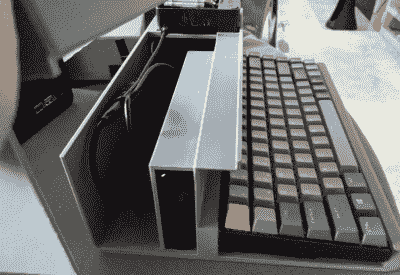

# HALWOP 用覆盆子 Pi 再现复古风格

> 原文：<https://hackaday.com/2020/10/12/halwop-recreates-retro-style-with-the-raspberry-pi/>

现代计算机是令人难以置信的工程壮举，但仍有许多人渴望更简单的时代。当键盘噼啪作响，一台台式电脑几乎占据了你的桌面。有一整个社区的人通过修复老式电脑来挠痒痒，但不是每个人都有时间、金钱或技能来进行这样的追求。另外，即使是最受宠爱的 Apple II 也不会帮你看 YouTube。

那些希望用现代的内部部件[重现老式电脑外观和感觉的人肯定会对[Maz _ 巴兹]](https://www.thingiverse.com/thing:4604061) 的 HALWOP 感兴趣。虽然它的 3D 打印外壳不是任何一台电脑的复制品，但它确实从苹果 Lisa 和 IBM XT 等标志性机器中汲取了灵感。这是一种设计理念的融合，在 1982 年左右似乎是一个好主意，有大量的 90 度角和通风口。

 考虑到给 HALWOP 供电的树莓 Pi 4 的大小，大部分情况下只是空心塑料。但是，当然，整个想法取决于它几乎是滑稽的大。有利的一面是，[Maz _ 巴兹]说你可以用其中一个空隔间来装 Anker PowerCore 26800 电池组。[至少在理论上，这使它成为一台“可携带”的电脑](https://hackaday.com/2020/01/10/a-luggable-computer-for-the-raspberry-pi-era/)，尽管试着移动它运气不错。

除了 Pi 4 和电池组，HALWOP 还使用了七英寸触摸 LCD 和 Keychron K2 蓝牙机械键盘。因为所有东西都是模块化的，所以组装非常简单。除了为一切供电的 USB 电缆，您只需要一根足够长的带状电缆来连接 LCD 和 Pi。

我们知道纯粹主义者不喜欢基于树莓派的“复古”电脑的想法，但是当然，这样的项目不是为了保持历史的准确性。它们是弥合现代技术和过去时代独特美学之间差距的一种方式。像 HALWOP 这样的设计让[新一代体验到了早期](https://hackaday.com/2020/02/08/a-modern-take-on-the-paperclip-computer/)的计算是什么样的，而没有放弃在中间几年取得的进展。