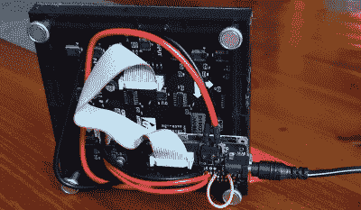

# 32×32 矩阵上的高保真艺术

> 原文：<https://hackaday.com/2020/10/11/lo-fi-art-on-a-32x32-matrix/>

在过去几年里，显示技术有了突飞猛进的发展，这在很大程度上要归功于智能手机革命。高分辨率液晶面板非常便宜，而且易于使用。尝试在 32×32 的 RGB LEDs 阵列上显示图像绝对没有逻辑上的理由。但是这并没有阻止费利克斯·斯普特尔继续做这件事。

他称这个项目为三十两个像素，旨在与 MPD(音乐播放器守护程序)协同工作，显示当前正在播放的任何音乐的专辑封面。超低分辨率的显示器给艺术品增加了某种抽象的元素，[费利克斯]说这使它成为一个有趣的话题。给定矩阵上显示的稀疏再现，客人将尝试并猜测专辑封面描绘的是什么。

 【费利克斯】很好地解释了如果你想重建他的设置，如何让服务器和客户端软件启动并运行，但他的 Python 脚本也有一个功能，如果你不想将所有东西都连接到 MPD 后端，你可以将任意图像推送到显示器上。

在硬件方面， *thirtytwopixels* 使用了树莓 Pi Zero W，Adafruit RGB Matrix Bonnet，以及[使用 HUB75 接口](https://hackaday.com/2020/05/09/reverse-engineering-saves-trashed-led-panels/)的 32×32 LED 矩阵。即使像这样一个相对较小的 LED 矩阵也会非常渴，所以[Felix]使用一个 5 伏的电源，可以提供 4 安培的电流来保持电子设备正常工作。

如果你想保持低分辨率的美感，但让显示屏更大，我们已经看到了用于定制巨型矩阵的 [WS2812B LED 条和 3D 打印框架](https://hackaday.com/2020/05/18/jumbo-led-matrix-brings-classic-sprites-to-life/)，这肯定可以适应这一概念。