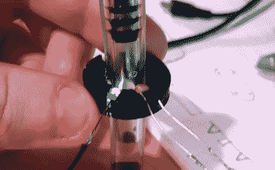
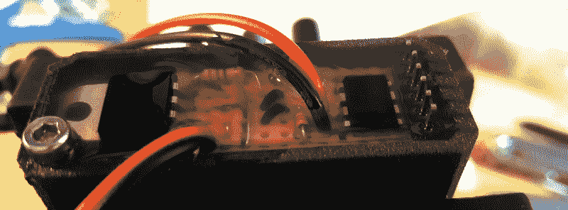

# 设计和制造定制的光学燃料传感器

> 原文：<https://hackaday.com/2020/10/14/designing-and-building-a-custom-optical-fuel-sensor/>

在某个时候，我们都有一个自己认为非常聪明的想法，于是我们跳到互联网上，看看是否有人已经提出了这个想法。大多数时候，他们有。但是万一你在网上找不到任何迹象，你基本上只能得出两个可能的结论。要么你即将进入一个未知的领域，要么你的想法太糟糕，以至于所有人都已经集体否定了它。

这正是[詹姆斯·斯坦利]最近发现自己的地方。他有了一个非接触式光学传感器的想法，这种传感器可以通过分析穿过燃料软管透明部分的光线来检测他的割草机何时将耗尽汽油。他找不到这种设备的任何以前的 DIY 例子，也没有出现商业版本。但是，这是否意味着它不会工作，或者没有人曾经尝试过吗？

Sensor proof of concept

在完全投入到传感器的设计之前，[James]开始做一些概念验证实验。第一步是 3D 打印一个环，环上有开口，可以以彼此不同的角度插入 LED 和光敏电阻。将 LED 和传感器放在燃料管线的相对两侧是最合理的，但他想测试它是否真的返回了最强的信号。令人惊讶的是，这个小测试表明，最佳对准实际上是 60°，因为它在“有燃料”和“无燃料”读数之间产生了最大的差距。

确信这个想法有价值，[詹姆斯]推进并设计了 3D 打印外壳，他最终称之为*燃料安全*。他还想出了一个相对简单的电路，使用的是他在一块 perfboard 上组装的 ATtiny85。MCU 从光敏电阻读取数值，将其与预定的阈值进行比较，并产生一个数字信号来指示管路中是否有任何可见的燃油。这个信号最终被用来点亮仪表板上的 LED，以指示何时靠边停车加油。

为了确保他新制作的传感器能够存活，他甚至用两部分硅树脂将整个东西封装起来。不幸的是，虽然它看起来令人印象深刻，但[James]指出，这是一种错误的材料，因为它太软了，粘起来不是很好。尽管如此，传感器外壳都扣好了，它至少应该提供一些缓冲，以帮助应对我们认为必须与竞赛割草机携手并进的那种剧烈振动。

我们以前见过黑客组装燃料监控系统，尽管出于谨慎，他们总是使用现成的传感器。但我们认为[詹姆斯]已经表明，如果你做研究并投入设计努力，就有可能制造出你自己的燃料传感器，它和商业市场上的任何东西一样安全。现在我们只需要等待新冠肺炎的风头过去，这样他就可以去赛道上看看效果如何。

 [https://www.youtube.com/embed/y3l_yfWQwT8?version=3&rel=1&showsearch=0&showinfo=1&iv_load_policy=1&fs=1&hl=en-US&autohide=2&wmode=transparent](https://www.youtube.com/embed/y3l_yfWQwT8?version=3&rel=1&showsearch=0&showinfo=1&iv_load_policy=1&fs=1&hl=en-US&autohide=2&wmode=transparent)

