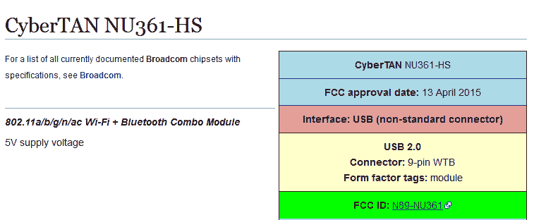

# 滚动您自己的 TiVo WiFi 适配器

> 原文：<https://hackaday.com/2020/10/14/rolling-your-own-tivo-wifi-adapter/>

唯一比发现 TiVo 最近真的推出了新的 4K 机顶盒更令人惊讶的事情是，他们不知何故没有费心在里面内置 WiFi。你不得不花 60 美元购买一个特殊的无线适配器来增加这个功能。我们会拿生活在过去的公司开玩笑，但坦率地说，这太容易了。

在 2020 年，只买一个这种昂贵的加密狗就够侮辱人的了，但是 TiVo super fan[xxbiohazrdx]需要四个。他们决定对适配器进行逆向工程，生产他们自己的低成本版本，而不是将近 250 美元交给那些长着触角的霸主。虽然最终的结果可能没有原来的那么苗条，但它的价格不到原来的 1/4。

假设 TiVo 只能与基于官方使用的相同 Broadcom BCM43569 芯片组的 WiFi 适配器对话，[xxbiohazrdxx]开始试图找到一个标准的 USB 加密狗，它可能是一个现成的替代品。不幸的是，看起来这种特殊的芯片几乎只用于专有应用，最常见的是作为智能电视内部的 WiFi 板。但事实证明，这并不一定是交易的破坏者。

 经过一番寻找，【xxbiohazrdxx】最终找到了很有前途的 CyberTAN NU361-HS 板。它不仅基于正确的芯片组，并运行在 5 伏，但它的 FCC ID 条目有一个完整的连接器引脚。这种特殊的 WiFi 模块用于许多廉价电视中，并且作为不到 10 美元的备件广泛提供。通过将电路板和 USB 分支 PCB 结合在一个 3D 打印的外壳中，你就获得了一个即插即用的 WiFi 适配器，TiVo 认为这是真正的交易。

曾经有一段时间，黑客日充斥着 TiVo 黑客，但现在距离运营商提供的廉价 DVR 吃掉公司的午餐已经过去了十多年。实际上，这篇文章很有可能是 2020 年唯一一次提到曾经强大的 DVR 登上头版。虽然 TiVo 的统治可能已经结束，但它作为首批 Linux 驱动的消费设备之一对[的影响将永远铭刻在黑客的历史上。](https://hackaday.com/2017/12/13/accident-forgiveness-comes-to-gplv2/)