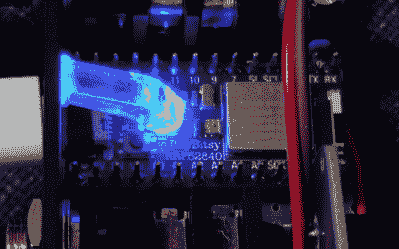

# 翻页踏板是相当老板

> 原文：<https://hackaday.com/2020/10/16/page-turning-pedal-is-pretty-boss/>

买东西让你的生活更轻松当然有治疗的乐趣，但是如果你真的想感觉良好，你必须尽可能自己动手做。[bjrn Brandal]碰巧有一个双开关 BOSS 踏板，[所以把它变成一个无线翻页器来阅读乐谱](https://hackaday.io/project/173185-ble-page-turner-control-pedal)是有意义的。

 正如[比约恩]所说，电路很简单——只需要两个 1/4”TRS 插孔和一个 ItsyBitsy  nRF52840 Express。插孔用来连接踏板输出到 ItsyBitsy，ItsyBitsy 通过 BLE 发送击键。

这个踏板很酷的一点是，它可以与一堆程序一起工作，像 forScore，Abelton Live，Garage Band 等等。通过按住两个踏板可以进入不同的模式，并通过闪烁的 LED 和蜂鸣声进行确认。

我们最喜欢的部分必须是 DIY 光导[bjrn ],它将 ItsyBitsy 的 RGB LED 弯曲 90 °,并将其指向外壳的前面。做得好！

除了电脑键盘什么都不玩？[把脚放在巨大的街机按钮后面的快捷键上](https://hackaday.com/2019/12/20/macro-foot-stool-helps-me-get-a-leg-up-on-work/)。