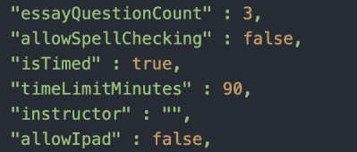

# 降低考试软件安全性的门槛

> 原文：<https://hackaday.com/2020/10/14/lowering-the-bar-for-exam-software-security/>

大多数标准化考试都是收费的:SAT 要 50 美元，GRE 要 200 美元，纽约律师考试要 250 美元。今年，对于法学院的应届毕业生来说，律师考试的代价要大得多——他们的隐私。

今年，许多现场活动不得不设法转移到互联网上，考试也不例外。我们认为在线考试应该没什么大不了的。现在是 2020 年。我们很好地掌握了安全和隐私应该如何工作，实现明智的反作弊功能应该不会太难。

这应该没什么大不了的，但对于一家软件公司来说，这确实是个大问题。

纽约州法律考试委员会(NY BOLE)和其他几个州考试委员会选择通过 ExamSoft 的 Examplify 来管理今年的律师考试。如果你错过了这个例子，在推特上关注纽约账户[文凭特权会让你很快赶上进度。从本质上来说，根据其用户的说法，Examplify 是一场彻头彻尾的灾难。先说一件二十年前就该解决的事。](https://twitter.com/dp4ny)

## 他们刚刚把我的密码电邮给我了吗？

密码以明文形式存储。说真的-这怎么还是一件事？[用户报告称，他们可以致电客户支持部门，不仅可以取回他们的用户名，还可以取回他们的密码。其他人的密码通过电子邮件发给了他们。如果客户支持代表能在电话里把你的密码读给你听，那你就真的有问题了。只需要一点社会工程学就可以让某人进入你的账户，如果你重复使用密码，那么你不相关的账户就很容易被攻破。(请使用密码管理器！)](https://twitter.com/BarExamTracker/status/1310980856513732612)

事实证明，你甚至不需要登录某人的账户来查看他们的个人信息。用户将政府 id 上传到他们的账户，这些 id 被迅速发送到服务器，并通过一个*随机 URL* 公开存储。值得注意的是，这似乎更像是纽约伯乐的一个缺点，而不是 ExamSoft。令人欣慰的是，一旦用户报告了这个问题，伯乐就修复了它——尽管它首先是一个问题的事实是荒谬的。更令人吃惊的是，纽约伯乐不是唯一一个有这种问题的考试委员会。DC 律师协会公布了用户的背景调查文件，除了他们的身份证之外，还包括社会安全号码和工作经历。

## 12345?太神奇了，我的行李上也有同样的组合！

Courtesy of [@milkbar$100](https://twitter.com/100Milkbar)

每个下载的考试都捆绑有一组配置文件，这些文件都是纯文本。令人困惑的是，这些文件中的参数，如“isTimed”和“allowSpellChecking”，似乎对软件没有什么影响。 [Examsoft 声称修改它们会破坏考试并使其无效](https://twitter.com/ExamSoft/status/1311320273166249985)，但事实似乎也并非如此。

该软件还会在考试开始前几天下载考试内容，这使得这些文件很容易被好奇的人发现和篡改。据 ExamSoft 称，这些文件至少用一个 18 字符的密钥进行了加密。在考试当天，密钥是公开的，考生可以用它来解密考试文件。这不是最好的策略，尤其是当密歇根律师考试不是像 ExamSoft 承诺的那样使用 18 个字符的密钥，而是使用密码 [green56、purple34 和 blue78 作为他们的考试文件](https://twitter.com/diplomaprivileg/status/1288180600843546624)。这些极其脆弱的密码可能容易受到暴力攻击。

Examplify 的主要卖点之一是其锁定电脑的能力。你不希望考生在谷歌上搜索任何东西，或者在第二台显示器上浏览课本的 PDF 文件。虽然一些更明显的作弊方式在这里被屏蔽了，但用户发现了一个被 ExamSoft 毫不奇怪地忽略了的漏洞。Mac 用户可能对通用剪贴板很熟悉，该功能启用后，用户可以在一台设备上复制一些内容，然后粘贴到与同一帐户关联的另一台设备上。你猜怎么着— [Examplify 没有禁用它](https://twitter.com/dp4ny/status/1310702476962803714)。这是一个有趣的漏洞，因为考生可以复制问题文本，朋友可以将其粘贴到 iPad 上，并复制教科书中的相关部分供考生阅读。目前还不清楚这个问题是否已经得到解决，但截至 9 月 28 日，该变通办法仍然可用。

用户也找到了其他创造性的方法来绕过软件锁定。据报道，如果计算机在考试中重启，用户可以不受限制地访问他们的文件和互联网大约 30 秒钟。一名用户甚至能够[重置计时器，并通过重启他们的计算机](https://twitter.com/dp4ny/status/1310671350781169670)重新开始考试。

你可以想象，不仅仅是安全问题很糟糕。用户报告了一系列界面问题，从[软件冻结期中考试](https://twitter.com/dp4ny/status/1311319634130460674)到面部跟踪软件(它可以通过看向屏幕来确定你是否作弊)[无法识别深色皮肤的人](https://venturebeat.com/2020/09/29/examsofts-remote-bar-exam-sparks-privacy-and-facial-recognition-concerns/)。

## 现在怎么办？

如果没有注册律师考试，很难深入到这些缺点的海洋中，但是我们能够找到 Examplify 安装程序的链接( [Windows](https://releases.examsoft.com/Examplify/Examplify_LATEST_win.exe) ， [macOS](https://releases.examsoft.com/Examplify/Examplify_LATEST_mac.dmg) )，安装在 ExamSoft 的服务器上，当然，是不受保护的。发疯吧。

令人印象深刻的是，随着现代技术的进步，我们已经找到了使考试比以往任何时候都更有压力的方法。完全取消律师资格考试和其他标准化考试或许值得考虑。目前，这些考试仍然是一个现实，这是不言而喻的，但我们还是要说:即使考试软件和纽约伯乐似乎让作弊变得很容易，请不要这样做。在所有这些失败中，他们至少在一个方面取得了成功。他们给了我们很好的例子，告诉我们如何不去做几乎所有的事情。

感谢[乔纳森·梅林]的提示！