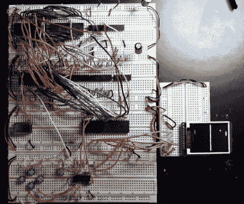

# 6502 上的手持式 Pong

> 原文：<https://hackaday.com/2020/10/15/handheld-pong-on-a-6502/>

早在 1975 年，在一个小到足以插入家用电视的设备中重现街机的轰动效应是一个相当大的技术挑战。当然，其中很大一部分是因为它需要足够便宜，消费者才会真正购买。但是，如果钱不是问题的话，由[Nick Bild]设计的 [Vectron 掌上电脑展示了一个基于 6502 CPU](https://github.com/nickbild/vectron_handheld) 和 7400 系列逻辑的专用 *Pong* 板可能会是什么样子。

Prototyping the Vectron Handheld

好吧，除了展示之外。虽然[Nick]确保尽可能使用与 6502 同时代的元件，但他还是加入了现代 SPI 液晶面板。毕竟，它应该是一个便携式游戏系统。

虽然正如你在休息后的视频中看到的，巨大的 273 毫米 x 221 毫米 PCB 只有*才符合这个描述。顺便说一句，没有技术上的原因让电路板这么大；[Nick]只是为了安全起见，因为他还在学习 KiCad。*

那些对 6502 项目有敏锐眼光的人可能看到了[尼克]去年组装的 Vectron 的[试验版](https://hackaday.com/2019/04/19/a-nearly-practical-6502-breadboard-computer/)。与原来的相比，手持设备的电路已经大大简化，因为它不是为通用 6502 计算机而设计的。你是否认为在它上面玩*乒乓球*可以弥补这些缺点，这是个人喜好的问题。

 [https://www.youtube.com/embed/bRN5SaRVa04?version=3&rel=1&showsearch=0&showinfo=1&iv_load_policy=1&fs=1&hl=en-US&autohide=2&wmode=transparent](https://www.youtube.com/embed/bRN5SaRVa04?version=3&rel=1&showsearch=0&showinfo=1&iv_load_policy=1&fs=1&hl=en-US&autohide=2&wmode=transparent)

