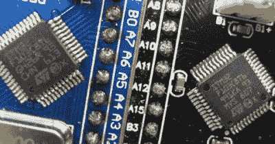
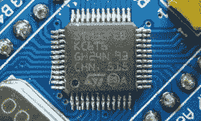
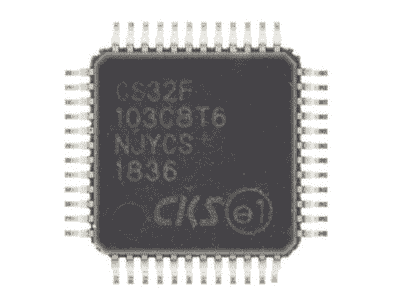
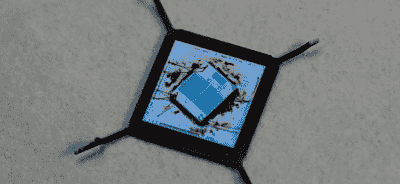
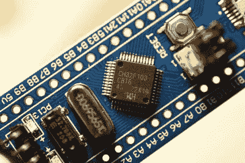
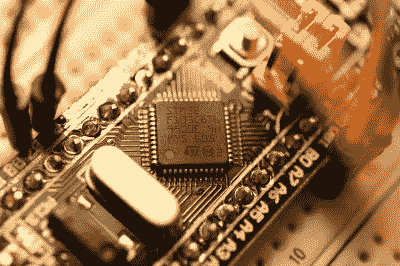

# STM32 克隆:好的、坏的和丑的

> 原文：<https://hackaday.com/2020/10/22/stm32-clones-the-good-the-bad-and-the-ugly/>

每当一种产品变得流行起来，其他公司开始感受到搭这种流行顺风车的冲动只是时间问题。这种现象是这些年来产生这么多可怕的玩具和电子游戏的主要原因。然而，它也推动了电子世界的发展。因此，ST 公司非常成功的基于 ARM 的微控制器系列(MCU)出现了模仿、克隆和彻头彻尾的赝品也就不足为奇了。

假货可能是最有问题的，因为这些芯片连 ic 封装上的标记都伪装成真正的 STM32 器件，而与它们伪装的器件的兼容性可能相差很大。对于带有自己标记的模仿品和克隆品，事情就有点模糊了，因为人们可以合理地假装，这些公司只是碰巧设计了与那些非常流行的竞争 MCU 设计完全引脚和寄存器兼容的 MCU。那将是最真诚的奉承。

让我们来看看周围都有哪些假货和仿制品，如果你最终拥有了一个，意味着什么。

## 对赝品的剖析

Good STM32 IC on the left, clone on the right, with extra dimples.

今年早些时候，Keir Fraser 在他们的 Github 上发布了一些在所谓的“蓝色药丸”和类似电路板上发现的假冒 STM 32 f 103 IC 的信息摘要。伪造品在包装上带有与 STM32 真品相同的标记，但通常可以通过包装上的凹痕图案或丝网印刷的质量来识别。

这些赝品并不总是功能齐全。正如 Fraser 所指出的，这些部件中的许多甚至不能被正确编程，甚至不能运行像通用的“blinky”例子那样简单的代码。有可能这些赝品实际上是有缺陷的 STM32F103 芯片或通过不合法渠道销售的类似产品。

The STM32FEB. STM32 it is not.

更阴险的可能是那些近似赝品，乍一看可能像真的零件，但它们上面的标识却出卖了它们:“STM32FEBKC6”。这不是一个合法的 ST 部分代码，这应该是第一个技巧。这是另一个可能只会给你带来悲伤的克隆，因为即使它真的工作，它也是 STM32F103 设计的精简版，缺少一些功能。找到详细的信息也很难。

## 好的艺术家临摹

CS32F103\. A more honest clone.

这留下了最棘手的克隆体，即前面提到的 CS32F103。这个克隆基本上像真的一样工作，可以很好地运行为 STM32F103 编译的 Blinky。这些 MCU 中的一些甚至可能被标记为 ST 部分，使得它们很难被最终识别。

其中一些由 CKS 制造(中科芯微)，一家中国公司，他们显然已经制作了 STM32F103 的功能完整版本，以至于他们已经修复了 ST 数据手册中列出的一些勘误表。CNXSoft 上的一篇[文章提供了关于这个 MCU 的更多细节。](https://www.cnx-software.com/2019/02/10/cs32-mcu-stm32-clone-bluepill-board/)

人们很快就会发现，这种芯片的一个主要区别在于对它进行编程和获取信息的时候。原因是 STM32F103 单片机报 ID `0x1ba01477`，迷惑了程序员。例如，在 OpenOCD 中，可以通过使用配置脚本来解决此问题，该脚本要么不指定 CPUTAPID (0)，要么指定由 CS32 MCU 报告的 ID。

## 千兆克隆

可能最著名的 STM32 克隆制造商之一是 GigaDevice 及其[GD32](https://www.cnx-software.com/2015/12/21/gigadevice-gd32-is-a-faster-software-and-pin-to-pin-stm32-compatible-cortex-m3-mcu/)MCU。正如在 [SMD Prutser](https://smdprutser.nl/blog/stm32f103-vs-gd32f103/) 的一篇系列文章中提到的，GD32F103 似乎是 STM32F103 的更快、更强大的版本。它具有更高的最大时钟速度和更快的闪存存储，其中[一个去封装单元](https://zeptobars.com/en/read/GD32F103CBT6-mcm-serial-flash-Giga-Devices) [显示](https://www.eevblog.com/forum/microcontrollers/cheap-bluepill-very-likely-it-has-fake-stm32-right/175/)他们在封装内使用了两个芯片。一个用于 MCU，一个用于闪存存储，允许在整个产品范围内以相当灵活的方式改变闪存大小。

Decapped GD32F103 MCU. The separate Flash die is visible on top.

乍一看，GD32 MCUs 比 STM32F1 系列更具吸引力，时钟速度(72 MHz 对 108 MHz)和闪存存储显著提高。虽然 GD32 上的闪存应该非常慢，但作为一个串行 SPI ROM，它使用 MCU 芯片上的 SRAM 来“缓存”闪存，这意味着它最终比片内闪存快得多，即使在 MCU 全速运行时也不需要等待状态。

更多 SRAM 而非纯闪存的缺点是会增加功耗，尤其是在睡眠模式下。当 SPI ROM 的内容在固件运行之前被复制到 SRAM 中时，它还会导致(小的)启动延迟。根据应用的不同，这可能是优点也可能是缺点。这当然与 ESP8266 MCU 的方法相同，它也使用外部 SPI ROM 进行固件。

然而，当谈到其他 GD32 设备时，他们似乎不太热衷于直接克隆。他们的 GDF303 MCU 保留了与 GDF103 相同的外设，尽管 STM32F3 的外设可能更好。这也禁止它们作为 STM32F3xx 板的嵌入式解决方案。根据个人对 STM32F1 外设的看法，这也可能会影响使用这些 GD32 MCUs 的决定。

## 他们无处不在

Genuine CH32F103 MCU on Blue Pill board.

虽然我知道上述的假货和克隆品，但我最近还是遇到了一个新的。这涉及从一家大型德国进口商和各种制造商 tat 的经销商处购买一些“蓝色药丸”STM32F103 板。我对此并不感到自豪，但我需要一些便宜的电路板用于黑魔法探针，他们做了一笔好交易。在亚马逊列表的评论中，一些人提到他们得到了一个真正的主板，而另一些人则提到这是一个“赝品”。

出于病态的好奇，我买了几块这样的板，当我看到我实际上收到的蓝色药片板并没有承诺的 STM32F103C8T6 MCU，而是一个标有 CH32F103C8T6 的药片板时，我既震惊又高兴。从好的方面来看，它并没有声称是一个“ST”部分。

Genuine STM32F103 MCU on Blue Pill board.

这款 CH32F103 MCU 由一家名为 WCH 的中国公司生产，[数据手册和](http://www.wch.cn/search?q=CH32F103&t=all)参考手册均提供下载。粗略看一下，数据手册和 manaul 显示的芯片实际上与 STM32F103 相同，具有相同的存储器映射和外设寄存器。

当使用 STM32F1xx profile 文件时，将其连接到 ST-Link/V2 加密狗并使用 OpenOCD 连接到它会导致与 CS32F103 MCU 相同的 CPUTAPID 错误。在按照其他人的建议对`stm32f1xx.cfg`文件做了同样的更改后，我能够将我的 [Nodate](https://github.com/MayaPosch/Nodate) STM32 项目中的‘Blinky’示例快速显示到板上，而没有进一步的问题。

这表明至少基本的 RCC(复位和时钟控制)、GPIO 和 SysTick 功能是相似的，足以让这样的基本测试工作。接下来，我将探索它是否也能像我在其他几块板上使用的 STM32F103 MCU 一样处理 USART、DMA、SPI、I2C 和 I2S 功能。如果这个 MCU 与 CS32F103 类似，答案可能是“是”。

当我就这些蓝色药丸板没有广告中的 STM32 部件联系卖方时，卖方的反应是，他们承认他们知道这一点，并声称“两个月后”他们将再次拥有使用真正 STM32 部件的板。不可否认，这提出了更多的问题，而不是答案，尤其是为什么他们会故意销售没有宣传的 MCU 的主板。

## 恐慌的时候到了？

我们当中有眼尖的可能已经注意到了，事实上这些克隆都涉及 ST 的第一代 Cortex-M MCU(STM 32 f 1 系列)。除非你需要为商业项目购买蓝色药丸板，否则这不太可能比严重惹恼爱好者和其他喜欢为随机项目准备一堆 3 美元的皮质-M3 板的人更多。如果从 Digikey 和 Mouser 等知名卖家处订购 MCU 和开发板，也不太可能有什么问题。

蓝色药丸和黑色药丸板最近也有了一点彻底的改变，更新版本采用了基于 STM32F4 的 MCU。虽然比基于 STM32F103 的同类产品贵一点，但它们确实带来了更多的资源和更令人愉快(在我看来)的 STM32F4 系列外设。这些可能会使 STM32F103 的市场和无数的克隆，假冒和拷贝枯竭。

直到第一批假冒、克隆、仿制的 STM32F401、STM32F411 单片机上市，自然。因为这显然是游戏的名字。