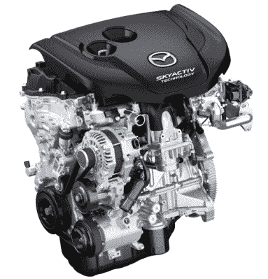
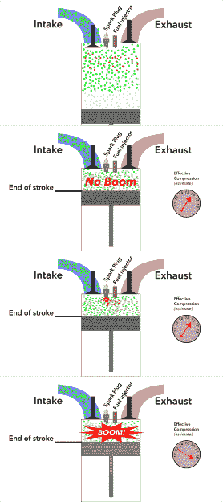
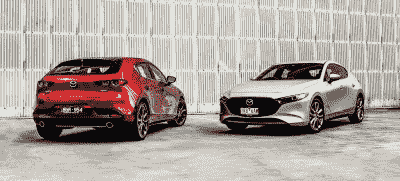

# 马自达通过 Skyactiv-X 大力投资先进的汽油技术

> 原文：<https://hackaday.com/2020/10/20/mazda-investing-big-in-advanced-gasoline-tech-with-skyactiv-x/>

作为一个概念，电动汽车曾经与飞行汽车没有什么不同。承诺在未来成为一件大事，但在此时此地却不切实际。然而，在过去的十年里，它们已经成为一个非常真实的事情，随着新型号带来更大的范围和更快的充电时间，市场份额逐年增长。

由于它们的排放更低，性能不断提高，人们认为传统内燃机已经寿终正寝是情有可原的。马自达不敢苟同——大力投资新技术，将汽油发动机带入下一个十年甚至更久。

## 两全其美

Mazda have offered diesel engines across their range in recent years. Image credit: Mazda

高效内燃机的圣杯不在于汽油，而在于柴油发动机。它们通常能达到超过 40%的热效率，相比之下，典型的汽车汽油发动机的热效率接近 20%。这一切都归结于柴油燃料的低挥发性。这使得柴油发动机能够在非常稀薄的空气/燃料比和令人难以置信的高压缩比下运行，而混合物不会过早爆炸和损坏发动机或浪费功率。这也使得压缩点火的使用成为可能，在这种情况下，气缸内上升的压力几乎瞬间点燃空气/燃料混合物。

相比之下，汽油发动机必须小心翼翼地保持更高的空气/燃料比，从 14:1 的化学计量水平，在某些情况下高达 9:1。这是为了确保燃料不会爆炸，而不是以可控的方式平稳燃烧。必须使用火花塞来启动点火，与压缩点火的瞬时性质相反，火焰前锋缓慢地穿过混合物。燃气发动机的压缩比也要低得多，实际上最大压缩比为 14:1。其他因素也发挥了作用，但混合物和压缩比是柴油在效率方面比汽油有优势的主要原因。

多年来，许多制造商试图让汽油发动机在压缩点火条件下运行。虽然一些制造商已经能够在低转速、低负荷条件下实现这一点。在较难驾驶的情况下，所需的较高压缩比只会导致空气/燃料混合物爆炸，损坏发动机。

## 极其复杂的解决方案

SPCCI combustion uses a spark plug to ignite a small region of rich fuel/air mix to raise the cylinder pressure high enough to push the rest of the mixture into compression ignition. Illustration: [Alex On Autos](https://www.youtube.com/watch?v=PT2Mt-tkJ_4)

尽管困难重重，马自达还是成功制造了一款名为 Skyactiv-X 的量产压燃式汽油发动机。与以往的尝试不同，它在一个创造性的黑客技术中包括了一个火花塞，他们称之为火花控制压燃式发动机，或称为 SPCCI，[正如 Alex 在汽车](https://www.youtube.com/watch?v=PT2Mt-tkJ_4)上的这段精彩视频中所解释的那样。

当在这种模式下运行时，发动机运行的空气燃料混合物非常稀薄，大约为 29:1-如此稀薄，即使发动机的高压缩比为 16:1 也不会导致混合物燃烧。当活塞到达压缩冲程的顶部时，少量额外的燃油被喷射到火花塞旁边。这种局部较浓的混合物被火花塞点燃，燃烧导致气缸内压力增加。这种增加的压力会导致混合物的其余部分经历压缩点火。其结果是，汽油发动机可以在比传统发动机更高的压缩比和更稀薄的空气燃料混合物下运行。目标比率非常低，以至于低压增压器被用作泵来向燃烧室提供更多的空气。

SPCCI 模式的效率令人难以置信，但当需要高功率时，以典型的火花点火模式运行发动机更有意义。然而，在压缩比为 16:1 的情况下，如果没有爆燃，这通常很难实现。然而，现代可变气门正时使得发动机能够在火花点火模式下运行时，在部分压缩冲程期间保持进气门打开。这降低了发动机的有效压缩比，使其下降到适合传统火花点火操作的点。这使得发动机能够在 SPCCI 和常规操作之间平稳过渡，这是其他制造商迄今未能实现的。

所有这一切都将使发动机在效率、功率和扭矩方面有所提高。马自达声称其燃油经济性比之前的发动机提高了 20%到 30%，扭矩增加了 30%。可悲的是，我们看到的数据并没有完全证实这一点。

看看实际的峰值数字，真实的数字似乎有点令人印象深刻。[将 2.0L Skyactiv-X 与之前的 2.0L Skyactiv-G](https://en.wikipedia.org/wiki/SkyActiv#Skyactiv-X) 进行比较，我们发现峰值扭矩仅增加 12%，峰值功率仅增加 14%。然而，这并没有考虑整个转速范围内的性能，在较低的转速范围内，扭矩增益可能会大得多。就燃油经济性而言，[一个 3 小时的真实世界测试](https://www.whichcar.com.au/reviews/comparisons/mazda3-skyactiv-x-v-mazda3-skyactiv-g-comparison)并没有显示出 Skyactiv-X 和以前的 Skyactiv-G 之间有很大的差异。考虑到 Skyactiv-X 也装有一个温和的混合动力系统，这是相当令人失望的。当技术稍微成熟一点的时候，我们想再看看这个比较，但至少可以说这是一个令人担忧的结果。

当然，马自达所取得的成就的复杂性不应被低估。生产一台可以在压缩点火模式和常规火花点火模式之间平稳转换的量产发动机需要一系列技术的结合，从先进的计算机发动机控制到直接喷射和可变气门正时。完成这样一个项目所需的研发投资是巨大的；没有其他汽车制造商实现这一壮举的事实应该表明掌握汽油压缩点火的难度。

## 这完全是为了投资回报

In a direct comparison, the new engine adds significant power and torque, but fuel economy gains haven’t been borne out in real world testing. Image: [Whichcar](https://www.whichcar.com.au/reviews/comparisons/mazda3-skyactiv-x-v-mazda3-skyactiv-g-comparison)

尽管在澳大利亚等一些独特的市场占据强势地位，但马自达仍是世界舞台上较小的汽车制造商之一。在生产的汽车中，它们仅排名世界第 17 位，[2017 年交付了 160 万辆汽车。](http://www.oica.net/wp-content/uploads/World-Ranking-of-Manufacturers-1.pdf)与许多其他制造商不同，它们不属于一个更大的财团，在由丰田、菲亚特-克莱斯勒和日产-雷诺-三菱等重量级企业主导的领域中，它们基本上是孤立的。这使得他们的成就更加令人惊讶，考虑到这位巨人所需的投资和可用的资源。

令人惊讶的是，马自达在汽油发动机的持续开发上投入了如此多的资源，许多人押注电动汽车将在未来几年不可阻挡地占据市场份额。像梅赛德斯这样的其他主要参与者已经采取行动终止汽油发动机的开发。除此之外，[随着一些城市寻求在未来几年完全禁止化石燃料汽车](https://hackaday.com/2019/11/20/brussels-looks-towards-banning-fossil-fuel-transportation-as-soon-as-2035/)，人们想知道马自达在未来十年将能够收回多少开发成本。[马自达自己的预测表明，到 2035 年](https://www.mazda.com/en/innovation/mazda-stories/engineers/skyactiv-x/)，汽油发动机仍将驱动 85%的汽车，但更重要的数字是汽油动力汽车占新销量的比例。BloombergNEF 的模型预计，到 2030 年，电动汽车将占据新车销量的 28%,因此马自达似乎还有足够的时间来赚钱。在该公司开始向电气技术转型时，它也是一个有用的补缺工具。

然而，如果 SPCCI 技术要在市场上做得好，就必须兑现其崇高的承诺。虽然这款新发动机的功率和扭矩肯定更大，但它还没有显示出燃油经济性的显著提高，而燃油经济性本应是它的主要优势之一。无论它有多新，多花哨，它都无法与全电动汽车在闪亮、未来的领域竞争。[类似于马自达在 20 世纪 90 年代对米勒循环发动机的实验](https://www.wardsauto.com/news-analysis/mazda-23l-miller-cycle-dohc-v-6)，我们怀疑这可能是一个有趣的现象，而不是改变汽油发动机的游戏规则。一如既往，时间会证明一切。