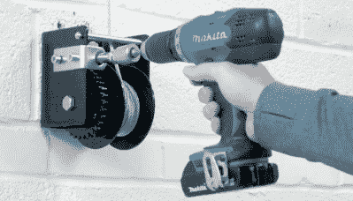

# 利用临时搭建的自行车起重机节省地面空间

> 原文：<https://hackaday.com/2020/10/16/saving-floor-space-with-a-scratch-built-bike-hoist/>

在车库或车间里，垂直储物空间往往没有得到充分利用，因为很难将笨重的物品安全地从地板上拿下来。于是我们在墙上贴了几个架子，在上面放了一箱箱的螺丝和元器件，收工了。与此同时，你最终会玩一个水平的俄罗斯方块游戏，所有的大东西都在地上。

为了腾出车库的一些地面空间， [[Chris Chimienti]最近决定设计并制造自己的起重机，将自行车吊离地面](https://www.thingiverse.com/thing:4616823)。虽然他的设计显然是为自行车而设计的，但核心概念可能适合提升你最近在车库地板上踢来踢去的东西；假设它对突然翻倒没有任何强烈的感觉。

A simple modification allows for operation with a drill.

在开始实际建造之前，[Chris]在 SolidWorks 中拼凑了一个他车库的粗略复制品，并开始试验起重机最终将使用的布局和机制。虽然我们都有全速完成一个项目的欲望，但这种更有条理的方法在处理复杂的项目时肯定能为你节省时间和金钱。在 CAD 中重新设计一个组件，尝试一种不同的方式，总是比真正去做更快更容易。

我们已经习惯于看到项目包括传感器、微控制器和 3D 打印组件，这是理所当然的，但[Chris]将这种构建保持在相对低的技术水平。当涉及到沉重的开销时，我们并不责怪他。尽管如此，为了安全起见，他还是不得不做了一些调整:他原来的棘轮绞盘可以在负载下空转，所以他换成了用电钻操作的蜗轮版本。

如果你喜欢有一个架空储物区的想法，但不一定想看它，[你可以用攀岩墙](https://hackaday.com/2015/02/14/rock-climbing-wall-installed-in-garage-doubles-as-storage-space/)把它遮住。

 [https://www.youtube.com/embed/96dkFKFrzj0?version=3&rel=1&showsearch=0&showinfo=1&iv_load_policy=1&fs=1&hl=en-US&autohide=2&wmode=transparent](https://www.youtube.com/embed/96dkFKFrzj0?version=3&rel=1&showsearch=0&showinfo=1&iv_load_policy=1&fs=1&hl=en-US&autohide=2&wmode=transparent)

