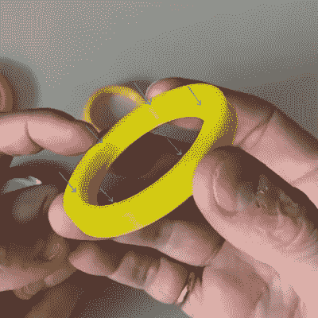

# 向 3D 打印零件添加挤压肋，以实现更好的压配合

> 原文：<https://hackaday.com/2020/10/15/adding-crush-ribs-to-3d-printed-parts-for-a-better-press-fit/>

[Dan Royer]分享了一个关于如何在 3D 打印零件和其他硬件(例如轴承)之间获得可靠紧密配合的技巧。)[他建议使用挤压筋](https://www.marginallyclever.com/2020/09/have-you-heard-of-crush-ribs/)，这是一种从注射成型领域借鉴来的可靠解决方案，并考虑到 3D 打印而重新加以利用。在我们解释解决方案之前，让我们先更仔细地看一下这个问题。

假设有人希望将轴承压入孔中。如果那个洞的大小不合适，轴承就不会被紧紧地固定住。如果孔有点太大，则轴承松动。太小了，轴承根本装不进去。由于 0.1 毫米的差异会对合身程度产生显著影响，因此保持正确非常重要。

Crush rib locations highlighted with blue arrows.

对于 3D 打印的物体来说，一个直径为 20 mm(例如)的孔在打印时会略有不同。解决这个问题的通常方法是调整打印机设置或修改对象，直到找到产生正确结果的神奇组合，也称为[金发女孩方法](https://hackaday.com/2020/06/09/finding-perfect-part-fits-with-the-goldilocks-approach-and-openscad/)。然而，这意味着 3D 模型只能在特定的打印机上打印出来，这对于旨在共享的设计来说是一个问题。由于[Dan]研究的是具有 3D 打印元件的机器人，找到解决这个问题的方法就显得尤为重要。

他从注射成型领域借鉴的解决方案是使用[挤压肋](https://www.protolabs.com/resources/design-tips/adding-crush-ribs-to-molded-parts/)，这可以被认为是一组非常小的支座，当一个零件被压入其中时会变形。它不是与孔的整个内表面接触，而是只与挤压肋接触。将零件压入挤压筋比试图使整个配合面完全正确要容易得多(也更宽容)。

以这种方式使用挤压筋有点不靠谱，因为它们在注射成型中的最初目的有些不同。注射成型零件的壁很少是真正平坦的，因为这使得它们更难从模具中排出。因此，曲面会略微倾斜，这称为拔模斜度。这个微小的角度意味着压配零件会成为一个问题，因为任何注塑孔都会有倾斜的侧面。解决方案是挤压肋，与墙壁不同的是，它是直的。这些肋足够小，不会有粘在模具中的问题，并提供了压配合五金件所需的配合面。[Dan]有一个关于将这种技术应用于 3D 打印物体的简短视频，嵌入在下面。

 [https://www.youtube.com/embed/0h6dCeATkrU?version=3&rel=1&showsearch=0&showinfo=1&iv_load_policy=1&fs=1&hl=en-US&autohide=2&wmode=transparent](https://www.youtube.com/embed/0h6dCeATkrU?version=3&rel=1&showsearch=0&showinfo=1&iv_load_policy=1&fs=1&hl=en-US&autohide=2&wmode=transparent)

围绕制造方法的局限性进行设计是获得良好结果的关键，一个领域的技术可以与另一个领域交叉授粉，正如他们在这里所做的那样。无论你只是好奇，还是[尝试像热熔胶注射成型](https://hackaday.com/2019/06/11/injection-molding-with-a-hot-glue-gun/)这样的东西，花一点时间[了解更多关于注射成型及其设计考虑](https://hackaday.com/2020/04/19/gain-an-understanding-of-injection-moldings-design-gotchas/)是值得的，因为它是推动世界前进的技术之一。