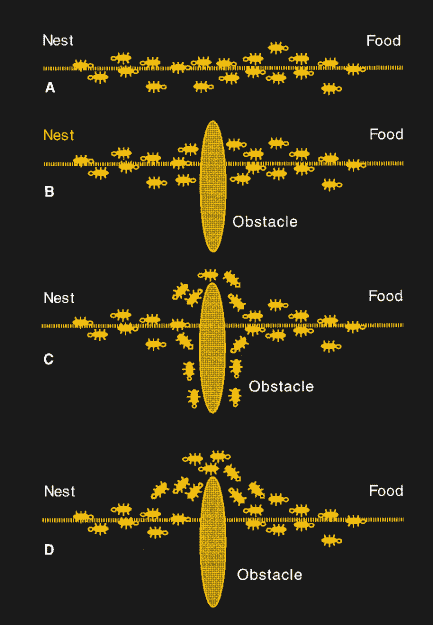

# 尝试解决旅行推销员问题

> 原文：<https://hackaday.com/2020/10/21/taking-a-crack-at-the-traveling-salesman-problem/>

人类的大脑是一个路径规划向导。回想一下封锁前的日子，那时我们都要背靠背地跑腿。在你的后脑勺总会有一个心理舞蹈，让你明白你是如何计划这一天的。可能是这样的“先去银行，然后去干洗。既然邮局在去杂货店的路上，我就顺便去把那个在后备箱里放了一个星期的盒子寄了。”

这种智力体操对机器来说并不是天生的——它实际上是计算机科学中一个著名的问题，被称为[旅行推销员](https://en.wikipedia.org/wiki/Travelling_salesman_problem)问题。虽然它在业内被归类为组合优化中的 NP-hard 问题，但一个更简洁、更容易理解的定义应该是:给定一个目的地列表，访问每个位置的最佳往返路线是什么？

今年夏天，有消息称长达 44 年的解决该问题的记录被打破了。让我们来看看为什么这是一个难题，以及华盛顿大学的研究团队如何采取不同的方法来实现加速。

## 从这里到那里的科学

旅行商问题(或简称 TSP)是计算机科学中研究最多的问题之一。早在 19 世纪，数学家 W.R .汉密尔顿和托马斯·柯克曼就首次考虑到了这一点。不管你怎么想，除了智能手机上的 GPS 导航系统，它实际上还有其他应用。可以被建模为 TSP 的内容包括从 ASICs 的布局、校车路线计划、为 PCB 钻孔的顺序到 DNA 测序的一切。点与点之间的“距离”可能意味着基因之间的物理距离或相似性。

20 世纪 30 年代，卡尔·门格尔，一位出生于奥地利的数学家，同时也是哈佛大学和莱斯大学的客座教授，考虑了简单考虑每一条可能路线的强力解决方案。这种方法很快变得非常困难，因为仅仅 15 个不同的位置就要计算 1，307，674，368，000 条不同的路线(这是 15 的阶乘)。可以想象，扩展到成百上千个不同的目的地很快变得不可计算。大约 60 个不同的目的地产生了大约与宇宙中估计粒子数量相同的可能路径。于是一个经典的计算挑战诞生了。

TSP 有几种不同的版本，例如公制、欧几里德、非对称和更多特定于域的约束，例如除了距离本身之外还增加了行驶不同路线的成本。这导致了一般和非一般 TSP 之间的区别。

## 我们独特的才能

奇怪的是，人类实际上非常擅长解决欧几里得版本的问题。即使在有超过 120 个目的地的情况下，人类也可以在接近线性的时间内达成近乎完美的解决方案。我们可以轻而易举地完成这一壮举，这吸引了一些认知心理学家，并引发了数十项关于这一主题的研究和论文。事实上，这种相同的能力已经在鸽子和变形细菌中表现出来。

目前的假设是，人类有几种启发法或捷径，使他们非常擅长满足——这个术语是由[司马贺](https://en.wikipedia.org/wiki/Herbert_A._Simon "Herbert A. Simon")创造的，简单地说就是达成一个“足够好”的决定。计算机做的大部分事情是计算一个具体的、可验证的答案。它是正确的或不正确的，没有中间的空间。在当前环境下，得出完美的解决方案比定义什么是足够好要容易得多。

## 近似解

在这种情况下，计算机科学家在过去的半个世纪里一直在改进和应用新的技术和近似方法，计算机可以用它们来猜测更好的解决方案。动态规划等技术能够将路线数量计算到 n ² 2 ^n 或 15 个目的地的 7372800 条可能路线，远远低于一万亿条。[分支定界算法](https://en.wikipedia.org/wiki/Branch_and_bound)能够得到更低的值，但是到目前为止，还没有证明存在评估少于 2 条 ^(n 条)路线的完美算法。

Modeling ant colonies, which use pheromone trails to build consensus for shortest path, was [proposed in this paper published in 1997](https://doi.org/10.1016/S0303-2647(97)01708-5).

这对于较大的数据集来说仍然是不合理的，因此需要求解近似解而不是完美解。诸如最近邻(Nearest Neighbor)之类的启发式算法，它只是简单地去最近的没有被访问过的目的地，使用马尔可夫链的随机搜索，甚至[模拟蚁群](https://jtp.io/aco-tsp/)都是用来产生近似解的解。然而，即使是这些算法中最好的算法也只能保证它们的解至多比完美解长 50%。

## 极小的改进比表面价值更有价值

虽然我们已经看到硬件在[定制加速器](https://hackaday.com/?p=442311&preview=true&preview_id=442311)和[纯粹数量的内核](http://www.math.uwaterloo.ca/tsp/sweden/compute/compute.htm)中被扔向 TSP，但还没有任何算法能够打破这一 50%的数字。直到[最近由安娜·卡林、内森·克莱恩和沙扬·加兰发表的预印本论文](https://www.quantamagazine.org/computer-scientists-break-traveling-salesperson-record-20201008/)讲述了一种新技术，它为 TSP 的公制版本提供了一点改进。这一改进只是将 50%的数字减少了 10 个 ^(-34 个)。这可能看起来不多，你可以说它是如此之小，以至于除了最大的数据集之外，它都无关紧要。

然而，关键是数学证明了改进是可能的。过去 44 年的记录已经被打破，论文的作者希望它能激励其他人。类似的突破发生在 2011 年，当时 TSP 的图形化案例有了小小的改进。这个小小的改进启发了其他研究人员，他们开发了重新设计的算法。开始时只是一个简单的增加，最终导致突破了 50%的障碍，一直到图形情况下的 40%。

这里的要点是问题是可以解决的。即使是那些看起来你已经达到极限而无法解决的问题。很高兴发现 44 岁的问题仍然得到一些关注，随着新的眼睛发现意想不到的方法，推动了艺术的发展。