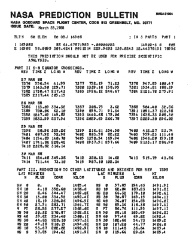
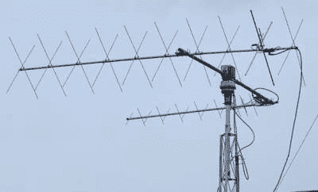
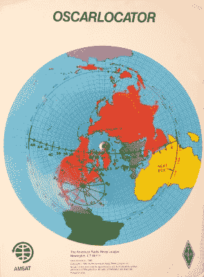
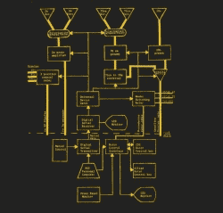
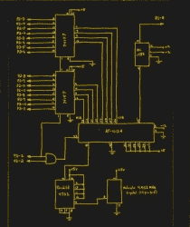
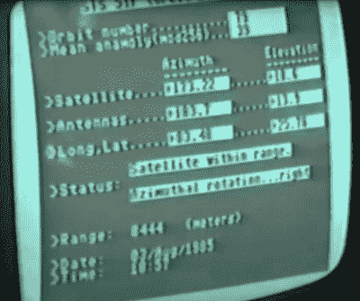
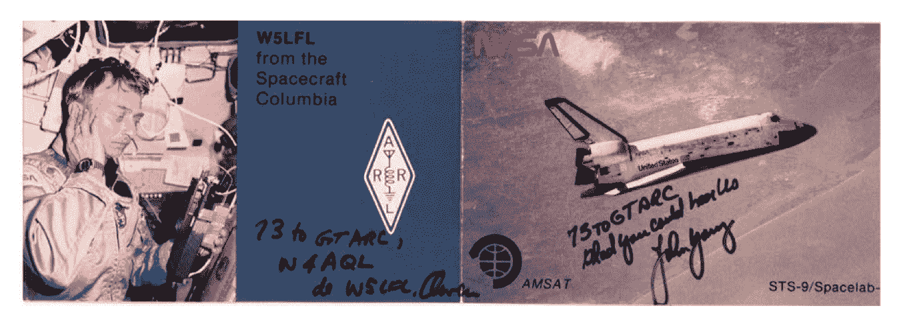

# 用准将宠物追踪卫星

> 原文：<https://hackaday.com/2020/10/29/tracking-satellites-with-a-commodore-pet/>

汤姆·纳尔迪最近写了一篇关于使用基于 6502 的 NES 跟踪卫星的文章，这让我想起了 80 年代初我在佐治亚理工学院的高级项目。在我们的俱乐部电台 [W4AQL](https://w4aql.gtorg.gatech.edu) ，我对业余无线电卫星产生了兴趣。听到你的信号从太空返回，随着它在头顶加速调整多普勒，保持天线指向，同时与其他地球站进行简短的对话或复制航天器遥测数据，通常是用莫尔斯码，这是一件非常激动人心的事情。

## 手动方式



Example of NASA Prediction Bulletin, courtesy of Dr. T.S. Kelso

在互联网出现之前的日子里，实现这一点是相当困难的。首先，你需要每颗卫星的轨道数据。这是通过注册美国宇航局戈达德太空飞行中心的真实纸质邮件列表获得的。一个信封每周邮寄两次，里面有一叠你所要求的美国宇航局卫星预测公告。这些包含了轨道参数，即所谓的[双线元素(TLE)集合格式](https://en.wikipedia.org/wiki/Two-line_element_set)，你必须输入到你的计算机中进行处理。当我们与航天飞机通信时，我们会通过电话或传真从 NASA 内部的人那里获得初步和后来的实际 TLE 数据。

与地球静止通信卫星不同，业余无线电卫星通常是在极地轨道上发射的，完成地球的一周需要 90 到 120 分钟。为了通过这些卫星之一进行通信，首先我们需要知道某一特定卫星何时会经过亚特兰大上空。

为了解决这个问题，我在校园的大型计算机上写了一个 Fortran 程序，这是一台 CDC Cyber 74，是当时真正的计算怪兽。这个程序传播由 TLE 数据给出的状态向量，并产生一个飞越亚特兰大的轨道列表。这些通过的特征是最大高度、通过的持续时间、AOS 和 LOS(信号捕获/丢失)时间以及最近接近的距离。我们人类会进一步过滤这个列表，忽略非常短的通行证或在我们睡觉或上课时发生的通行证——毕竟，我们在 GA Tech 的原因是努力学习，学到很多东西，并获得学位毕业。

```
Object                  Orbital altitude  Inclination  Orbital period
======================  ================  ===========  ==============
Oscar 8                  900 km circular  99 degrees   103 minutes
Radio Sputnik 5,6,7,8   1600 km circular  83 degrees   120 minutes
Space Shuttle STS-9      250 km circular  57 degrees    90 minutes
Space Shuttle STS-51F    315 km circular  50 degrees    91 minutes
```

当时的卫星有两种流行的模式。对于大多数 ham 来说，模式 A 最容易使用，上行链路在 2 m 波段，下行链路在 10 m 波段。模式 J 也使用 2 m 上行链路，但下行链路在 70 cm 波段。典型的业余无线电爱好者卫星站将使用静止的水平环形天线进行 10 米的接收。2 米和 70 厘米的天线通常是八木天线，安装在普通的可旋转仰角吊杆上，吊杆本身安装在可以旋转方位角的垂直桅杆上。十米接收很简单，不需要移动天线。然而，操纵八木天线是一项艰巨的任务。



Typical steerable Yagi Antenna Array, courtesy of Gloucester County ARC, W2MMD

选定了合适的轨道后，下一步我们必须让那些八木卫星沿着卫星的轨迹前进。在业余卫星站，这是一个完全开环的过程。你计算出卫星在某一时刻的位置，然后驱动天线到达空间中的那个点。如果你还记得在有线电视和流媒体出现之前，老式的家庭可控电视天线，在火腿小屋中的排列非常相似。每个转子都有一个转子控制箱，有一个模拟仪表指示方向，当然，现代的是数字的。这些控制箱通常有三个转向按钮:左、右和刹车释放。

为了跟踪卫星，我们有几种可用的技术。一种方法是将卫星的地面轨迹和足迹用图形叠加在地球的极投影图上。通过旋转地面轨道覆盖图，使其与轨道参数给出的轨道位置相匹配，该轨道参数具有最冷的名称[上升交点](https://en.wikipedia.org/wiki/Longitude_of_the_ascending_node)的赤经，我们可以直观地看到卫星在我们站上方的路径。地面路径覆盖图具有时间刻度线，覆盖区覆盖图具有方位线和高程环。这种粗糙的图形技术在我们天线的宽波束内提供了跟踪卫星所需的基本信息。我们还必须保持我们的时钟与 WWV 或 WWVH 同步——那时候没有网络时间协议。



Oscarlocator from the author’s personal collection.

第二种技术更精确，但需要穿越校园。使用另一个 Fortran 程序，我可以打印出一个所需轨道的时间、方位角和仰角的表格。操作员不必从图形叠加中插入角度:数字清楚地显示在计算机打印纸上。然而，从校园计算机中获取这些数据并不简单。通常我会去校园对面的计算机中心大楼，在终端上登录我的账户，然后手工输入数据。在执行时，程序会生成打印输出。

然后，我不得不在输出柜台前等待操作员将打印出来的文件分发给我们这些没有耐心的用户。当俱乐部获得一台带有内置声音调制解调器的便携式打印终端时，我们感到非常幸运。这意味着我们可以拨入主机，远程运行程序，并立即获得我们的轨道时间表和跟踪表，而无需穿越校园——以 300 波特的惊人速度！

虽然所有这些计划都在我们的掌握之中，但这需要相当多的努力和预先计划。虽然一个单独的操作员可以与卫星通信，但两个人更好——一个人操作无线电，另一个人操纵天线。我想起了这一时期的两件事，这两件事促使我考虑一个计算机控制的项目。首先，我们从一位 EE 教授那里继承了两台 Commodore 宠物电脑。其次，我们有一个正在进行的问题，从我们位于地下室一层的小屋控制 5 楼屋顶上的设备。只是没有足够的电线来做我们想要的所有事情，即使是正常的高频操作，更不用说卫星跟踪了。

## 彼得准将来营救了

我们拥有的 [Commodore 宠物电脑](https://en.wikipedia.org/wiki/Commodore_PET)是从它们的标准工厂条件改造而来的。他们有全尺寸的外部键盘，所以你不必使用 Chiclet 键。内部存储器已经升级到 32K 内存。我 1983 年的报告说，这种扩展存储卡还有两个通用的 8 位 TTL 输出寄存器，用于与外界通话。

[](https://hackaday.com/wp-content/uploads/2020/10/block-diagram_had.jpg)

如图所示，宠物计算机与两个设备对话——转子控制接口选择并操作转子盒，数字串行发射器，本质上只是一个 UART，它将数据串行发送到屋顶，以远程控制各种设备。旋翼控制很有趣，因为我们在小屋和屋顶之间只有一根旋翼控制电缆。我不得不在继电器之外实现 8P3T 开关，并在转子之间复用电缆。这意味着一次只能有一个转子旋转，但这对于我们的目的来说并不是一个严格的限制。

除了旋转器控制信号多路复用之外，屋顶上还有相当多的辅助设备需要远程控制。如图所示，我们使用 RF 同轴继电器来切换 VHF/UHF 天线极化，并在 10 米和 70 厘米下行链路信号路径之间切换。此外，还有前置放大器、下变频器和功率放大器需要开关。除了转子多路复用，大多数都是在卫星通过期间的静态设置，尽管 PET 完全控制这个接口上的一切。 [](https://hackaday.com/wp-content/uploads/2020/10/pet-interface-serial-xmt_had.jpg) 我们做了一个 UART 接口，连接到宠物的一个 TTL 输出寄存器，将这个控制数据串行发送到车顶进行控制。我手绘了所有的原理图并手工贴上了 PCB 原图——当时没有 KiCad。

我很快发现了一个问题，宠物控制所有这些屋顶设备，这与卫星操作完全无关。这只宠物不是全天候运行的，而且从盒式磁带启动和加载速度很慢。只需要控制屋顶继电器进行高频操作的操作员不想等 10 多分钟来启动宠物。事实上，他们对此颇有微词。所以我加了一个手动控制面板来绕过宠物。这些年来，这一理念让我受益匪浅——计算机控制很好，但有时你需要手动控制，哪怕只是为了测试。

## 我们不需要闭环

这个设置仍然有一个问题——你可能已经注意到没有反馈。有一种方法可以让宠物读取信号，但是尽管我们尝试了各种方法，但在我们有限的预算和有限的机械技能范围内，我们无法获得足够稳定的反馈。具有集成反馈信号的方位转子是最容易监控的。但我们使用的仰角转子没有任何这样的反馈。

我们试了一根底部有铅块的长杆，连接在电位计上。当吊杆在高度上上下旋转时，杆总是指向下方。理论上的好主意，实际上并不奏效。我们短暂地玩了一下同步马达，它真的很酷。转动一个马达的轴，房间对面的另一个马达也转动相同的量，只通过几根电线连接。但即使是这几根电线对我们特殊的装置来说也太多了。

最后，我得出结论，对于感兴趣的卫星和涉及的天线波束宽度，运行天线旋转控制开环是可行的。可以肯定的是，在传球前程序性地检查对准会造成很多麻烦，但是一旦传球开始，它就会按预期工作。我不断调整天线旋转的计算机模型，包括数学模型和常数，如空载时间、旋转速度、加速度等。这是一个粗糙的解决方案，但它在我们有限的预算内完成了工作。

#### 旁白:天顶交叉和三轴安装

你可能认为卫星直接从头顶飞过是完美的——它尽可能地靠近你的空间站。嗯，那不一定好。问题是，当卫星从头顶掠过，仰角接近 90 度时，方位转子将突然以令人难以置信的速度旋转，以保持指向。有一些方法可以减轻这种情况——一种方法是接受一些指向误差，并在天顶周围的一个小圆圈内操纵天线——这个圆圈的直径由卫星的速度和转子的最大速度决定。

更好的解决方案是增加第三个旋转轴，但这在机械上很复杂。两个转子位于卫星经过之前，使得连接到第三个转子的天线杆垂直于轨道平面。这样，在卫星通过期间，仅使用第三个转子，其他两个转子保持固定。

## 奥斯卡在哪里？

为宠物提供与现实世界的接口只是成功的一半。我仍然需要一种方法来计算卫星的位置。虽然在小屋里有一台电脑很棒，但宠物电脑的功能比校园主机弱几千倍。没有图形用户界面，没有跟踪地球的地图，只是在基于文本的状态屏幕上更新数据字段。



Satellite Tracking Screen, courtesy of Sherman Banks.

然而，我记得软件开发中的一个主要问题。那些日子，社区里流传着几个跟踪卫星的程序，我把其中一个流行的程序输入到宠物里。我联系了这个项目的作者，让他了解我的学校项目，并获得他的许可。

但令我惊讶的是，他回答“不行，你不能用我的软件”。对于一个不知道自己局限性的年轻大学生来说，这只是一个小小的挫折——我去了 GA Tech 图书馆，查阅了几本关于轨道力学的书籍，并编写了自己的算法。令人惊讶的是，轨道物体的基本开普勒定律和方程并不难理解和计算。唉，当你求解天线指向卫星的角度时，会得出一个超越方程。在大型机上解决这个问题需要几毫秒，但在宠物机上却慢得令人痛苦。在接下来的一个多月里，我整个周末都呆在家里编程，对富含咖啡因的健怡可乐上瘾了一辈子，并开发了一个工作程序。

## 升级

屋顶设备的手动控制不直观。您实际上是在 UART 中切换地址和数据位。当然，这本来是可以改进的，但我们中的一些人开始质疑最初的“没有更多的电线可以布线到屋顶”的约束。事实证明，只要稍加努力，这确实是可能的。一根更大的信号电缆被拉到屋顶，一个改进的接口面板被制作出来。此外，宠物也显示出它的年龄，所以我们升级到 Commodore C64——带软盘存储。我做了一个新的，更小的转子控制接口，连接到 C64 的用户端口，并通过继电器控制转子。

## 成功的操作

这个系统虽然有点挑剔，但确实在几年内为我们提供了很好的服务。我们不仅能够通过业余无线电卫星进行交流，而且非常自豪地联系到了根据一个名为 [SAREX](https://en.wikipedia.org/wiki/Shuttle_Amateur_Radio_Experiment) 的新计划被允许从航天飞机上操作的前两名宇航员。1983 年 11 月，欧文·加略特博士(W5LFL)在哥伦比亚号的 STS-9 任务上听了我们的演讲，这是由我们自己的 GA Tech 校友约翰·扬博士驾驶的。我们也为我们最近的俱乐部校友感到骄傲，他是摩托罗拉团队中的一员，设计并制造了加略特博士使用的定制收音机。

[](https://hackaday.com/wp-content/uploads/2020/10/w5lfl-qsl-card.png)

QSL Card from Owen Garriott W5LFL, courtesy of Sherman Banks.

1985 年 8 月，我们再次就挑战者号的 STS-51F 空间实验室任务联系了托尼·英格兰博士。你可以在下面的链接中看到这些努力的视频。

*   [YouTube:从 STS-51F 接收 SSTV](https://www.youtube.com/watch?v=41y2ITIS8AE)
*   [YouTube:试图联系 STS-51F](https://www.youtube.com/watch?v=HtvRJ1HLFqI)
*   [YouTube:与 STS-51F 成功双向联系](https://www.youtube.com/watch?v=gYGe8jiI-II)

## 未来？

去年，我挑战自己，做了一个这个项目的微缩版，放在一个 Altoids 罐子里。它现在被搁置了，直到我能找到原始软件的拷贝。敬请关注…

## 包扎

在我毕业几年后，我工作的公司慷慨地让我制造和销售这种基于 C64 的跟踪系统，命名为 Satellite AutoTracker。那是以后的事了。

这个项目对我的影响怎么强调都不为过。通过卫星与另一家广播电台对话的行为汇集了如此多的工程和科学学科，从轨道和多普勒频移的物理学到学习制造印刷电路板的微小细节，再到让它们一起发挥作用的整体系统工程努力。每一个都很有趣，但当它们成功地融合在一起并发挥作用时，就非常棒了。

我从这个项目中学到了很多，但它看起来不像是学习，因为它太有趣了。伙计们，这是最好的学习方法。