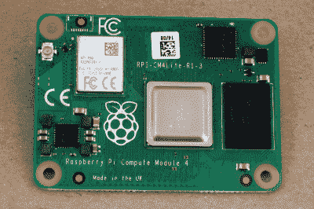
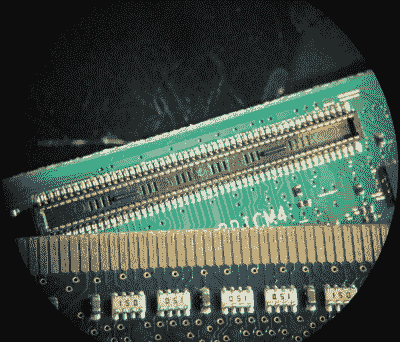
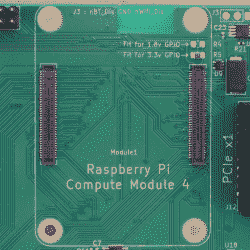
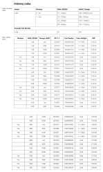
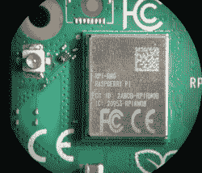
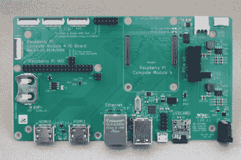
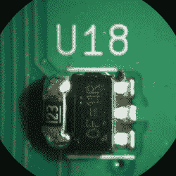

# 新的树莓 Pi 4 计算模块:再见，你好，PCIe！

> 原文：<https://hackaday.com/2020/10/19/new-raspberry-pi-4-compute-module-so-long-so-dimm-hello-pcie/>

全新的 [Raspberry Pi 计算模块 4](https://www.raspberrypi.org/products/compute-module-4/?variant=raspberry-pi-cm4001000&resellerType=home) (CM4)刚刚发布！惊讶吗？不，我们也不是——树莓基金会[已经暗示它将为 4 系列发布一个计算模块](https://iot-industrial-devices.com/upcoming-raspberry-pi-compute-module-4-possible-release-date/)很久了。

外形得到了彻底的改进，但这个小东西的变化比第一眼看到的要大，我们将带您了解其中的大部分。最大的好处是 PCIe 和 NVMe 的简单实现，使得数据进出固态硬盘的速度快得离谱。结合可选的 WiFi/蓝牙和设计简单的千兆以太网，CM4 是一个连接怪物。

超快速家庭 NAS 是一个经典的希望用 Pi 构建它的项目。CM4 让这一切最终成为可能。

 如果你不知道计算模块，它们是你可能认为的树莓派的精简版，官方称为“B 型”外形。针对商业应用，计算模块缺乏其大型兄弟姐妹的许多物质享受，但他们在设计上以灵活性为代价，并允许一些额外的功能。

计算模块对初学者来说并不友好，但我们对 Raspberry 团队能够让中级黑客访问这个模块的程度印象深刻。这主要归功于今天发布的 IO 分线板的开放式设计。使用完全开放的 KiCAD 设计文件，如果您可以编辑和订购 PCB，然后对邮件中的内容进行回流焊接，您就可以为 CM4 进行设计。好处是一个更轻、更便宜、但更具可定制性的平台，将 Raspberry Pi 4 的功能打包到一个 40 mm x 55 mm 的薄型封装中。

因此，让我们看看有什么新功能，然后稍微了解一下将计算模块整合到您自己的设计中需要做些什么。

## 再见，再见，DIMM

CM4 最令人震惊的是新的连接器。自从第一代 Raspberry Pi 有了计算模块之后，他们就有了 200 针的 SO-DIMM 连接器，就像笔记本电脑的 DDR2 内存板一样。CM4 改变了这一状况，选择了两个高速、高密度的 100 针夹层连接器。打破传统是痛苦的，我们知道你们中的一些人会留下一个满是 SO-DIMM 插座的壁橱，但他们这样做是有充分理由的。

Pi 4 家族使用的片上系统(SOC)，Broadcom BCM2711，[为聚会带来了更多的外围能力](https://datasheets.raspberrypi.org/bcm2711/bcm2711-peripherals.pdf) (PDF)。因此，Pi 4 Model B 增加了第二个 HDMI 连接器、USB 3.0 和千兆以太网。但是它能做的更多！例如，没过多久，有事业心的黑客就意识到 USB 3.0 在 PCIe 的一辆公交车上，于是[用 USB 3.0 替换了 PCIe 的](https://hackaday.com/2019/07/10/giving-the-pi-4-pci-express/)。这是可行的，但很困难，需要一些复杂的板上返工。

计算模块的存在是为了让设计人员能够轻松使用 SOC 的所有功能。将 PCIe 与双 HDMI 和其他高速外设一起打包到旧的 SO-DIMM 连接器中是不可能的，这是今年夏天 Raspberry 工程师暗示的。因此有了新的连接器: **Hirose DF40C-100DS-0.4V** 如果你已经开始对电路板设计感兴趣的话。

CM4 设计用两个夹层连接器取代了一个 SO-DIMM，实现了低速和高速外设的完美分离。一面有传统的树莓 Pi GPIOs，电源，SD 卡接口，以太网。另一方面负责 PCIe，USB，HDMI，MIPI CSI 相机和 DSI 显示线，每种两个。一方面，这意味着您可以使用更多的高速 IO，另一方面，如果您不需要任何高速设备，您可以使用简单的单连接器设计。

新连接器还允许模块占用更小的空间，并在安装到设备中时降低电路板的高度和重量。它们实现了高速和低速域的更好分离，因此更容易布局。见鬼，它们甚至比旧的 SO-DIMM 插座还便宜。考虑到这是 PCIe 的权衡，我们一点也不会对这种变化感到惋惜。

## 32 种口味:购买您需要的 Pi

Click to read the fine print.

CM3 比 CM2 有更多的订购选项，Pi 4 Model B 比 Pi 3 Model B 有更多的内存配置选项。但是 CM4 拿走了蛋糕。有 32 种不同的品种，价格也相应不同。为什么？有四层 RAM、四层板载 eMMC 存储和可选的无线模块。(4 x 4 x 2 = 32。)让我们从基本型号开始:没有无线功能、1 GB 内存、没有 eMMC 的 CM4。那将花费你 25 美元。

对于其余的选项，它就像比萨饼配料。额外的 5 美元可以让你无线上网。每层 5 美元，您就可以添加 8 GB、16 GB 或 32 GB 的 eMMC。获得 2 GB 内存的主板需要 5 美元，4 GB 需要 20 美元，8 GB 需要 45 美元。

快速测试:一台带 WiFi 和 4 GB 内存的 CM4 Lite(无 eMMC)多少钱？我们得到 50 美元。CM4 带无线功能，32 GB eMMC，2 GB 内存？也是 50 美元。一个什么都有的 Pi(无线/ 32 GB eMMC / 8 GB RAM)？$90.

一些可能的配置在数据手册中被列为“大容量”，而其他配置则被列为“1+/大容量”，因此对于较小的用户来说，它们可能不太容易获得。例如，如果您想要数量为 1 的无线，您可能会被限制为 2 GB 或 4 GB RAM 配置。然而，eMMC 的所有等级都是同等可用的。因为从长远来看，这一切都可以根据客户的需求而改变，所以你可能想要查看 Raspberry Pi 网站上的最新信息。

## 加上 PCIe，减去 USB 3.0

与 Pi 4 Model B 相比，CM4 更加灵活。主要区别是 CM4 不再将 PCIe 总线专用于 USB 3.0。这个选择对于面向消费者的主板来说是有意义的，但 CM4 是面向设计师的。PCIe 可以非常简单地添加到 CM4 设计中:您需要的只是正确的插座和 3.3 V 和 12 V 电源轨。这甚至已经在较新的 [NVMe](https://en.wikipedia.org/wiki/NVM_Express) 固态硬盘上进行了测试。Raspberry 工程师 Dominic Plunkett 告诉我们，他们在实验室中获得了 390 兆字节/秒的写入速度，这非常接近理论上的最高速度。你正在用这个来换取 B 型的 USB 3.0 端口，但如果你追求的是快速的 SSD I/O，NVMe 的 PCIe 是最前沿的。对于单板电脑来说还不错！

型号 B 只有一个双通道 MIPI CSI 摄像机连接器和一个双通道 MIPI DSI 显示器连接器断开。CM4 允许每种两个，例如，支持立体 3D 成像。(你也可以用 CM3+ 来做这件事，但是那是旧的，现在已经坏了。)此外，Model B 仅提供两通道版本的 CSI 和 DSI，而 CM4 则额外提供四通道版本，以获得更高的带宽。使用这些，你可以获得更高的相机性能，而不需要[求助于外部硬件](https://www.circuitvalley.com/2020/02/diy-imx219-4-lane-mipi-breakout-board-raspberry-pi-camera-fpga-4-lane-mipi-csi.html)。想要 DSI 屏幕上的超高帧率或分辨率视频？CM4。

 甚至可选 WiFi/蓝牙模块更灵活。除了板载 PCB 天线，他们还为外部天线添加了一个 UFL 连接器，内部和外部天线都可以根据需要通过软件启用或禁用。这使得 CM4 成为要求苛刻的 WiFi 应用程序的正确选择，或者只是在金属盒内构建。Raspberry Pi 基金会将出售一款经 FCC 认证可与 CM4 配合使用的天线，或者你可以自带天线，但费用由你承担。

最后，以太网芯片得到了小小的升级，升级到 CM4 上的 [BCM54210PE](https://www.broadcom.com/products/ethernet-connectivity/phy-and-poe/copper/gigabit/bcm54210) 。它仍然是一个千兆以太网 PHY 芯片，但这个也支持 [IEEE 1588 精确时间协议](https://en.wikipedia.org/wiki/Precision_Time_Protocol)。如果你需要比 NTP 更好的时间同步，你知道这意味着什么。

## 开放式问题

当我们用细齿梳仔细研究 CM4 数据表时，我们注意到了两件让我们好奇的事情。

首先，它说 CM4 比 B 型效率更高，所以耗电更少。但因为它在一个更小的板上，它不像 Model B 那样被动散热，而且它可能仍然更倾向于降低 CPU 速度以防止过热。目前还没有可用的数据，但我们将会得到一辆 B 型车，并很快对这两款车进行压力测试对比。敬请关注。

第二，有一个关于在 [MXL7704 电源管理 IC](https://www.maxlinear.com/product/power-management/universal-pmics/universal-pmics/mxl7704) 上留下的两个模拟输入的诱人句子，你可以参考[数据手册](https://www.maxlinear.com/document?id=22295&languageid=1033&type=Datasheet&partnumber=MxL7704) (PDF)进行进一步研究。它们似乎是在官方 IO 板上标有`AIN0`和`AIN1`的引脚中断开的。在我们看来已经有人挑战了。

最后，有时灵活性与易用性相冲突。Model B 总共配有四个 USB 端口:两个 USB 3.0 和两个 USB 2.0。USB 3.0 被取消，CM4 只有一个 USB 2.0 端口的连接，因为这是 Broadcom SOC 原生支持的。如果你想要更多的 USB 端口，你必须建立自己的集线器。他们在 Model B 上就是这么做的，在 CM4 IO 演示板上也是这么做的。说到 IO 板…

## 入门:IO 演示板

90% of the circuitry is a USB hub and power regulation. The backside is just traces.

我们收到了一个 IO 板和样品 CM4。有了[可靠的文档](https://datasheets.raspberrypi.org/cm4io/cm4io-datasheet.pdf)以及 [KiCAD 设计文件](https://datasheets.raspberrypi.org/cm4io/CM4IO-KiCAD.zip)，它基本上就是一个制作你自己的基于 CM4 的设计的模板。看一看！

让我们印象深刻的是，将 CM4 的所有功能融入现实世界所需要的东西是如此之少。HDMI 端口只是简单地从一个连接器直接连接到另一个连接器，MIPI 相机和显示器线路也是如此。以太网是通过以太网供电保护实现的，但如果您不需要，您可以直接从 CM4 连接到磁性元件。(或者到光收发器？)PCIe 同样简单:除了 3.3 V 和 12 V 电源轨，所有东西都是从 CM4 直接进入插座的。

Found this gem of a pullup resistor on the SD card power switch.

事实上，IO 板唯一看起来像是接受了任何设计工作的部分(无意冒犯，RPi 工程师！)是 USB 2.0 集线器，最多允许四个连接，如果您想要一个经过测试的设计，可以直接复制；电源可以从 12 V 筒式插孔向下转换为 CM4 的 5 V 和 PCIe 连接器的 3.3 V。SD 卡，以适应非 eMMC“精简”版本的 CM4，有一个高端开关，以便它可以被 CM4 关闭，以节省电力时，不使用。其他的都是简单的电线。

但它们不一定是简单的导线，对于没有设计过高速板的人来说，这是一个问题。基本上有两类走线需要小心:90ω差分对和 100ω差分对。第一组包括 PCIe 和 USB，在一对中，它们需要匹配到 0.15 毫米，建议 PCIe 使用 0.1 毫米。以太网、HDMI 以及 MIPI CSI 和 DSI 连接的额定电阻为 100ω。

根据数据手册，跨线对长度明显不太重要，但在差分对中的两条线路之间，长度匹配是值得的。自 CERN 在 2015 年添加以来，KiCAD 一直在进行差分对，并且强烈推荐使用 [Saturn PCB toolkit](http://www.saturnpcb.com/pcb_toolkit/) 来计算阻抗控制的走线宽度，但它仅适用于 Windows。(你也许可以照搬 IO 板设计中的走线宽度和间距，而忽略整个问题。)

当然，除非你需要，否则你不需要所有这些高速外设。假设你有办法把软件放入 eMMC，你可以用 5 V 和 GND 管脚运行一个带有 eMMC 和无线的 CM4 服务器。对于经典的无头 Pi 体验，您也可以连接 GPIO 和 SD 卡线路，完全不用担心阻抗问题。(请注意，您可以仅使用低速夹层连接器来完成此操作。很好。)

但这不是你来这里的原因。你想把 IO 板参考设计变成高速定制 PCIe NAS，记得吗？你走吧！请记住设计大量的状态 led。

## 包裹

总之，CM4 的一切都是树莓 Pi 4 模型 B，除了在一个更灵活，不太方便消费者的包装。它有 32 种不同的品种，并暴露了一些严重的高端外设，这对于低价格标签来说更加令人印象深刻。入学的真正成本是设计你自己的董事会，但即使这样，在一些帮助下也不会太糟糕。我们很期待看到你们会怎么做。