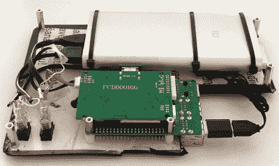

# 简化加固的 Raspberry Pi 便携式

> 原文：<https://hackaday.com/2020/10/19/simplifying-the-ruggedized-raspberry-pi-portable/>

在过去的一年里，我们已经看到了一波便携式计算机的出现，它围绕着树莓皮在一个商用重型存储箱中占据了一席之地。不难看出为什么；无论你是买鹈鹕包还是买一个更便宜的替代品，这些防水包都比你要 3D 打印或在家庭商店里胡乱拼凑的任何东西都要坚固得多。尤其是如果你能避免在侧面打出任何洞的话。

受这些版本的启发，但希望更容易、更便宜地推出自己的版本， [[Dmitry]最近揭开了他所谓的*军事化 Pi*](https://developer.run/50) 的面纱。你不需要 CNC 来切割任何面板，也不需要 3D 打印机来为所有组件创建内部框架。如果你真的想这么做，你甚至可以不用焊接任何东西。除了从别人那里买一个预制的钻机，很难想象还有比这更简单的事情。

 大部分工作涉及切割 PVC 泡沫板，该泡沫板在[15 美元的箱子底部装有树莓派、电池组和 LCD 驱动板【德米特里】设法找到了全球速卖通](https://gist.github.com/dmi3/5fe788a7e73c9dc12925dcc3a809609d)。他放在 PVC 板上的“碳纤维”标签对建筑的结构完整性没什么作用，但看起来确实不错。当然，如果你有合适的工具，你当然可以从更结实的东西上切下盘子。至于显示器，九英寸的液晶显示器大小正好可以压入盖子。

完成制作后，[Dmitry]找到了一个便宜的 Android 手机壳，其中包括一个可以直接插入 Pi 的微型 USB 键盘，他正在寻找将黑莓轨迹球添加到该设置中的方法。我们尤其喜欢他在 Raspberry Pi 端口周围保留的大面积开放区域，这使您可以轻松连接到网络或插入闪存驱动器。它也可以是一个很好的隔间来保存你的 RTL-SDR，用于一些移动无线电工作。

对于那些不介意花名牌钱并能使用 3D 打印机的人来说，[[Jay Doscher]](https://hackaday.com/2020/09/14/this-ruggedized-raspberry-pi-was-built-to-be-copied/)的 Raspberry Pi 快速工具包是另一个不用重新发明轮子就能得到一个粗糙的 Pi 的好方法。