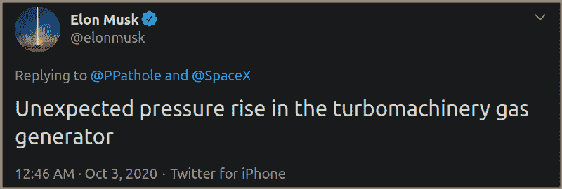
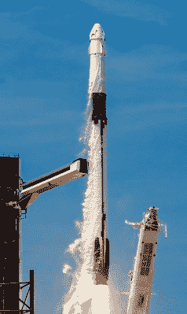
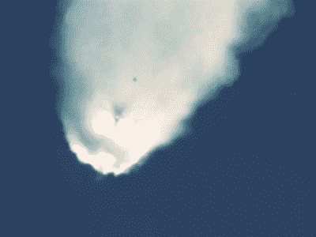
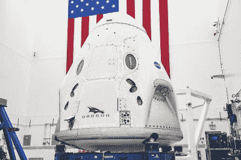

# 引擎故障推迟了 SpaceX 返回国际空间站的时间

> 原文：<https://hackaday.com/2020/10/27/engine-trouble-delays-spacexs-return-to-the-iss/>

原定于万圣节从肯尼迪航天中心出发前往国际空间站的载人任务被推迟了至少几周，因为美国宇航局和 SpaceX 公司正在调查该公司梅林火箭发动机的问题。但是这个问题实际上并不是在将四名新成员送上轨道前哨的助推器上发现的。这个故事要追溯到 10 月 2 日，当猎鹰 9 号上的计算机为美国太空部队携带下一代 GPS III 卫星进入轨道时，在离发射只有两秒钟的时候关闭了引擎。

SpaceX 和 NASA 决定推迟另一款猎鹰 9 号的发射，这一事实清楚地表明，这个问题不仅限于一个特定的助推器，肯定是梅林引擎本身的设计或建造存在问题。虽然这两个实体对当前的情况一直守口如瓶，但首席执行官埃隆·马斯克(Elon Musk)在 GPS III 中止几个小时后发了一条推文，暗示问题出在发动机的气体发生器上:

正如我们之前讨论过的，[梅林就是所谓的“开式循环”火箭发动机](https://hackaday.com/2019/02/13/the-impossible-tech-behind-spacexs-new-engine/)。在这个可以追溯到二战时期德国 V-2 的经典设计中，一个更小、效率更低的火箭发动机的废气被用来旋转涡轮，产生将推进剂泵入主燃烧室所需的动力。气体发生器中高于预期的压力可能会导致它驱动的涡轮发生灾难性的故障，所以毫不奇怪猎鹰 9 号的机载系统决定中止。

因为其中一个火箭发现了潜在的严重故障而让整个火箭队停飞是一种合理的预防措施，以前也曾多次这样做过。工程师需要时间来调查这个问题，并确定是否必须对其余的车辆进行更改，然后才能安全返回飞行。但这正是本案中事情变得有趣的地方。

SpaceX 还没有让他们的整个猎鹰 9 号火箭队停飞。事实上，自 10 月 2 日发射失败以来，该公司已经发射了几架这样的飞机。那么，为什么这些助推器中只有一部分卡在了衣架上，而其他的则继续执行他们预定的任务呢？

## 认证的飞行前助推器

自 2018 年以来，越来越多的 SpaceX 任务使用了以前飞行的助推器。这要归功于最新的，也是最后的，被称为 Block 5 的火箭。在获得了早期版本助推器的宝贵飞行经验后，SpaceX 的工程师们能够确定在飞行、重返地球大气层和着陆过程中损坏最严重的部件。

Falcon 9 Block 5

在 Block 5 中解决了这些弱点后，SpaceX 认为猎鹰 9 号应该能够在只进行小规模翻新的情况下执行至少 10 次任务。偶尔大修，每个机身可能会进行多达 100 次飞行，尽管这一理论需要几年甚至几十年才能得到检验。迄今为止，没有一架猎鹰 9 号的飞行次数超过 6 次。

在 SpaceX 到目前为止在 2020 年进行的 18 次成功发射中，除了两次以外，所有发射都是在重复使用的 Block 5 助推器上进行的。大多数这些火箭及其发动机最初是在 2018 年或 2019 年建造的。新制造的助推器通常只在客户提出具体要求时使用，而一直要求使用新火箭飞行的两个实体恰好是美国宇航局和太空部队。

因此，原定于 10 月 31 日发射“载人龙”号飞船的火箭和 10 月 2 日发射 GPS III 卫星“T2”号和“萨卡加维亚”号的火箭都是在今年早些时候的同一时间制造的。事实上，它们甚至有连续的序列号，SpaceX 分别将其称为 B1061 和 B1062。

有鉴于此，SpaceX 为何没有让整个舰队停飞就变得很清楚了。我们没有看到影响猎鹰 9 号本身的问题，只是那些在 2020 年制造的问题。

## 年龄与经验

由于猎鹰 9 号 Block 5 和梅林引擎的设计自 2018 年以来一直被冻结，以方便美国宇航局对该车辆进行人工评级，我们知道没有引入新的或重新设计的组件。但这并不意味着 SpaceX 不会从一家供应商那里收到一批不合格的组件，这些组件进入了 B1061 和 B1062。这种情况并非没有先例。

2015 年，CRS-7 任务结束，在升空两分钟后，猎鹰 9 号第二级内部的一个高压氦气瓶松动，车辆完全失去了动力。对用于固定瓶子的不锈钢吊环螺栓的检查发现，尽管制造商额定负载为 10，000 磅，但一些螺栓在仅 2，000 磅时就失效了。美国宇航局后来的调查确定，事故的责任最终在于 SpaceX 公司，因为他们在飞行前没有独立核实制造商的说法。

CRS-7 disintegrating over the Atlantic Ocean

虽然飞行前测试当然很重要，但没有什么可以替代真正的测试。SpaceX 一直坚持认为，为可重复使用而设计的火箭与为单一飞行而设计的火箭一样可靠，如果不是更可靠的话。随着每一次后续的飞行和检查，该公司认为，车辆的整体可靠性得到改善。

看起来磨损的辅助部件被替换，而已经证明其可靠性的核心车辆系统仍然存在。SpaceX 的既定目标是为他们的火箭实施一个与商用飞机不同的维护计划，并最终能够在几天甚至几小时内让单个助推器返回飞行状态。

在为他们的任务要求一个新的火箭时，美国宇航局和太空部队相信他们得到了一个更可靠的运载工具，但这似乎与事实不符。迄今为止，新的和重复使用的猎鹰 9 号 Block 5 火箭的累积成功率为 100%。没有证据支持一个比另一个更可靠的说法，而目前的情况似乎表明，使用经过飞行验证的助推器将防止推迟*弹性*和*萨卡加维亚*任务。

## 像飞行一样测试

当然，拖延总比失败好。当人的生命受到威胁时，最好花额外的时间来确保一切都完美运行。据美国宇航局人类探索和运营任务理事会副主任 Kathy Lueders 称， [SpaceX 目前正在更换前往国际空间站的猎鹰 9 号中的一个引擎](https://twitter.com/KathyLueders/status/1318915120051802112)，该引擎表现出与 10 月 2 日异常类似的气体发生器行为。他们还将更换下一枚从装配线上下来的火箭的发动机，序列号为 B1063，目前计划在年底前发射一颗美国航天局/欧空局联合地球观测卫星。

*Endeavour* will fly on a reused booster in March of 2021

这就引出了一个有趣的问题。对所有有效载荷使用标准化的助推器，无论是空间站的货物、通信卫星还是人类乘员，都比美国宇航局在航天飞机时代有更多的机会发现潜在的缺陷。

如果这次载人飞行任务没有搭载与搭载*萨卡加维亚* GPS III 卫星几乎相同的火箭，气体发生器的问题可能不会被及时发现。[虽然“乘龙”号已经做好准备，能够将它的人类乘客拉到安全的地方](https://hackaday.com/2019/08/05/spacex-clips-dragons-wings-after-investigation/)，如果助推火箭失败，这不是任何人都特别渴望利用的应急措施。

在飞行后检查和不管有效载荷如何都保持相同的飞行器配置之间，猎鹰 9 号正在迅速成为历史上最可靠的轨道助推器之一。这可能就是为什么美国宇航局决定明年允许宇航员乘坐经过飞行验证的猎鹰 9 号助推器飞行的原因。该协议规定该机构将只允许宇航员乘坐用过的火箭轻轻的飞向 T2，但至少这是一个开始。