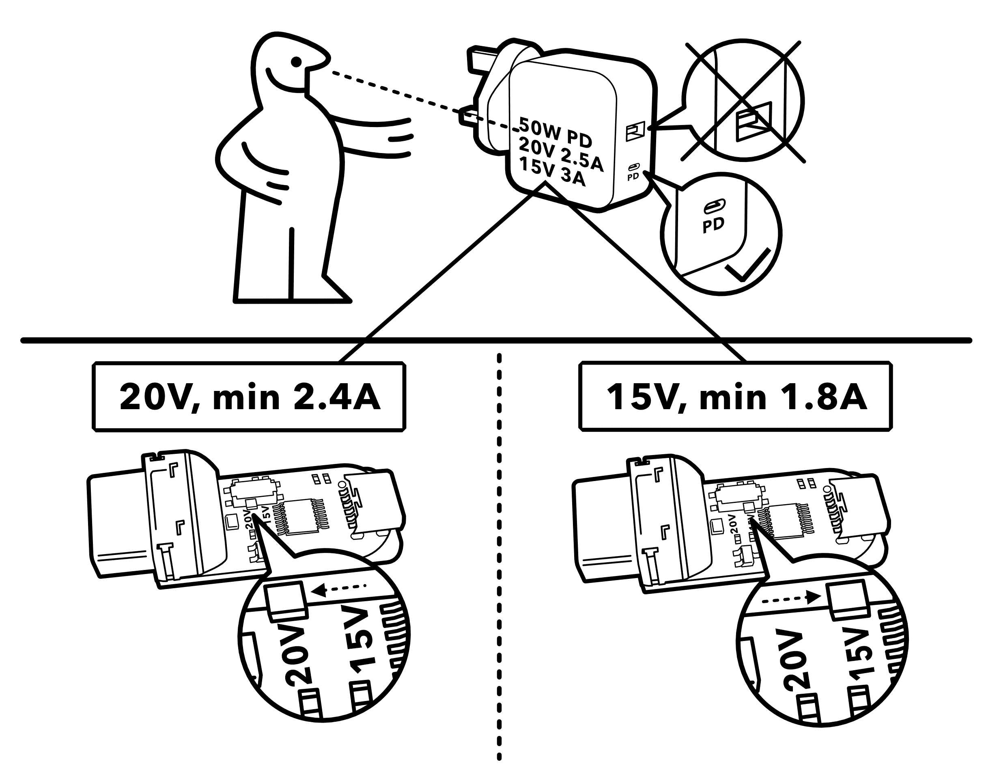

# 过多的电力输送潜力

> 原文：<https://hackaday.com/2020/10/23/a-plethora-of-power-delivery-potential/>

在 Hackaday 这里，我们一直在享受单端口 USB-C 世界的特殊副作用；越来越多的可编程 DC 电源以无处不在的笔记本电脑充电砖的形式出现。曾经是筒形插孔或奇怪的矩形插头的唯一领域(我们正在看你联想)，通过 USB-C 电源传输的通用语言提供充电变得非常普遍。但是，利用这些美味的 100 瓦电源往往是定制 PCBA 和固件黑客的领域。对于想在项目中集成电力传输的渴望电力的黑客来说呢？为此，我们来看一段由[Brian Lough] 制作的精彩视频，它描述了四种常见的控制器 IC，以及为什么您会在下一个项目中选择其中一种。

A superb illustration from the TS100 Flex-C-Friend documentation

[Brian]从一个急需的解释者开始，他解释了什么是能量输送*；一个深度不够的话题。但是这个视频的主要目的是深入神秘的“USB C 触发板”通常情况下，这些设备一端采用 USB，另一端提供一个端子板，可能带有一个按钮或 LED 作为用户界面来选择电压和电流。我们以前见过这些作为[笔记本电脑插孔替代品](https://hackaday.com/2020/06/09/solving-buyers-remorse-with-a-rotary-tool-and-soldering-iron/)和 [TS100 电源](https://hackaday.com/2019/11/01/adding-usb-c-to-the-ts100/)的产品，但很难说哪种看似相同的选择最适合某个项目。*

 *视频的主体是[Brian 的]基于 IP2721、FUSB302、STUSB4500 和 Cypress EZ-PD BCR 的四种类型触发板的详细演示。对于每一个，他都描述了特定 IC 的行为以及如何配置它。他的重点是构建一个为 TS100 供电的电路板(与他的 [TS100 Flex-C-Friend](https://github.com/witnessmenow/ts100-flex-c-friend) 相似)，但内容是普遍适用的。当然，我们也很欣赏他对 Tindie 上每个描述模块的产品的概述。

关于力量传递的另一个角度，请查看长期受欢迎的[jason cerudolo] 的这一系列帖子。不要错过他的经典项目，T2 USB 简易烤箱 T3。*