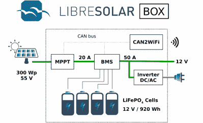

# 让太阳能自由

> 原文：<https://hackaday.com/2020/10/24/let-the-solar-free/>

任何第一次接触太阳能的人都会很快发现有大量的信息需要理解和消化。你可能认为你只需要买一些太阳能电池板，把它们连接起来，然后插上电源。但是关于它们如何连接，电池板的电压，以及驱动负载的硬件，还有许许多多不同的问题。[Michel]、[case06]和[Martin jger]已经着手创建一个更简单、更容易理解的充电控制器，命名为 LibreSolar。

电荷控制器基本上是一个简单的概念。目标是用太阳能电池板给电池充电，这意味着它本质上只是一个重型 DC/DC 降压转换器。这个项目的不同之处在于，它是一个为可扩展性而构建的开放平台。

还包括 UEXT 连接器，用于添加额外的外设，并对 STM32 固件进行一些调整，这将很容易处理小型风力涡轮机(当然，需要进行一些调整以转换为 DC)。LibreSolar 的设计似乎着眼于创建纳米级的本地化网络网格。例如，他们开发了一个 Raspberry Pi Zero 模块，该模块使用 WiFi 来创建一个 CAN 总线，允许这些盒子相互交流它们的最大电压。这使得系统尽可能即插即用，因为总线不需要主控制器来通信。

凭借 MPPT(最大功率点跟踪)、20 安培峰值充电、用于更新的 USB 接口和几个内置保护机制等功能，这显然是一个经过深思熟虑的项目。我们期待看到它在现实世界中的部署！

The [HackadayPrize2020](https://prize.supplyframe.com) is Sponsored by: