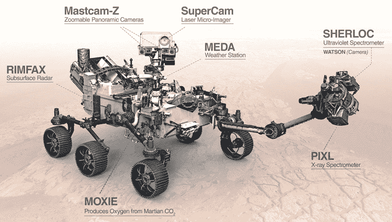
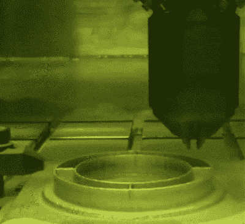
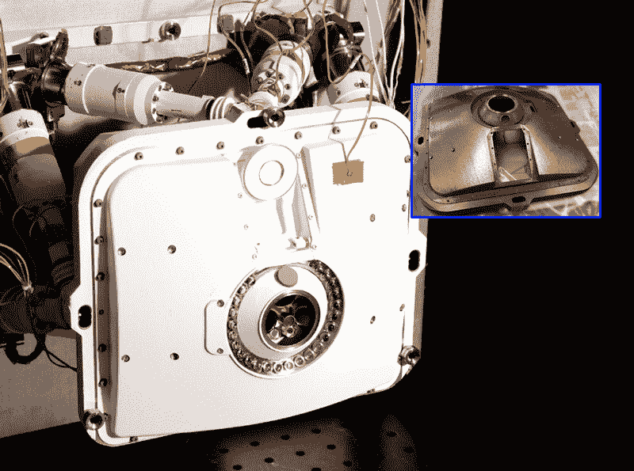
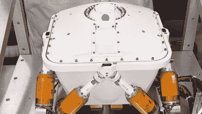

# 将 3D 打印零件送上火星:JPL 增材制造中心一瞥

> 原文：<https://hackaday.com/2020/11/10/sending-3d-printed-parts-to-mars-a-look-inside-jpls-additive-manufacturing-center/>

随着火星 2020 任务现在已经过了地球和目的地之间的中点，美国宇航局的喷气推进实验室最近发布了几个关于毅力号火星车上的 3D 打印部件的故事。“毅力”号被塞进它的大气层，并准备好进行高风险的火星表面之旅，它展示了我们用增材制造技术制造的 11 个独立部件。这不是第一次用增材制造技术制造部件的航天器飞行，但这是 JPL 第一次用这么多打印部件制造交通工具。

为了更深入地了解 3D 打印制造符合太空飞行条件的部件是什么样子，并探究添加制造技术与传统减去制造技术的基本原理，我联系了 JPL，并与添加制造小组负责人 Andre Pate 和该任务主要科学仪器的首席工程师 Michael Schein 取得了联系。他们都很友好地给了我时间来提问和研究 JPL 在增材制造方面的所有很酷的东西，并了解 3D 打印和太空飞行的未来。

## 你有莫邪，孩子

总的来说，我们对火星 2020 任务非常感兴趣，对其移动天体生物学和地质学实验室“毅力”背后的工程特别感兴趣。除了深入研究[自适应样本缓存系统](https://hackaday.com/2020/07/30/geocaching-on-mars-how-perseverance-will-seal-martian-samples-with-a-return-to-earth-in-mind/)和[独创性](https://hackaday.com/2020/09/02/an-up-close-look-at-the-first-martian-helicopter/)，前者将封存火星风化层样本，用于最终的样本返回任务，后者是第一架设计用于在外世界运行的飞行器，我们[还介绍了毅力漫游者](https://hackaday.com/2020/02/13/mars-2020-rover-curiositys-hi-tech-twin-is-strapped-for-science-includes-a-flying-drone/)，它将携带所有这些设备环绕红色星球。这部漫游者计划进行的大量科学研究很可能会改变我们对火星的看法，并很可能找到外星生命的第一个确凿证据。

Perseverance rover, with 3D-printed parts on PIXL (end of arm) and MOXIE (starboard side of hull). Source: [NASA/JPL](https://mars.nasa.gov/resources/25045/science-instruments-on-nasas-perseverance-mars-rover/).

为了完成这些任务，毅力号包括许多复杂的仪器，其中两个配备了任务中包含的大多数 3D 打印部件。用于 X 射线岩石化学或 PIXL 的行星仪器，旨在深入火星岩石内部寻找化石生命的迹象。火星氧气原位资源利用实验，或莫邪，旨在测试从火星大气中生产无限量氧气的技术，以支持返回地球的燃料火箭。这两种仪器都包含用先进的金属 3D 打印技术制造的零件，既可以在 JPL 的增材制造中心内部制造，也可以在外包给特殊工作的供应商处制造。

## 材料和方法

除了更典型的聚合物打印机(主要用于原型制作和打印固定装置和夹具)，JPL 的内部添加剂实验室拥有广泛的打印金属零件的技术。使用哪种模态在很大程度上取决于零件的用途。JPL 还与外部添加剂制造供应商达成协议，打印他们无法在内部完成的零件。

Directed-energy deposition printer being used to print a part at JPL’s Additive Manufacturing Center. Source: [NASA/JPL](https://www.jpl.nasa.gov/news/news.php?feature=7766).

对于非飞行部件，JPL 团队主要使用定向能沉积，这可能是目前听起来最酷的 3D 打印方式。DED 依赖于高能束，要么是激光，要么是电子束，其中加入粉末金属或细金属丝。这种能量创造了一个熔融金属池，应用于不断增长的打印。DED 有点像电弧焊或激光熔覆，增加了打印头的 CNC 控制和惰性环境，以减少不断增长的打印的氧化。DED 具有相对快速的构建速率和创建精细特征的能力的优势，以及对额外加工或压制等后处理步骤的最小需求(下文将详细介绍)。

DED 的另一个优点是可以用梯度合金制作印刷品。JPL 的 DED 打印机是一台 [RPM 222XR](https://www.rpm-innovations.com/laser-deposition-systems-222xr.html) ，在一次打印中支持多达四种不同的金属。这类似于 FDM 打印机，它可以支持多根细丝，并在一次打印中打印不同的颜色或不同的材料，但甚至更好，因为它可以做所谓的[梯度合金](https://www.metal-am.com/gradient-alloys-by-additive-manufacturing-developed-at-nasas-jet-propulsion-laboratory/)，其中金属零件由多种粉末制成，零件的不同区域具有不同的冶金属性。例如，在好奇号上，一个致动器的钢轴导致了磁性编码器的问题。通过打印非磁性不锈钢轴的磁性敏感部分，他们能够避免这个问题。

然而，注定要在 JPL 制造的航天器上飞行的零件并不是在内部的 DED 机器上打印的。更确切地说，JPL 转而使用粉末床熔融打印机来生产飞行合格的零件。对于粉末床印刷工艺，有一个字母汤的价值，包括选择性激光烧结(SLM)，选择性激光熔化(SLM)，和直接金属激光烧结(DMLS)。下面的视频显示 DMLS 坐在 EOS M290 上，这是 JPL 增材制造中心运行的三台 DMLS 机器之一。

 [https://www.youtube.com/embed/jbl6nhaGtIM?version=3&rel=1&showsearch=0&showinfo=1&iv_load_policy=1&fs=1&hl=en-US&autohide=2&wmode=transparent](https://www.youtube.com/embed/jbl6nhaGtIM?version=3&rel=1&showsearch=0&showinfo=1&iv_load_policy=1&fs=1&hl=en-US&autohide=2&wmode=transparent)

在我们已经习惯的所有业余爱好者级别的聚合物打印方法中，粉末床融合方法可能是与立体平版印刷术(SLA)的树脂打印最密切相关的。尽管 SLA 打印使用光来聚合光敏树脂，但粉末床熔融打印机使用高能光束来烧结或熔化粉末材料薄层表面的颗粒，以形成打印的每一层。光束可以是强有力的光纤激光器，也可以是电子束；JPL 可以在内部进行激光打印，但当零件需要电子束打印时，它会与供应商签订合同。

无论使用哪种能源，控制这些打印机的粉末床都需要大量的工程设计，因为打印质量与粉末的深度直接相关。当一个层完成时，构建平台按照编程的层高度向下移动到容器中。然后，通过复杂的橡胶滚轴装置将更多的粉末金属添加到后退的床表面顶部的微小空间中，该橡胶滚轴装置确保完全均匀的新粉末层被铺设在其上，下一层可以被构建。打印一次建立一层，直到它最终从松散的粉末中挖掘出来，清除任何支撑结构，并为后期处理做好准备。

## 后处理

热等静压(HIP)是粉末金属工业长期使用的一种工艺，用于完成通过例如模压或金属注射成型制造的部件，最近用于金属添加制造。用这些技术中的任何一种制造的零件必然在其中有空隙；无论用来制造零件的粉末颗粒有多细，气体仍然会滞留在其结构中。HIP 的目标是使用氩气等惰性气体，结合高达 2000 摄氏度的高温和大约 100 兆帕或更高的极端压力，将这些气泡挤出去。

经过 HIP 处理的零件在压实时会出现相当大的收缩。这一点在设计时必须考虑到，但热等静压相对于常规热压具有明显的优势，因为它将压力均匀地施加到零件上，在所有维度上可预测地收缩。这有助于避免使用实心砧座的传统压制给零件带来的尺寸变形。

 [https://www.youtube.com/embed/WVteEJy2rbQ?version=3&rel=1&showsearch=0&showinfo=1&iv_load_policy=1&fs=1&hl=en-US&autohide=2&wmode=transparent](https://www.youtube.com/embed/WVteEJy2rbQ?version=3&rel=1&showsearch=0&showinfo=1&iv_load_policy=1&fs=1&hl=en-US&autohide=2&wmode=transparent)

航天用金属部件的添加制造中的另一个考虑是“箱中铸造”问题。对于传统的减法制造，起始材料是一块已经经过铸造工艺的金属。这种金属经过铸造、挤压或锻造，经过热处理和回火，具有已知的强度、延展性和硬度等特性。它甚至可能已经过 x 光检查，以发现任何隐藏的缺陷。它的晶体结构或多或少是固定的，剩下要做的就是去掉不必要的部分，露出隐藏在里面的部分。

然而，对于添加制造，产生的金属部件的特征并不明显。在减法制造中，初始材料的晶体结构已经非常固定，根据定义，完成金属 3D 打印所需的能量手段会改变初始材料的微观结构。因此“盒子里的铸造厂”——3D 打印部件中的金属实际上是从头开始制造的。对于飞行合格的零件，潜在的数十亿美元悬而未决，工程师需要解释 3D 打印零件在其火热的诞生过程中经历的混乱、充满活力的制度，无论多么短暂。这增加了一层不确定性，但对于增材制造提供的灵活性来说，这只是做生意的另一个成本。

## 减法与加法

我问的是决定一个零件是用传统的减法还是加法制造的分析。深入调查后，我认为成本是主要驱动因素。美国宇航局和 JPL 最近在降低太空探索的成本方面做了很多，他们的预算一直反映了以尽可能少的成本做大事的需要。因此，当你看到一个零件，当使用减法制造时，会将原材料的 90%变成芯片，加法似乎很有意义。毕竟，如果一个零件可以用相当于成品体积的原材料来制造，那么成本节约将是相当可观的。

The front cover of PIXL is one of the eleven 3D-printed parts on Perseverance. Additive manufacturing made this part possible, while traditional machining would have been prohibitive. Source: [NASA/JPL](https://mars.nasa.gov/resources/25266/perseverances-pixl-opens-its-dust-cover/).

事实证明我错了。对于用于飞行的零件，成本很难被认为是转向增材制造的驱动力。附加技术通常被视为一种使能技术，用于制造其他方式无法制造的零件。前面提到的梯度合金编码器轴就是一个完美的例子——除了添加制造之外，很难在单个零件中融合冶金特性。另一个除了添加剂之外不可行的零件的例子是质量必须保持最小的零件，或者将进入具有特定冷却需求的组件并需要具有内置冷却通道的零件。这种零件很难用减法来制造，但用 3D 打印要容易得多。

 加法的另一个亮点是对传统零件的再造。我们都听说过这样的故事:我们永远无法从阿波罗计划中制造出强大的 F1 引擎的新版本，主要是因为制造它们的专业知识和工具的损失。虽然这种极其复杂的发动机不太可能被再次制造出来，但增材制造经常被用来再造那些不再可用的零件。虽然 JPL 在这方面做得不多——他们毕竟是在建设未来——但其他实体，如美国空军，需要让 60 多年前从装配线上下线的[飞机存活下来](https://www.youtube.com/watch?v=tRT5g_50Iik)，经常需要这样做。他们将定期扫描零件，甚至经常使用 CT 扫描仪，并由几十年前退休的机械师打印早已倒闭的供应商制造的零件，以保持他们的舰队飞行。

因为就像添加制造在航空航天应用中一样灵活和强大，你会认为整个行业会蜂拥而至。虽然在某种程度上是这样，但在很多方面，这是一个非常保守的行业，明智地以怀疑的态度看待彻底的变革。但是，随着增材制造继续使曾经不可能的部件成为可能，随着 JPL 使用这些以前不可能的部件不断取得成功，它将证明自己并巩固其作为各种任务的首选制造方法的地位。