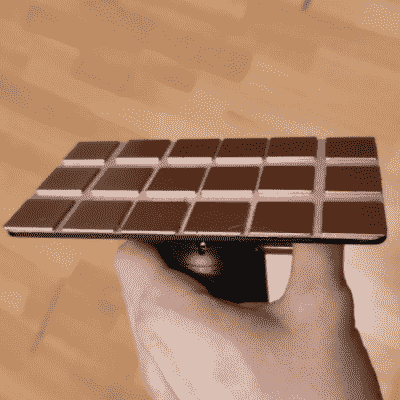

# 面向 SLA 的改进的灵活构建板已准备就绪

> 原文：<https://hackaday.com/2020/10/26/improved-flexible-build-plate-for-sla-is-ready-to-rock/>

Elegoo Mars 是一款负担得起的 SLA(树脂基)3D 打印机，可能很少有人比[Jan Mrázek]的机器看到更多的修改和实验。[他的 DIY 灵活构建板的最终设计](https://blog.honzamrazek.cz/2020/04/adding-a-flexible-sheet-on-elegoo-mars-build-platform-2-final-design/)是对他最初的概念证明的改进，这证明了灵活构建平台在 SLA 打印机上可以像在 FDM 一样有用；不是从刚性的构建平台上凿掉零件，而是简单地从磁性底座上弹出柔性钢板，并稍微弯曲它，以便更容易地拆卸零件。[他最初的设计](https://hackaday.com/2020/04/06/flexible-build-platforms-work-for-fdm-how-about-sla/)工作正常，但有一些粗糙的边缘，已经被解决了。

 

【陈安】默磁筑台。

我们喜欢[Jan]介绍所有设计元素的方式，并解释什么可行，什么不可行。例如，最初他使用镀锌钢板，这很容易操作，但最终并不是一个可行的选择，因为一旦弯曲，它就会保持弯曲。弹簧钢对于灵活的构建平台来说是一种更好的材料，但对于业余爱好者来说更难切割。

幸运的是，对于任何金属加工店来说，这都是一项简单的工作，而且[Jan]可以非常便宜地切割出各种厚度。原来甜区是 0.3 mm(虽然对于特别脆弱的部位 0.2 mm 是更好的选择。)[Jan]还建议将板材切割得比构建平台大几毫米；毕竟，当一个人可以将指尖放在边缘下时，从磁性基底上剥离薄片要容易得多。

钢片粘附的磁性基底非常简单:[Jan]通过用 3M 粘合安装带安装 20 x 20 x 1 mm 的磁体阵列来转换库存构建平台。他担心树脂可能会渗入磁铁之间并引起问题，甚至可能干扰粘合剂；但到目前为止，它似乎工作得很好。树脂具有足够的粘性，绝不会渗透到缝隙中，而且到目前为止还没有观察到对粘合剂的影响。

观看下面嵌入的短视频，其中[Jan]展示了他的最新平台设计，看部件是如何轻松拆卸的。

 <https://blog.honzamrazek.cz/wp-content/uploads/2020/04/VID_20200420_205234.mp4?_=1>

[https://blog.honzamrazek.cz/wp-content/uploads/2020/04/VID_20200420_205234.mp4](https://blog.honzamrazek.cz/wp-content/uploads/2020/04/VID_20200420_205234.mp4)

看起来从现在开始只剩下微调了。[Jan]怀疑新的板材导致了大象脚变形的轻微明显增加(物体在底部右侧稍微变宽)，但这充其量只是一个小问题。SLA 的灵活构建平台最近开始作为售后零件出售，但是[Jan]的工作表明，一个有效的 DIY 解决方案对于一个业余爱好者来说是完全可行的。

如果你对在你的工作室里添加一台 SLA 3D 打印机很感兴趣，[这里有一篇文章解释了从 FDM 转移到 SLA 会给你带来什么。](https://hackaday.com/2019/10/02/when-does-moving-to-resin-3d-printing-make-sense/)