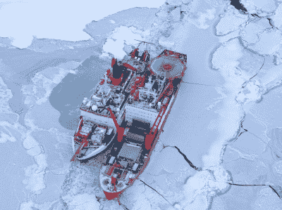
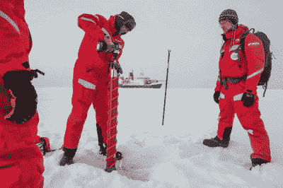
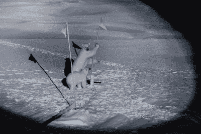
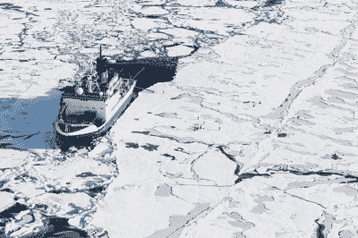

# MOSAiC 项目为科学目的冻结了北极冰盖中的一艘船

> 原文：<https://hackaday.com/2020/11/04/mosaic-project-freezes-a-bmosaic-project-freezes-a-boat-in-the-arctic-ice-pack-for-scienceoat-in-the-ice-pack-for-arctic-research/>

就在两周前，德国科考船“极地号”驶回港口，宣告了有史以来最大的北极科考项目的结束。MOSAiC expedition 是研究北极气候的多学科漂流观测站的缩写，它花了整整一年时间进行实验，测量北极的条件，并研究独特的北极气候如何受到人类活动的影响。

## 规模和范围前所未有的

The operation was regularly resupplied by visits from other icebreakers, bringing equipment, food, and fresh personnel. Alfred-Wegener-Institut / Jan Rohde (CC-BY 4.0)

该项目预算超过 1 . 4 亿€，有 300 多名科学家参与，旨在研究北极地区全年的冰循环。为了实现这一点，该项目的研究船 *RV Polarstern* 被导航到浮冰中，并被允许冻结在浮冰中并随浮冰漂流。随着季节的推移，这艘船随着海冰漂过了极地。一路上，一系列轮换的研究小组在冰上架设设备，进行定期测量，[调查几个科学重点领域。](https://mosaic-expedition.org/science/scientific-focus-areas/)不同的小组观察大气条件和海冰本身，研究人员还关注该地区的生物地球化学、海洋和生态系统。

在任务期间，破冰船被用来向极地考察船运送货物和人员。该项目在春季面临问题，由于新冠肺炎疫情带来的限制，不得不放弃由飞机执行的预先计划的转换。[号也改为由](https://www.heise.de/newsticker/meldung/Arktis-Expedition-Mosaic-Forschungsschiff-Polarstern-unterbricht-fuer-drei-Wochen-seine-Drift-4709468.html)号船执行，其中*号极地船*号暂时离开冰面，与*号 RV Sonne* 号和*号 RV Maria S. Merian* 号会合，进行大约 100 名船员的交接，并领取给养。这次绕行花了三周时间，但没有对任务造成任何重大负面影响。

## 填补空白

Researchers use a power drill to take core samples from the ice.

MOSAiC 探险队的主要目标是弥补目前北极地区气候模型的不确定性。当谈到气候变化时，地球上的这个地区起着巨大的作用，但是由于数据有限，科学家们发现很难准确预测北极未来的状况。通过收集全年的数据，该项目的支持者希望获得对潜在未来结果的重要见解，并更好地了解在独特的极地环境中发挥作用的机制。

通常情况下，由于冰层的厚度，研究小组在冬季无法进入北极中部地区。通过坚持一整年，随着浮冰漂流，研究人员能够更接近北极，并进行持续的观察，这在以前是不可能的。研究小组在冰上建了一个大营地，不同的小组为他们各自的专业建立“城市”。致力于机器人水下探险者、气象研究和海洋测量的区域在冰上都有自己的位置，科学家可以在那里进行数据收集和调查。

Esther Horvath (CC-BY 4.0)

然而，这并非没有挑战。从项目一开始，变暖的气温意味着找到一块合适的冰比预期的要困难。随着项目的进展，比平常更脆弱的冰经常破裂和移动，迫使团队重新安置设备。然而，这也为近距离观察浮冰在当今条件下的行为提供了一个很好的机会。

其他危险包括遭遇北极熊的真实威胁。极地考察船上安装了一台红外扫描相机，当北极熊靠得太近时，所有人员都会被带回船上。除此之外，在营地周围设置了装有小型炸药的绊网，以吓唬那些冒险靠近的熊，并有武装警卫看守以防万一。

## 结论

The ship returned successfully to port after spending a full year out in the ice. Researchers are hopeful that data collected will provide vital insights into Arctic climate systems.

目的是通过更好地了解海冰的形成、北冰洋环流和极地大气条件等主题，科学家将能够更好地预测人类活动对世界气候的影响。围绕气候系统中不可逆转的临界点有许多悬而未决的问题，这项研究可能对阻止气候变化的最坏影响至关重要，以免为时过晚。为了实现这一目标，[收集的数据将被广泛共享](https://mosaic-expedition.org/science/mosaic-data/)，首先与该计划的参与者共享，并从 2023 年 1 月 1 日起面向公众。MOSAiC 希望产生的数据能够帮助一代又一代的科学家揭开北极气候如何运作的神秘面纱。