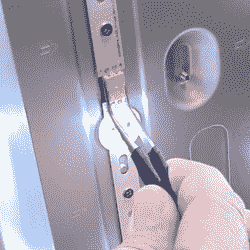
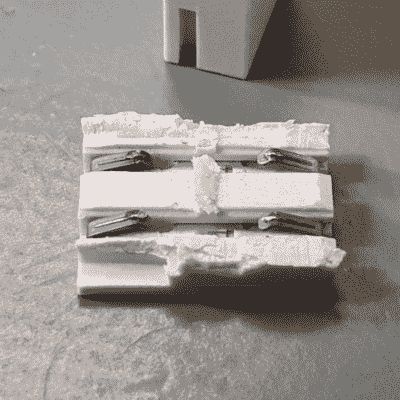

# 低技术含量的解决方案将昂贵的高科技电视从垃圾堆中拯救出来

> 原文：<https://hackaday.com/2020/10/27/low-tech-fix-saves-expensive-high-tech-tv-from-junk-pile/>

Wiggling this connector caused the backlight to turn off and on.

[Tweepy]的电视停止了工作，这次经历是一个简短的提醒，如果一个现代电器出现故障，值得看一看里面，因为故障可能很简单。在这种情况下，[坏了的电视实际上是一个坏了的 LED 背光，修复是如此令人尴尬的简单](http://www.dotmana.com/weblog/2020/04/industrial-manufacturing-dfm-or-planned-obsolescence/),以至于[Tweepy]试图将其归咎于疏忽大意的 DFM(为制造而设计),甚至在最坏的情况下是某种计划淘汰的努力。

事情是这样的:电视似乎停止了工作，但当强光照射在屏幕上时，人们仍然可以分辨出屏幕内容。看到这种情况，[Tweepy]推断背光灯出现了故障，并打开了设备，看看是否可以修复。然而，背光故障的原因令人惊讶。这不是电源，甚至也不是任何发光二极管本身；由于一个廉价的小 PCB 到 PCB 连接器，以及里面的两个小弹簧触点失效，整个背光无法打开。

The failed connector, once cut open, showed contacts in poor condition (click to enlarge). It was ditched for a soldered connection, and the TV lived again.

从外面看，一切正常，但扭动连接器会使背光打开和关闭，因此连接显然是坏的。通过进一步调查，[Tweepy]发现，PCB 的触点和连接器内部的两个小导体显示出明显的电弧和氧化迹象，导致连接不良，最终导致故障，导致电视无法使用。解决方法不是清洁触点；正确的解决方法是用焊接连接代替连接器。

使用这种廉价的小连接器无疑节省了工厂的组装时间，但它也导致了相当短时间内的故障。如果不是[Tweepy]手边有一把螺丝刀(或者懒得去调查),这台本来可以正常工作的电视无疑会被扔进垃圾堆。

这是一个很好的提醒，即使一个人的修理技能有限，也要花些时间调查电器故障，因为问题可能很简单。有计划的淘汰是一个诱人的门槛，在这个门槛上抛弃这样的失败，但是有一个很好的案例可以证明[有计划的淘汰并不是一件真正的事情](https://hackaday.com/2018/09/24/planned-obsolescence-isnt-a-thing-but-its-your-fault/)，即使制造商以这样或那样的方式损害产品肯定是。