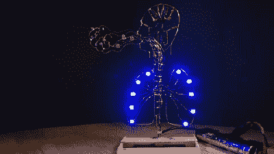

# 电路雕塑为分立元件注入活力

> 原文：<https://hackaday.com/2020/10/27/circuit-sculpture-breathes-life-into-discrete-components/>

今年，我们可能都在不同的背景下对呼吸进行了很多思考。虽然呼吸是我们所有人都必须做的事情，但在 2020 年，这个简单的行为已经变成了麻烦制造者。他们说最好的艺术模仿生活，而[bornach]的不稳定呼气确实做到了这一点，一直到关于不稳定的部分。特别有趣的是，最终的结果——呼吸，视觉化——是如此平静，它几乎可以成为一个冥想的装置。

 在这个电路雕塑上找不到一个微控制器，它使用一对非稳态多谐振荡器来点亮两组 led，分别代表吸入和呼出的空气。我们喜欢[bornach]在这个美丽的电路雕塑中使用两种大小的呼出 led 来代表液滴和气溶胶，我们喜欢大多数组件都是从旧电子产品和旧项目中回收的。

我们的[电路雕塑挑战赛](https://hackaday.io/contest/174093-2020-circuit-sculpture-challenge)将持续到 11 月 10 日，因此，即使你正在等待参加 Remoticon 研讨会，在大会结束后的肾上腺素激增阶段，仍有一点时间来制作一些东西。如果你需要灵感，[可以看看其他一些参赛作品](https://hackaday.io/submissions/circuit-sculpture-art-contest/list)或[只需浏览所有赛道雕塑](https://hackaday.com/?s=circuit+sculpture)。

 [https://www.youtube.com/embed/4GnMmbElsOE?version=3&rel=1&showsearch=0&showinfo=1&iv_load_policy=1&fs=1&hl=en-US&autohide=2&wmode=transparent](https://www.youtube.com/embed/4GnMmbElsOE?version=3&rel=1&showsearch=0&showinfo=1&iv_load_policy=1&fs=1&hl=en-US&autohide=2&wmode=transparent)

