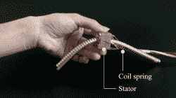

# 柔性致动器开始动作

> 原文：<https://hackaday.com/2020/11/01/flexible-actuators-spring-into-action/>

柔性机器人致动器的大多数实验都是基于气动技术，但[Ayato Kanada]和[Tomoaki Mashimo]一直在研究使用螺旋弹簧作为线性致动器的移动部件。名为柔性超声波马达(FUSM)的[Yunosuke Sato]在其工作的基础上，将一对 FUSM 组装成一个具有二维运动控制的闭环致动器[。](https://www.researchgate.net/publication/342823192_Self-Sensing_and_Feedback_Control_for_a_Twin_Coil_Spring-Based_Flexible_Ultrasonic_Motor)

单个 FUSM 本身就很有趣，它的螺旋弹簧是唯一的机械运动部件。[Kanada]和[Mashimo]发表的一篇早期论文阐述了如何将弹簧推过充当该电机定子的金属块上的一个孔。附在该块上的压电装置以受控的方式使其轻微变形，从而导致弹簧的线性运动。【T2

对于闭环反馈，可以测量从弹簧自由端到定子块的电阻，并将其转换为几毫米以内的直线距离。然而，弹簧的作用端可能由于拉伸或弯曲而变形，这使得计算其实际位置变得困难。解释这种变形是这组研究人员的未来课题。

这项工作是在 IROS2020 上展示的，像今年的许多其他会议一样，转移到网上，成为 IROS 点播。免费在线注册后，我们可以[在会议上观看这个项目或任何其他项目的 12 分钟录音演示。该视频包括一些精彩内容，例如说明 FUSM 如何工作的定子块变形的夸张动画，以及位置计算挑战的一个示例，其中预期的圆形运动实际上产生了一个椭圆形。](https://www.iros2020.org/ondemand/episode?id=2888&id2=Soft%20and%20Flexible%20Robotics&1603857244268)

说到已经转移到网上的会议，我们自己的 [Hackaday Remoticon](https://hackaday.com/2020/09/29/all-the-workshops-and-the-smd-challenge-happening-at-hackaday-remoticon/) 即将推出！

> 我们的工作现在正在进行。提出了一种柔性超声波电机，它是一种新型的自感知软驱动器。https://t.co/FsCrRUULJopic.twitter.com/AEVsmVqZS4[T4](https://t.co/FsCrRUULJo)
> 
> — Ayato KANADA（金田礼人） (@AyatoKanada) [October 27, 2020](https://twitter.com/AyatoKanada/status/1320949579911557120?ref_src=twsrc%5Etfw)

[via [打开机器人 Twitter feed](https://twitter.com/OpenRoboticsOrg)