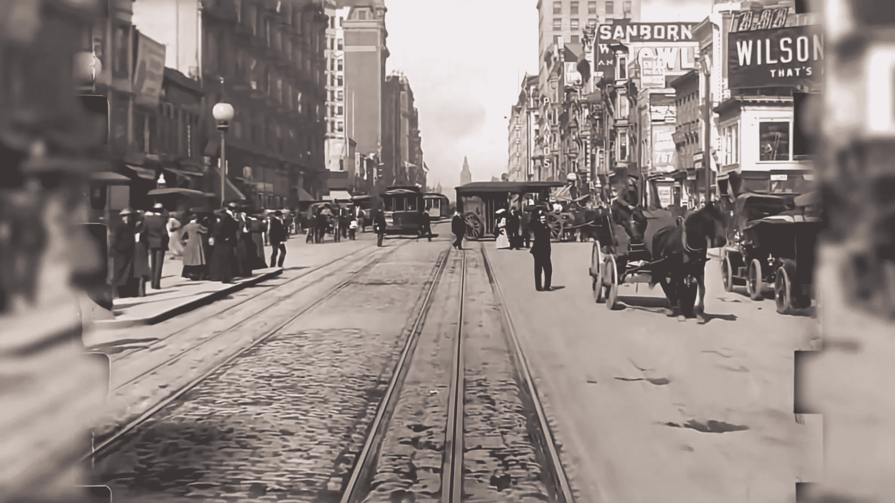
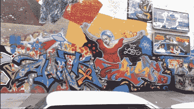

# “增强”现在是个东西，但是不要相信你看到的

> 原文：<https://hackaday.com/2020/11/25/enhance-is-now-a-thing-but-dont-believe-what-you-see/>

这在 20 世纪 90 年代是一个再熟悉不过的比喻了——电影和电视中的执法人员拍摄一张像素化的模糊图像，然后点击神奇的“增强”按钮，显示出将被绳之以法的嫌疑人。在以前根本没有数据的地方创造数据，对于任何有一点技术专长的人来说，都是破坏沉浸感的一个好方法，并且破坏了许多电影和电视节目。

当然，技术在进步，曾经完全不可能的事情在适当的时候往往变得微不足道。如今，人们期望一台低于 100 美元的计算机可以很容易地区分香蕉、狗和人，这在微型计算机时代的初期是不可思议的。这种能力植根于神经网络技术，可以通过训练来完成以前认为计算机难以完成的各种任务。

随着神经网络和大量处理能力的出现，出现了大量旨在“增强”一切的项目，从低分辨率人脸到旧电影镜头，提高分辨率并填充根本不存在的数据。但是幕后到底发生了什么，这种技术真的能够精确地增强任何东西吗？

## 有根据的猜测

[1906 年地震前 4 天在三藩市拍摄的一部电影中的一个大幅增强剪辑](https://www.youtube.com/watch?v=VO_1AdYRGW8)。[Denis]使用免费工具对旧素材进行着色、升级和提高帧速率。

我们之前已经展示过神经网络做这样的壮举，[比如 DAIN 算法将镜头放大到 60FPS。](https://hackaday.com/2020/09/20/boost-your-animation-to-60-fps-using-ai/)其他人，像【Denis Shiryaev】，结合各种工具[对旧素材进行着色，平滑帧速率，并将分辨率提升到 4K。](https://www.wired.com/story/ai-magic-makes-century-old-films-look-new/)神经网络可以做到这一切，甚至更多，从根本上说，方法在基础层面是一样的。例如，要创建一个神经网络来将镜头放大到 4K 分辨率，必须首先对其进行训练。该网络从图像对中学习，具有低分辨率图片和相应的高分辨率原件。然后，它试图找到采用低分辨率数据的变换参数，并产生尽可能接近高分辨率原始数据的结果。一旦对足够多的图像进行了适当的训练，神经网络就可以用于对其他材料进行类似的转换。增加帧速率的过程是相似的，甚至着色也是如此。显示一个网络彩色内容，然后显示黑白版本。经过足够的训练，它可以开发算法，将可能的颜色应用到其他黑白镜头中。

A team at Duke University created a tool to produce high-resolution portraits from heavily pixelated images. However, the resulting output is a fabrication, and not necessarily one that matches the original face in the low-resolution source image.

关于这项技术需要注意的重要一点是，它仅仅是利用广泛的经验基础来产生它认为合适的东西。这就像一个人看一部电影，在看过其他电影中许多类似的比喻后猜测结局一样。猜测的可能性很大，但不能保证 100%正确。[正如脉冲面部成像工具](https://www.intelligentliving.co/pulse-ai-photos-sharper/)背后的团队所解释的那样，这是使用人工智能进行升级的一个常见思路。脉冲算法基于人脸的非常低分辨率的输入来合成图像。该算法基于其训练集的数据，对原始人脸可能的样子进行最佳猜测，通过重新缩小来检查其工作，以查看结果是否与原始低分辨率输入匹配。当然，不能保证生成的脸和真实的脸有任何相似之处。高分辨率输出仅仅是计算机对真实人脸的构想，而*可能是低分辨率图像的来源。这项技术甚至被应用到视频游戏的纹理中，但是结果可能是混杂的。神经网络并不总是能做出正确的猜测，通常需要一个人在回路中提炼输出以获得最佳结果。然而，有时结果很有趣。*

一个普遍的事实是，当处理低分辨率影像或黑白镜头时，不可能准确地填充不存在的数据。碰巧的是，在神经网络的帮助下，我们可以做出对一个不经意的观察者来说似乎真实的极好的猜测。这项技术的局限性出现的频率比你想象的还要高。例如，着色在城市街道和树木等事物上非常有效，但在其他事物上表现很差，如衣服。树叶通常是绿色的，而道路通常是灰色的。然而，帽子可以是任何颜色；虽然可以从黑白图像中收集到阴影的粗略概念，但准确的色调却永远失去了。在这些情况下，神经网络只能在黑暗中尝试。

由于这些原因，重要的是不要认为以这种方式“增强”的镜头与历史相关。由这种算法产生的任何东西都不能被确定地认为是真实的。以一部政治事件的彩色电影为例。该算法可以改变一些微妙的细节，比如翻领别针或旗帜的颜色，从而制造出一种没有事实依据的效忠暗示。放大算法可以创造出与历史人物惊人相似的面孔，而这些历史人物可能从未出现过。因此，档案工作者和那些致力于修复旧胶片的人会避开这类工具，因为这与他们保持历史准确记录的事业格格不入。

[This footage](https://www.youtube.com/watch?v=fT4lDU-QLUY) was shot in New York in 1993 with a then-cutting edge 1080p camera. It has a crispness and quality not reached by upscaled historical footage.

真正的感知质量也是一个问题。与 1993 年在纽约用真正的 1080p 相机拍摄的[镜头相比，1890 年在巴黎拍摄的 4K 升级版电影](https://www.youtube.com/watch?v=fT4lDU-QLUY)简直相形见绌。即使是强大的神经网络的最佳猜测也难以与高质量的原始数据相比。当然，我们也必须考虑 100 多年来相机技术的进步，但不管怎样，神经网络不会很快取代高质量的相机设备。捕捉高质量的好数据是无可替代的。

## 结论

“增强”算法的应用确实存在；可以想象好莱坞对将旧胶片升级用于时代作品的兴趣。然而，将这种技术用于诸如历史分析或执法目的是完全不可能的。计算机捏造的数据与现实没有实际联系，因此不能用于这些领域来寻求真相。然而，这并不一定会阻止任何人的尝试。因此，对这些工具如何工作的基本概念有一个很强的理解，对于任何希望透过烟雾和镜子看到事情的人来说是关键。