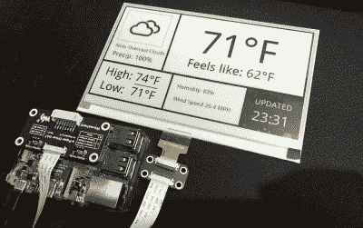

# 电子纸天气显示是一个很好的基础

> 原文：<https://hackaday.com/2020/11/03/e-paper-weather-display-is-a-great-base-to-build-from/>

随着电子纸模块变得越来越便宜，我们开始看到它们越来越多地出现在黑客项目中。过去，你必须强迫二手 Kindle 来执行你的命令，但现在你可以只购买屏幕本身，并配有一个插头，可以直接插入你的树莓 Pi。它的价格仍然和二手 Kindle 一样高…但至少它附带了一些文档，并且有 Python 库可以与它对话。

但是从哪里开始呢？如果你需要一些灵感，也许还需要一点源代码，这个由[詹姆斯·霍华德]制作的[非常光滑的天气显示是一个很好的基线](https://github.com/AbnormalDistributions/e_paper_weather_display)。并不是说它真的*需要*任何额外的改进，因为我们认为它已经看起来很华丽了。但是，将一些额外的功能移植到他的代码上要比你自己的项目从头开始容易得多。

 这很大程度上与他的代码有多简洁和注释有多好有关。我们已经看到了足够多的这样的项目，知道什么是经常在后端运行的意大利面条，但是这里没有。[James]使用强大的 Pillow 图形库组装显示器，[让你只需几行代码就可以绘制图元并放入文本和图标](https://hackaday.com/2018/03/21/making-pictures-worth-1000-words-in-python/)。

一旦所有的数据都被插入，整个屏幕就被保存为图像文件，然后在电子纸显示器上打开。即使您不是 Python 专家，您也应该能够理解正在发生的事情，以及如何按照您的意愿改变它。

我们一直对电子纸寄予厚望，看起来这项技术可能最终会达到临界质量。虽然它仍然有点贵，但我们已经开始[看到它在意想不到的地方出现并产生巨大影响](https://hackaday.com/2020/09/18/radon-monitor-recreates-steam-gauge-with-e-ink/)。希望像这样的项目能激励其他人投身于 T4。