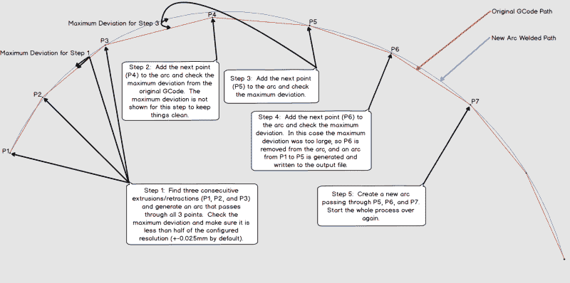

# 这个 GCode 后处理器将线条挤压成弧形

> 原文：<https://hackaday.com/2020/11/03/this-gcode-post-processor-squeezes-lines-into-arcs/>

当 slicer 软件将 3D 打印机模型文件转换为 GCode 时，它实际上是创建了一个按层组织的连接线段的顺序列表。但是，当原始模型的特征密集时，或者当模型表示小曲线时，切片器最终会创建大量微小的片段来表示这些信息。

这只是野兽的本性；大量的细节转化成许多微小的片段。不幸的是，一些打印机实际上很难以期望的速度打印这些模型，不是因为一些机械限制，而是因为处理器不能足够快地重新计算这些部分的速度。其结果是，一些打印机只是打印不稳定或打印速度变慢，导致打印时间大大超出预期。

进入 [Arc Welder](https://plugins.octoprint.org/plugins/arc_welder/) ，这是一个由【FormerLurker】编写的 GCode 压缩工具，它仔细检查 GCode 文件，寻找这些微小的片段，并试图用更少的电弧来替换它们的连续簇。结果是，表示模型所需的 GCode 命令的数量急剧下降，因为连接的线段命令簇变成了单弧命令。

“现在等等”，你可能会说，“弧不就是这些线段的近似吗？”是的，你是对的！但这就是弧焊机的神奇之处。该程序被编写为使得弧仅在以下情况下替换段:( 1)弧可以完全与所有段与段的交点相交，并且(2)段和弧表示之间的距离误差在某个阈值内。这些约束的作用是使生成的后处理在非常高的细节程度上忠实于原始图像。

A concise description of Arc Welder’s main algorithm as pulled from the docs

这整个程序运行的假设是，你的 3D 打印机的板载运动控制器接受 arc 命令，特别是 G2 和 G3。几年前，这还不常见，因为从技术上来说，3D 打印和 STL 文件只需要在直线段上移动。但是随着越来越多的人开始将这些运动控制板用于其他非打印应用，我们开始看到 arc 在运行 Marlin、Smoothieware 和 RepRap 固件 Duet 风格的板上实现。

出于好奇，这个程序既有[关于操作原理*的有据可查的*](https://plugins.octoprint.org/plugins/arc_welder/)又有 [的开源](https://github.com/FormerLurker/ArcWelderPlugin)。如果[FormerLurker]看起来像是一个熟悉的名字，你可能是对的，因为他们也是业余爱好者最喜欢的 3D 打印延时工具 [Octolapse](https://hackaday.com/2018/07/02/coolest-way-to-watch-3d-printing-lights-camera-octolapse/) 的幕后策划人。最后，如果你给弧焊机一个旋转，为什么不在评论里给我们看看你得到了什么？

感谢提示[ImpC]！