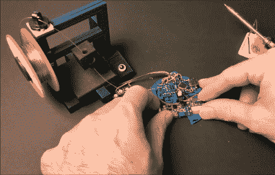

# 爸爸 DIY 室内曲棍球比赛得分很高

> 原文：<https://hackaday.com/2020/11/07/dad-scores-big-with-diy-indoor-hockey-game/>

我们认为现在下结论还为时过早，但我们肯定有一个年度最佳父亲的有力竞争者。[DIY_Maxwell]为他年幼的儿子制作了一款轻松的曲棍球游戏,看起来老少皆宜。每当用附带的 DIY 曲棍球棒(或其他任何东西)击打冰球时，它就会发光，并根据其加速度发出不同的声音。

 印刷圆盘内是一个运行 MPU6050 加速度计的 Arduino Nano，一个 12-NeoPixel 环和一个压电蜂鸣器。[DIY_Maxell]重用了一个电源组充电电路，给小 LiPo 电池充电。

最初的电路使用一对硬币电池，但 Arduino 随机冻结，可能是因为 led 的电流消耗。请务必在休息后查看视频，该视频以一个小的停止动作开始，[以 3D 打印机](https://hackaday.com/2020/09/15/whimsical-solder-stand-moonlights-as-toy-3d-printer/)形状的焊料台为特色。

有一屋子的地毯或易碎物品吗？你可以做一个空气曲棍球桌来代替。

 [https://www.youtube.com/embed/fs35TY9EAiM?version=3&rel=1&showsearch=0&showinfo=1&iv_load_policy=1&fs=1&hl=en-US&autohide=2&wmode=transparent](https://www.youtube.com/embed/fs35TY9EAiM?version=3&rel=1&showsearch=0&showinfo=1&iv_load_policy=1&fs=1&hl=en-US&autohide=2&wmode=transparent)

