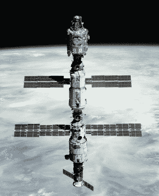

# 间隔:一个重要的周年纪念，Starlink 故障直线下降，月球手机，和载人发射

> 原文：<https://hackaday.com/2020/11/11/spacing-out-a-big-anniversary-starlink-failures-plummet-lunar-cellphones-and-a-crewed-launch/>

几个月后，我们将带着对轨道上发生的事情的定期综述回来，我们将带你远离*星际迷航:发现*和*曼达洛人*，并带你了解真实太空世界的一些亮点。我们期待着本周的发布，以及一个重要的周年纪念日。

The ISS as it looked twenty years ago. NASA (Crew of STS-106), [Public domain](https://commons.wikimedia.org/wiki/File:Unity-Zarya-Zvezda_STS-106.jpg).

首先是一个安静但极其重要的周年纪念日:在撰写本文的这一周，我们已经度过了人类在国际空间站持续存在 20 周年。在过去的几十年里，世界地缘政治地图可能已经在地球表面盘旋，但美国、俄罗斯、加拿大、欧洲和日本的宇航员及其所有的模块和实验一直在我们的头顶上，在一个国际和谐和科学努力的岛屿上。空间站最终将服务多久似乎还存在政治上的不确定性，然而现在它的未来似乎是确定的[，谈论它在火星任务研究和商业扩展模块](https://www.nasaspaceflight.com/2020/05/near-far-future-of-station/)中的用途。

SpaceX 的 [Starlink](https://www.starlink.com/) 全球卫星宽带项目已经成为新闻。任何长期的太空观察家都知道，卫星之间存在故障率，飞行器在投入使用前失踪并不罕见，Starlink 也不例外。[据报道，他们的失败数字为 2.5%](https://www.businessinsider.com/spacex-starlink-internet-satellites-percent-failure-rate-space-debris-risk-2020-10?international=true&r=US&IR=T) ，导致在星座完成时可能有一千颗左右的卫星在轨道上死亡，但是[天文学家 Jonathan McDowell 的修正计算](https://twitter.com/planet4589/status/1321842804088279041)显示了不同系列发射的令人印象深刻的改进。最近的发射失败率仅为 0.2%，这几乎肯定与 SpaceX 工程师的一些令人印象深刻的幕后工作相对应。

如果你记得诺基亚，仅仅是因为他们十多年前在消费手机市场的主导地位，那么你可能不会意识到他们仍然是移动电话基础设施领域的主要参与者，即使他们的手机辉煌时代已经过去。因此，他们被美国国家航空航天局选中在月球表面部署第一个外星球 4G 蜂窝网络。所以如果你在地球上信号不好的地方，你现在可以抱怨甚至*的宇航员*都比你的服务好！玩笑归玩笑，这个网络不会是我们在这里使用的网络的延伸。取而代之的是，它将使用 4G 技术，在 NASA 整个行动区域的表面上提供可靠的月球语音、视频和遥测通信。该系统将由太空加固和小型化基站组成，这些基站将由机器人部署，因此短期内不太可能有宇航员手机发射塔工程师在月球上工作。

本周值得关注的新闻将是 11 月 14 日 SpaceX 向国际空间站发射的 Crew-1 任务。我们都看到了今年早些时候的第一次载人宇航员龙测试任务，这将形成太空舱的第一次操作人员发射。由于 SpaceX 工程师需要解决一些技术问题，这项任务自 8 月以来一直被推迟。我们祝愿他们一切顺利，当我们看到舱门打开，他们登上新的轨道家园时，我们会松一口气。