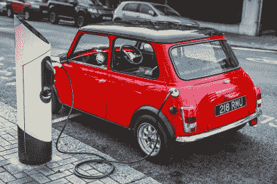

# 作为替代产品的电动汽车改装工程

> 原文：<https://hackaday.com/2020/11/15/an-ev-conversion-engineered-as-a-drop-in-replacement/>

随着特斯拉(Tesla)或聆风(Leaf)等电动汽车风靡一时，似乎每周都有新的竞争对手加入，世界似乎正在为电动马达而非内燃机而疯狂。然而，电力牵引的另一个领域很少成为头条新闻，那就是通过改装电机将现有的 ic 汽车转化为电动汽车。所涉及的工程可能相当大，每辆车都不同，因此我们很有兴趣看到英国公司 Swindon Powertrain 为经典 Mini 提供的产品，这可能是许多流行车型的第一个负担得起的预制转换套件。

Swindon Powertrain’s demo Mini

该套件采用了他们的 HPD 板条箱电动汽车电机[，我们在今年早些时候报道过](https://hackaday.com/2020/06/07/crate-ev-motor-hits-market-the-swindon-powertrain/)，并将其与一个迷你前副车架相匹配。支架和 CV 接头专为套件设计，可直接放入 Mini 中。这种差异似乎是向右偏移，而不是原来的中心位置，所以我们对使用 Mini 自己的传动轴的说法感到好奇，但这几乎不是一个应该对任何准备承担这样一项任务的人征税的问题。他们还可以提供交钥匙转换的所有其余部分，这可能是最有趣的驾驶电动汽车之一。

经典的 Mini 现在是一种受欢迎的机器，早已过了它作为大众廉价的旧汽车的日子，所以应该根据现在比一些新车更贵的一个好例子来看待套件的价格。我们预计这个工具包在专业和半专业市场上最有吸引力，而不是家庭转换的预算结束，但它仍然值得注意，因为它是未来的一个可能的迹象。我们期待预制子框架成为各级电动汽车改装的主要产品。其他流行的引擎升级也发生了同样的事情，毫无疑问，一些以它们为特色的转换将进入 Hackaday 的页面。

正如我们在之前提到的那样，[我们喜欢将转换作为电动汽车采用途径的一部分的想法。](https://hackaday.com/2020/05/15/electric-vehicles-continue-the-same-wasteful-mistakes-that-limit-longevity/)