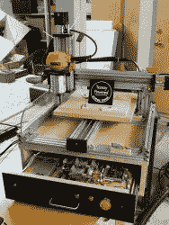

# 强大 CNC 的小型控制器

> 原文：<https://hackaday.com/2020/11/11/teensy-controller-for-powerful-cncs/>

似乎每年，它变得更容易建立自己的数控系统。从 20 世纪 90 年代早期的增强机器控制器(EMC)项目到 2000 年代后期运行 Grbl 的 Arduinos，开源社区已经突飞猛进。Grbl 是其核心固件，解释 g 代码并命令步进电机，通常以这样的方式移动工具头以制造某物。围绕它建立了大量的系统，包括早期的 Makerbot 打印机。

它还催生了过多的其他项目(Grbl GitHib repo 有 2400 个分支！)，包括一个名为 grblHAL 的 32 位风味。这个版本是由[Phill Barrett] 开发的[奇妙的 CNC 控制器板的核心。为了更强大的 Teensy 4.1，抛弃了 Arduino，[Phil]的控制器支持完整的五轴控制、变频驱动主轴、除尘器控制以及洪水和薄雾冷却剂控制。它可以高达 160 kHz 的步进速率运行(Arduino 上的标准 Grbl 达到 30 kHz)，并且可以与 USB 或以太网接口组装。](https://hackaday.io/project/175209-teensy-41-cnc-controller)

那里不乏有趣的基于 Grbl 的机器——包括一台[改进的 Atari 绘图仪](https://hackaday.com/2019/10/24/retro-hardware-plots-again-thanks-to-grbl-and-esp32/)和一台[三轴旋转 CNC](https://hackaday.com/2018/09/24/a-rotary-axis-cnc-machine/) (作者自己项目的无耻插件)，但看到新硬件的开发无疑会找到进入下一代项目家族的途径，这总是令人兴奋的。我们迫不及待地想看看接下来会发生什么！