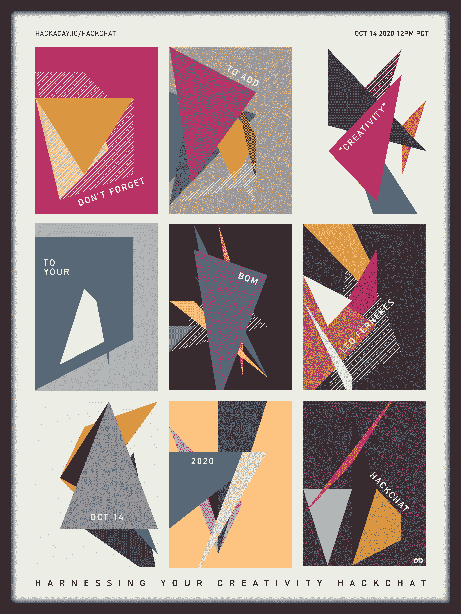

# 利用你的创造力

> 原文：<https://hackaday.com/2020/11/16/harnessing-your-creativity-hack-chat/>

加入我们太平洋时间 11 月 18 日星期三中午与 Leo Fernekes 的[驾驭你的创造力黑客聊天](https://hackaday.io/event/175236-harnessing-your-creativity-hack-chat)！

(*注:这次黑客聊天是从 2020 年 10 月 14 日重新安排的。*)

你坐在工作台上，周围都是行业工具——仪表和示波器、电源和手动工具，以及一个库存充足的零件箱。你的试验板已经准备好了，你的手指已经跃跃欲试，你已经拥有了开始工作所需的一切，但是——什么也没有发生。缺少了一些东西，如果你像我们中的许多人一样，那就是你无法从易贝或亚马逊那里得到的东西:让创新发生的创造性火花。

创造力是一种很难描述的东西，当它不存在的时候，人们通常会注意到它。硬件黑客需要极大的创造力，而且并不总是能指望它在需要的时候出现。如果你能以某种方式减少实践中的创造性，并使它像任何其他商品一样容易为每个项目采购，那就太好了。

虽然利奥·费尔内克斯还没有将创造力商品化，但从他的 YouTube 频道上的项目广度来看，他有一个很好的将想法转化为创作的系统。我们在我们的页面上展示了他的一些作品，比如[分立晶体管数字时钟](https://hackaday.com/2020/04/09/tell-time-like-its-1960-with-this-all-transistor-digital-clock/)、[你需要的最后一个连续性测试仪](https://hackaday.com/2020/07/13/build-an-everlasting-continuity-tester/)，以及他的[有些非传统的试验技术](https://hackaday.com/2020/05/24/ironclad-tips-for-copper-clad-prototyping/)。狮子座也不怕失败，并分享学到的教训。

然而，他的项目并不是故事的全部:我们要讨论的是他的过程。Leo 加入了我们的黑客聊天，来探究创造过程，看看怎样做才能保持你的方法的严谨性和系统性，同时还能使这个过程富有创造性和灵活性。请带着您的疑问加入我们，寻找将零件和技能转化为真正创新的成品项目所需的灵感。

 我们的黑客聊天是 [Hackaday.io 黑客聊天群发消息](https://hackaday.io/messages/room/2369)中的社区直播活动。本周，我们将于太平洋时间 11 月 18 日星期三中午 12:00 坐下来讨论。如果时区让你和我们一样困惑，我们有[一个方便的时区转换器](https://www.timeanddate.com/countdown/generic?iso=20201118T12&p0=224&msg=Harnessing+Your+Creativity+Hack+Chat&font=cursive)。

点击右边的那个发言气泡，你会被直接带到 Hackaday.io 上的黑客聊天群，不用等到周三；随时加入，你可以看到社区在谈论什么。

