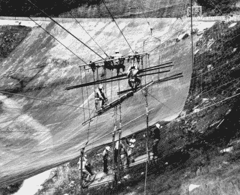

# 阿雷西博第二条电缆故障后的高度紧张

> 原文：<https://hackaday.com/2020/11/11/tensions-high-after-second-failed-cable-at-arecibo/>

今天，我们很遗憾地报告，阿雷西博天文台的一根主要支撑电缆折断了，这让这台麻烦的射电望远镜离潜在的灾难又近了一步。该天文台 300 米的反射盘在波多黎各的恶劣天气中暴露了 60 年后，已经急需维修，但日益减少的资金使工程师们很难跟上。2017 年飓风玛丽亚造成的破坏仍在修复中，当时一根二级支撑电缆在 8 月份挣脱并砸穿了碟形天线，导致人们严重担心在灾难性故障不可避免之前，该结构还能承受多少虐待。

这种情况尤其可怕，因为两条故障电缆都连接到同一个塔上。剩下的每一根缆绳现在都比以往承受更大的重量，增加了再次发生故障的可能性。除非工程师能够支撑碟形天线并减轻这些电缆上的压力，否则整个结构可能会被多米诺骨牌效应拖垮；随着对它们的需求变得太大，每根电缆相继折断。

Workers installing the reflector’s mesh panels in 1963.

作为一项预防措施，该网站已经对所有非必要人员关闭，并限制工人的风险，在工程师制定计划以稳定结构直到替换电缆到来时，无人机被用来评估碟形天线和电缆。幸运的是，他们领先了一步。

早在 9 月，管理阿雷西博天文台的中佛罗里达大学联系了几家公司，以制定策略来解决之前失败的电缆及其造成的损害。为了应对最近的挫折，这些计划现在已经被提高了。

不幸的是，还有一个资金问题。有人担心，在飓风玛丽亚袭击后，天文台将不得不关闭，因为预算中没有足够的资金进行相对较小的必要维修。中佛罗里达大学介入并提供了必要的资金，以使天文台在 2018 年保持在线，但他们可能需要依靠他们的合作伙伴国家科学基金会来帮助支付他们自那以来积累的维修费用。

阿雷西博天文台是一个独特的设施，它的毁灭对科学界来说是一个不可思议的打击。研究人员已经在为修复前景而努力，这将使强大的射电望远镜停止使用一年或更长时间，但现在看起来天文台很有可能会失去。我们希望地面上的团队可以安全地稳定这个标志性的仪器，这样它就可以在未来几年继续探索深空。