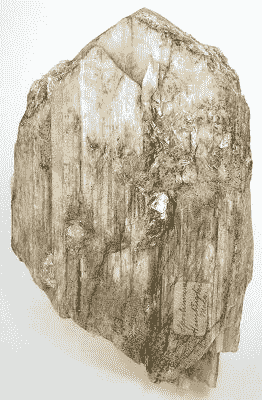
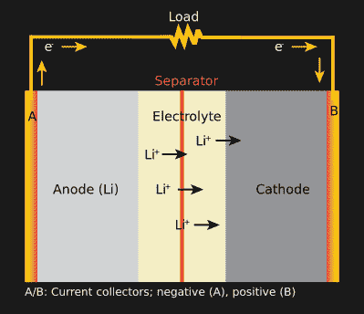

# 锂:它是什么？我们有足够的锂吗？

> 原文：<https://hackaday.com/2020/11/30/lithium-what-is-it-and-do-we-have-enough/>

锂是一种银白色的碱金属，是最轻的固体元素。这种神奇的金属离氦只有一步之遥，如今似乎无处不在。除了构成多种电池的骨架外，它还用于润滑剂、情绪稳定药物，并在铁、钢和铝生产中作为重要的添加剂。随着电话、太阳能电网和电动汽车越来越受欢迎，每个都配备了锂电池，世界越来越希望储存越来越多的电力。这意味着对更多锂的需求不断增长。迄今为止，产量一直难以跟上需求的步伐。这就引出了一个问题，我们有足够的锂供每个人使用吗？

制造一个 70 千瓦时的特斯拉 Model S 电池组需要大约 138 磅(63 千克)99.5%的纯锂。2016 年，OICA 估计全球[有 13 亿辆汽车在使用](http://www.oica.net/wp-content/uploads//Total_in-use-All-Vehicles.pdf)。如果我们用电动汽车取代所有汽车，我们将需要 1790 亿磅或 8950 万吨(8100 万吨)的锂。那只是汽车。这还不包括智能手机、笔记本电脑、家用电力系统、[大规模电网存储项目](https://hackaday.com/2019/12/16/the-hornsdale-power-reserve-and-what-it-means-for-grid-battery-storage/)，以及数千种其他使用锂电池的产品。

2019 年，美国地质调查局估计，世界已探明锂储量为 1700 万吨。包括未查明的在内，估计全球锂总量为 6200 万吨。虽然这两个估计都没有达到 8900 万吨的水平，但为什么确定的总量和估计的总量之间有如此大的差距呢？而且根据一般的经验法则，原子核越轻，元素越丰富，难道不应该有更多的锂储备吗？毕竟，美国地质调查局估计，已探明的铜储量约为 21 亿吨，还有 35 亿吨有待发现。为什么这两个元素之间有 100 倍的差距？

## 锂是什么，它从哪里来？

锂在地质学上是稀有的，因为它在原子上是不稳定的，这是因为它比任何其他稳定的核素具有最低的每个核子的结合能。这有利于核反应(锂在 1932 年第一次早期核反应中被用作燃料)，但不利于在自然界中找到它。进一步加剧其挥发性的是，锂是一种碱，如果与它所反应的元素(如空气中的元素)接触，就会燃烧。纯锂需要储存在油中才能安全运输。

A 660 gram sharply terminated crystal of spodumene: Rob Lavinsky, iRocks.com

鉴于它的稀有性和活性，提取过程不同于其他金属。目前，有两种方法可以提取锂。第一种方式来自离子化合物，如[伟晶岩矿物](https://en.wikipedia.org/wiki/Pegmatite)(由石英、长石、云母和其他晶体组成)。很长一段时间，这是世界上锂的主要来源。截至 2020 年，澳大利亚的大部分锂产量来自锂辉石，这是一种存在于伟晶岩和细晶岩中的辉石矿物。

除了存在于矿物中，锂还可以在盐水和海水中找到，因为它可以以离子的形式溶解。这意味着在南美洲和内华达州发现的锂饱和盐水可以使用太阳能蒸发器进行干燥，然后一旦达到良好的浓度，碳酸锂和氢氧化锂就可以通过添加碳酸钠(洗涤苏打或苏打灰)和氢氧化钙(熟石灰或苛性石灰)进行沉淀。盐水提取过程通常需要 18 到 24 个月。

然而，不同的工艺生产的锂并不相同。如前所述，电池制造商要求 99.5%的纯锂，剩下的 0.5%很重要。盐水会带入铁或镁，这是电池制造商试图避免的杂质。锂辉石还具有纯度的优势，因为澳大利亚的矿床估计含有 2.4%的锂。然而，卤水中丰富的锂含量使其非常引人注目，即使浓度很低(0.2-0.3%)。据估计，有 2300 亿吨锂溶解在海洋中，但浓度为 0.1-0.2ppm 时，提取变得经济可行还需要一段时间。已探明储量和总估算储量之间的差异主要可以用卤水来解释。盐水很难估计，因为它们的浓度变化很大，而且经常隐藏在奇怪的地方。

Uyuni Salt Flat by [Leonardo Rossatti](https://www.pexels.com/photo/uyuni-salt-flat-2613110/) from Pexels

例如，世界上大部分锂卤水都集中在一个被称为“锂三角”的地区，这个地区位于智利、玻利维亚和阿根廷的交界处。这个三角形被认为包含超过 75%的现有已知锂。其中一个卤水来源是玻利维亚西南部靠近安第斯山脉顶部的乌尤尼盐沼(大约海拔 12000 英尺或 3700 米)。

顶部有一层几厘米到几米厚的盐。在坚硬的地壳下面是液态卤水，锂的浓度相对较高(0.3%)。在地壳上钻一个洞可以将盐水抽出并进行处理。你可以想象，高海拔使提取变得复杂，运输提取的锂也变得更加复杂。

## 电池技术

为什么锂作为电池效果如此之好？使用锂的电池种类数不胜数。还有 Li-MnO2，最常见的消费级电池化学物质，Li-FePO4、Li-CSVO、Li-CFx、Li-CuFeS 和 Li-FeS2 只是目前常用的一些变体。勒温·戴写了一本锂电池入门指南，可以帮助你理清头绪。

How a Li-ion battery discharges. Image by [Sdk16420](https://commons.wikimedia.org/wiki/File:General_discharging_Li_battery_diagram.svg) CC-BY-SA

每个电池都有三个部分:阳极、阴极和电解液。今天大多数电池使用液体电解质，这是由悬浮在有机溶剂中的锂盐制成的。固态锂电池提供了一些希望，但仍处于开发阶段。他们使用固体锂氧化物作为电解质，因为它们是固体，不能泄漏，这是基于液体的同行的安全问题。阳极通常是一种材料，如石墨或钛酸锂[嵌入锂](https://en.wikipedia.org/wiki/Intercalation_(chemistry))(可逆分层)。阴极通常由锂镍钴(LMO)或锂镍锰钴氧化物(NMC)制成。

锂电池内部的可逆反应在所有锂电池中非常相似。在放电过程中，阳极发生氧化半反应，形成负电子和正锂离子。锂离子向阴极移动，而电子通过电路向阳极移动。它们在还原半反应中重新结合。施加电流，这个反应就会逆转。因为阴极和阳极都允许锂离子插入它们的结构中，所以锂离子在两个电极之间来回“摇摆”。由于锂的相对不稳定性和原子结构，它很容易形成锂离子并通过电池运输。

这种反应确实有其局限性。电池电压过高(5.2 伏)会导致氧化钴的合成，从而损坏电极。让电压降得太低会导致氧化锂的产生，它会与电池本身发生反应，从而不可逆地损坏电池。在鲍勃·巴德利去年写的这篇精彩的文章中，你可以学到更多关于电池化学的知识。

## 阴极/钴问题

正如我提到的，电池的阴极通常由钴制成。有趣的是，钴在某些方面比锂更稀有。尽管钴很稀有，但由于锂离子电池，对钴的需求持续飙升。超过一半的世界供应量在刚果民主共和国，这是一个臭名昭著的世界开发地区。童工和奴隶劳工在矿井中被反复报道，许多公司试图找到这种材料的道德来源。在减少每个电池所需的钴量方面已经取得了进展，钴量已经从阴极的 1/3(NMC 111)下降到 1/10(NMC 811)。许多公司正试图制造完全不含钴的电池，例如，特斯拉 Model 3 的 LFP 阴极不含钴。即使新技术投入生产，我们离无钴还有很长的路要走，今天的大多数电池仍然是钴基的。我们可能在面临锂短缺之前很久就面临钴短缺。

## 我们有足够的食物给每个人吗？

简短的回答大概是。几十所不同的大学和国家实验室已经拿出了这样或那样的预测研究。劳伦斯伯克利国家实验室在 2011 年的一项研究中表示，我们可以用现有的储量建造 10 亿个 40 千瓦时的锂电池，然而，他们假设每个电池只有 10 千克锂(特斯拉 Model S 的 1/6)。即使我们有足够的原材料，也需要考虑将其转化为可用形式的过程。

自 2012 年以来，消费量每年增长约 25%，超过了产量每年 4%至 5%的增幅。在某种程度上，有些事情必须改变。一些人将这些市场状况与石油行业相提并论。对石油的需求导致了以前在商业上不可行的新提取方法和新技术。在从海洋等浓度较低的来源提取锂变得更加经济可行之前，我们仍有大量的研究和开发工作要做。也就是说，我们可以做一些事情来缓解前进道路上的困难。

## 回收锂

回收锂一直是研究人员和工程师的梦想。在实现这个梦想的道路上有几个障碍，即回收设计和成本效益。与铅酸电池不同，铅酸电池在设计时考虑到了回收利用，并且[实现了大约 98%的质量回收率](https://hackaday.com/2018/07/16/getting-the-lead-out-of-lithium-battery-recycling/)，锂离子电池通常专注于适合它们所在产品的大小和形状。回收还需要贴标签来说明电池的化学性质，而锂离子电池通常不会。与铅酸不同，锂电池的阳极和阴极密度相似，这使得它们很难分离出来回收利用。这需要复杂的化学或磁性分离步骤，这些步骤根据电池的化学性质而变化。

 也就是说，[大学正在努力改进流程](http://dx.doi.org/10.1016/j.joule.2020.10.008)。虽然他们的结果令人难以置信的有希望，但问题是回收利用在经济上还不可行。购买原材料制造新电池比回收旧电池便宜。

## 新电池技术

每隔几年左右，一些新的电池技术就会被宣布为我们潜在的救星。似乎新的、更好的电池即将出现的承诺每年都在兑现。我们[报道了当前的竞争者](https://hackaday.com/2020/09/01/potential-contenders-for-battery-supremacy/)以及一些有前途的新贵，如[锂硫](https://hackaday.com/2020/08/23/lithium-sulfur-batteries-slated-for-takeoff/)和[锂陶瓷](https://hackaday.com/2018/09/15/testing-lithium-ceramic-batteries-lcbs/)。每一种都承诺了不同的东西，比如更高的能量密度，更快的充电速度，或者更环保。虽然普遍的共识是，当我们在消费产品中看到电池突破性的宣传时，我们会相信它，但我们仍然必须赞扬过去几十年来创造锂离子电池稳定改进的所有研究人员和工程师。

因此，下次当你看到项目中的小型锂电池或由 18650 个电池组成的大型电池库时，花一点时间去欣赏它们的来源，或许甚至可以让自己思考下一步会发生什么。