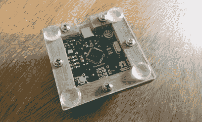

# 微型宏键盘是基于兆的

> 原文：<https://hackaday.com/2020/11/19/micro-macro-keyboard-is-mega-based/>

从备用零件中拼凑出一些东西，或者在另一个项目的概念验证中找到实用性，会带来某种快乐。[Clewsy]正在做一些古怪的事情，[建造了这个小 keeb 来证明一些事情，例如读取一个关键矩阵](https://hackaday.io/project/175874-macr0)。现在它变成了一个音乐/媒体控制器，在一个巨大的匹配音量旋钮旁边看起来很棒。

 在轻轻背光的 Gateron blues 下面是一个定制的基于 ATMega32u4 的电路板，可以通过透明的丙烯酸底板看到。这是一个很好的接触。我们不确定木材是否来自相框，但如果不是，它们看起来很适合做外壳材料。

这个 keeb 看起来很棒，我们对透明和镀铬键帽都很感兴趣。我们只能希望[Clewsy]把下一个版本的细节发给我们。

如果你想开始构建键盘，像这样的宏键盘是不会错的。如果你脑子里想的不止四个宏，那就做一些更大的，比如带操纵杆的定制游戏手柄。