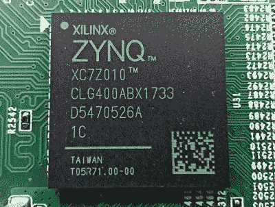

# 从比特币矿工那里黑进 FPGA 控制板

> 原文：<https://hackaday.com/2020/11/18/hacking-the-fpga-control-board-from-a-bitcoin-miner/>

对于任何认真挖掘比特币等加密货币的人来说，我们已经远远超过了标准台式电脑的用处。虽然一系列高端 GPU 对一些货币仍然可行，但真正的重量级人物正在使用定制的采矿硬件，这些硬件利用专用集成电路(ASICs)来处理数据。但最终，即使是最强大的采矿场也会开始显示其年龄，许多人最终会在二手市场上以低价出售。

自然，黑客们正在努力为这些计算能力寻找替代用途。虽然它不会教一个旧的 ASIC 一个新的技巧， [[xjtuecho]记录了一些关于 Ebit E9+比特币矿工](https://github.com/xjtuecho/EBAZ4205)的 FPGA 控制板的非常有趣的细节。这款被称为 EBAZ4205 的主板可以从在线进口商那里以大约 20 美元的价格买到，如果你能找到二手的，价格甚至会更低。由于它只是控制器，它不会帮助你建立一个预算超级计算机，但人们总是对廉价的 FPGA 开发板感兴趣。

The Zynq SoC combines an FPGA and ARM CPU.

根据[xjtuecho]的说法，让 EBAZ4205 为实验做好准备需要一点工作。首先，你可能不得不在你自己的微型 SD 插槽上焊接，这取决于你从哪里得到的电路板。您还需要添加几个二极管来配置从哪个存储设备启动，以及选择主板从哪里获取电源。

完成后，您将拥有一个带 256 MB DDR3 的双核 Cortex A9 Linux 板和一个具有 28K 逻辑元件的 Artix-7 FPGA。从那里你去哪里取决于你自己。

这不是我们第一次看到 FPGA 板以最低价格进入过剩市场。当 IT 部门在 2013 年开始抛售他们的 Pano Logic 瘦客户机时，一个专门的 FPGA 黑客社区围绕着它涌现出来。我们不确定 EBAZ4205 在其第二次生命中是否会享有同样的受欢迎程度，但价格肯定是正确的。

【感谢 Rog77 的提示。]