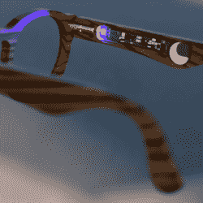

# 为什么你需要完成

> 原文：<https://hackaday.com/2020/11/21/why-you-need-to-finish/>

迈克和我在播客上谈论一个有趣的智能眼镜黑客。这是其中一个项目，即使你不需要一副上面有 led 的眼镜来帮助你导航，你也会忍不住惊叹于整个过程中做出的许多小设计选择。

例如，我喜欢柔性印刷电路板通过缠绕电池和形成电池座来实现双重功能的方式。我觉得这是一个典型的诀窍，只有在你需要的时候才会想到。需要是发明之母，诸如此类。有一个问题，如何在狭小的空间里安装电池座，以及一套包括柔性 PCB 基板在内的资源。巧妙地将所有这些融合在一起，最终产生了一个新颖的解决方案。如果你只是坐在沙滩上，你不会想到这些；你必须设计一些电子的、空间受限的、在柔性 PCB 上的东西来实现这个。

 迈克随口说了一句话，他说有时候你只需要完成一个项目，就能得到你在这个过程中想出的好主意和聪明的解决方案，我认为这个电池盒的例子充分说明了这一点。回想起来，我数不清有多少项目可能是愚蠢的，也可能不是愚蠢的，但在这个过程中，我想到了一个小技巧，我将在许多进一步的项目中使用它，比最初的应用程序寿命长。

原则上完成一个项目本身就是一个合理的目标。但是，当看到事情结束的过程是新的有趣的挑战和解决方案的生成器时，它甚至更有价值。因此，如果你被困在一个项目中，不确定你是否想一直走下去，考虑一下这个旅程本身是否是目的地，把它看作是一个想出下一个持久技巧的机会。

### 坏消息:阿雷西博

如果你读了上周的时事通讯，你会听到我大声质疑阿雷西博天文台遭受的破坏是否已经超出了让它继续运行的经济可行性的门槛，不幸的消息刚刚传来，阿雷西博之战已经失败。我们说要流泪，现在我们在这里。Sic 过境格洛丽亚芒迪。希望有更酷的东西取代它！

This article is part of the Hackaday.com newsletter, delivered every seven days for each of the last 200+ weeks. It also includes our favorite articles from the last seven days that you can see on [the web version of the newsletter](https://mailchi.mp/hackaday.com/hackaday-newsletter-649368). Want this type of article to hit your inbox every Friday morning? [You should sign up](http://eepurl.com/gTMxQf)!