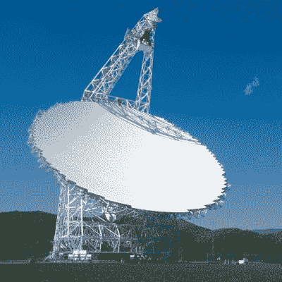
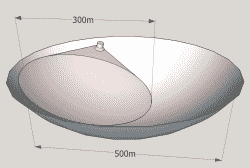
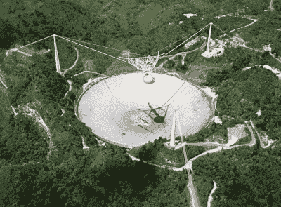

# 悼念阿雷西博:随着一个独特的科学设施的消亡，谁来传递火炬？

> 原文：<https://hackaday.com/2020/11/24/eulogy-to-arecibo-with-demise-of-a-unique-scientific-facility-who-will-carry-the-torch/>

当最终宣布它们将退役时，很少有望远镜会得到公众的情绪反应。在波多黎各阿雷西博的阿雷西博天文台，在最初报告射电望远镜的巨大碟形天线受损后，过去几个月不仅天文学家，而且世界各地无数人都在屏息等待。

当国家科学基金会宣布他们将让望远镜退役时，人们的悲伤和震惊是可以理解的。阿雷西博不仅是波多黎各的地标，它还是《T2》、《黄金眼》(T3)(1995)和《T4 接触》(T5)(1997)等标志性电影中的望远镜。它的数据被用于 Seti@Home 和 Einstein@Home 等公共项目。

阿雷西博的死亡真的不可避免吗？这对科学界意味着什么？

## 阿雷西博的定义是什么

The Green Bank Telescope.

真正的问题是，我们失去了什么？有没有阿雷西博的继任者能够填补科学界目前面临的巨大空白？观察使其独一无二的望远镜的各个方面有助于我们找到答案。

望远镜本质上是用于观测遥远的电磁辐射源的高灵敏度仪器。对于光学望远镜来说，这意味着电磁波谱的可见光部分。射电望远镜以类似的方式工作，但是被调谐以接收无线电频率。阿雷西博能够利用其 304 米直径中的有效 221 米，通过多个接收器捕获 1-10 GHz。就像光学望远镜的主镜在很大程度上决定了有多少光最终会到达传感器一样，射电望远镜主镜(碟形)的大小和形状也是如此。

大多数望远镜可以调整，使反射镜指向天空的不同部分。这主要是力学和工程学允许的问题，西弗吉尼亚州的[绿岸望远镜](https://en.wikipedia.org/wiki/Green_Bank_Telescope)是目前最大的完全可控的射电望远镜，碟形直径为 100 米。波多黎各的阿雷西博和中国的 [FAST](https://en.wikipedia.org/wiki/Five-hundred-meter_Aperture_Spherical_Telescope) 射电望远镜有固定的反射镜，利用了[喀斯特](https://en.wikipedia.org/wiki/Karst)天坑留下的自然洼地。在这个碗状的凹陷中，安装了组成碟形天线的元件，主要是按照这些轮廓，用一个可移动的接收器阵列来瞄准望远镜。虽然很方便，但这将这些望远镜的视野限制在相当狭窄的天空区域。

The illuminated area of the FAST telescope on the primary dish.

无论是更新的还是体积更大的，很明显中国的 FAST 望远镜要优于阿雷西博，但这并不完全正确。阿雷西博的碟形反射器比 FAST 安装得更牢固。虽然后者更灵活，绞盘能够调整反射器网格的形状，但这在这些更高的频率下带来了折衷。即使对 FAST 的接收器进行类似于阿雷西博在 1997 年获得的升级，FAST 也只能覆盖高达约 5 GHz 的频率，只有阿雷西博性能的一半。

除了这些性质，还有一个[雷达天文](https://en.wikipedia.org/wiki/Radar_astronomy)的问题，需要传输强大的雷达信号。阿雷西博有四个雷达发射机，功率分别为 20 太瓦(连续)、2.5 太瓦(脉冲)、300 兆瓦和 6 兆瓦。这些占用了大量的空间，因此由于重量和空间方面的考虑，不能安装在 FAST 的二级平台上与其接收器并排。阿雷西博只是雷达天文学中经常使用的两台望远镜之一，另一台是 70 米长的[戈德斯通太阳系雷达](https://en.wikipedia.org/wiki/Goldstone_Solar_System_Radar)，带有 500 千瓦的发射机。

随着小行星和彗星的探测成为阿雷西博雷达天文任务(跟踪和预警系统)的重要组成部分，这留下了一个主要的盲点。没有阿雷西博，我们不得不主要依靠光学望远镜来追踪这些穿越太阳系的天体。

## 基础设施预算之舞

或许不足为奇的是，阿雷西博是冷战时期的产物，被设想为反弹道导弹(ABM)防御系统的一部分。像阿雷西博这样的设施将提供探测任务，大概足够灵敏，可以从雷达信号中过滤掉一枚[多弹头分导弹道导弹](https://en.wikipedia.org/wiki/Multiple_independently_targetable_reentry_vehicle)内的假弹头。阿雷西博对重返大气层的洲际弹道导弹的确切物理知识没有扎实的理解，他是 ARPA 领导的填补这方面知识空白的努力的一部分。

随着冷战的持续和苏联最终解体前重点的转移，阿雷西博发现自己处于一种与苏联的铁锈和剥落的油漆覆盖的奇迹没有什么不同的境地。作为一种不需要的军事资产，它的作战预算逐年减少。尽管小行星研究是其独特的任务之一，但在 2001 年 [NASA 宣布](https://web.archive.org/web/20081205190409/http://www.space.com/scienceastronomy/astronomy/arecibo_cuts_011220.html)他们将削减 27%的资金，并“鼓励”国家科学基金会(NSF)资助整个项目 1100 万美元的预算。

2007 年， [NSF 宣布](https://www.washingtonpost.com/wp-dyn/content/article/2007/09/08/AR2007090801654.html?hpid=moreheadlines)由于他们自己的预算被削减，除非能找到其他资金来源，否则他们将不得不关闭阿雷西博。值得注意的是，波多黎各本身相当贫穷，其政府甚至没有财力支持这样一个标志性的望远镜，而且由于波多黎各不是美国的一个州，华盛顿 DC 也没有参议员为其游说。

美国宇航局在 2010 年恢复了对该望远镜的资助，2012 年增加到 350 万美元/年。尽管如此，国家科学基金会在此期间改变了阿雷西博天文台的运作方式，寻求商业和其他合作伙伴，并将康奈尔大学从该项目中移除。到 2015 年，NSF [向](https://www.nationalgeographic.com/science/phenomena/2016/06/10/with-earths-largest-telescope-threatened-its-homeland-rallies/)发出信号，表示正在考虑让该设施退役。

当飓风 Maria 在 2017 年损坏了 430 MHz 馈线和部分主碟形天线时，由中佛罗里达大学(UCF)领导的一个财团通过财政支持成功阻止了天文台的退役，但随后在 2020 年 8 月 10 日，[一条二级平台支撑电缆断裂](https://hackaday.com/2020/08/24/damage-to-arecibo-leaves-gaping-hole-in-astronomy/)，损坏了主碟形天线和接收器平台。

随着几十年来在最低运营预算下蹒跚前行的现实，11 月 7 日[见证了第二次电缆断裂](https://hackaday.com/2020/11/11/tensions-high-after-second-failed-cable-at-arecibo/)，进一步损坏了主碟形天线。在工程师[检查了第二起事故后的设施](https://earthsky.org/space/arecibo-observatory-broken-cables-aug-nov-options)后，对媒体的声明称:

> 初步分析表明，在 11 月 6 日发生故障的主电缆应该能够轻松应对基于设计容量的额外负载。工程师们怀疑，第二根电缆故障很可能是因为它随着时间的推移已经退化，并且自 8 月以来一直在承载额外的负载。

所有这些似乎都指向缺乏维护预算，导致阿雷西博天文台的许多电缆没有定期检查、维护或更换。特别是在波多黎各这样相当潮湿和温暖的气候中，钢缆的腐蚀会加速，缺乏维修会导致承载能力下降。

## 可能是什么

Arecibo Observatory from the air in happier days.

像阿雷西博这样的科学设施的一个主要问题是，它们不够炫，不够酷，不足以保证持续的资金流动，有些管理比其他管理更差。主要原因是，许多科学主要涉及等待，挖掘多年的数据，更多的等待，处理更多的数字和运行模型，希望你看到一个定理得到证实。

当政治家或普通人被问及对阿雷西博的死亡有何看法时，很多人不太可能总结出该设施的用途，以及为什么它的损失远远超出了天文学界。

位于天文台附近的Á·安赫尔·拉莫斯基金会游客中心于 1997 年开放。它作为一个教育中心，不仅有关于阿雷西博天文台的展览和展示，还有天文学和大气科学。随着天文台的消失，这个中心的未来以及波多黎各在天文学中的作用都成了疑问。

## 为未来

在这个世界上，一些人以十亿计他们的价值，而华尔街以万亿计他们的进步，像阿雷西博这样的设施的运营和维护预算是非常小的。尽管如此，似乎没有迹象表明阿雷西博退役的决定将被恢复。是否会在波多黎各或美国任何地方建立一个替代设施，目前仍悬而未决。

我们现在能确定的是，尽管它的地理位置不同，缺乏雷达发射能力，FAST 望远镜和一系列较小的射电望远镜将能够弥补那里的大部分不足。由于中国将大型科学项目视为声望的象征，除了快速建设，他们还计划在 2023 年将该国完全可控的 110 米[奇台射电望远镜](https://en.wikipedia.org/wiki/Qitai_Radio_Telescope)上线，这将使其成为世界上同类望远镜中最大的。

人们只能希望美国和其他国家上钩，开始与中国在建造最好、最有用的望远镜和其他科学项目方面进行友好竞争，以促进人类到达恒星。因为最终，当一颗大的小行星设法不避开地球时，只有像阿雷西博这样摇摇欲坠的地点来展示一个人的经济实力是毫无价值的。