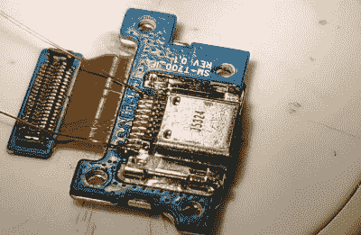

# 由于新的充电器 IC，废弃的平板电脑再次复活

> 原文：<https://hackaday.com/2020/11/24/trashed-tablet-lives-again-thanks-to-new-charger-ic/>

你有没有从垃圾桶里拿出一件看起来没什么问题的电子产品，却发现它真的坏了？既然你在读 Hackaday，我们已经知道答案了。捡垃圾是黑客的光荣传统，我们都知道每次你从路边捡东西都是一场赌博。但是当[Everett]从电子垃圾箱中拿出的三星 Galaxy Tab S 无法充电时，[他决定把它砸开，看看它是否真的无法修复](https://tterev3.blogspot.com/2020/11/saving-broken-tablet-with-charger-hack.html)。

第一步是使用 USB 功率计来查看平板电脑在插入电源时是否真正产生电流。由于线路上只有 10 毫安的电流，[Everett]知道该设备甚至没有试图给自己充电。因此，他的下一步是拔出电池，从工作台电源充电。这让平板电脑醒了过来，据他所知，其他一切都像预期的那样工作。似乎唯一的问题是充电电路烧坏了。

Where we’re going, we don’t need ribbon cables.

现在，在这一点上，[Everett]可以只是上网为平板电脑买一个新的主板，然后就收工了。但是这有什么意思呢？相反，他在一块柔性印刷电路板上用 TP4056 集成电路连接了一个简单的充电电路，并将其安装在一个正方形的 Kapton 胶带上。然后，他使用 34 AWG 电磁线将其连接在平板电脑的 USB 端口和电池之间，完全绕过了平板电脑的电子设备。

修复成功了，但是有一个小问题。由于 TP4056 只能升至 4.2 V，电池最大电压为 4.35 V，[Everett]表示，根据安卓系统，他被黑的充电器只能将平板电脑的容量提高到 92%。但考虑到另一种选择，我们认为这不仅仅是一个值得的交换。

人们很容易将平板电脑视为一次性设备，但这并不是我们第一次看到有人仅仅凭借焊接和耐心就拯救了一台。当然，[一旦你重新启动旧平板电脑，你会怎么处理它](https://hackaday.com/2020/11/10/help-im-buried-alive-by-tablets/)完全是另一回事。