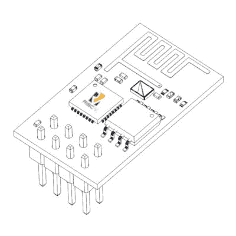

# Espressif 泄漏 ESP32-C3:一个 WiFi SoC 的 RISC-V 和 ESP8266 引脚兼容

> 原文：<https://hackaday.com/2020/11/22/espressif-leaks-esp32-c3-a-wifi-soc-thats-risc-v-and-is-esp8266-pin-compatible/>

在 Espressif ESP8266 出现六年后，我们可能会认为重点已经转移到了更新的双核 ESP32。但是新发现的 ESP32-C3 出现了转折。这是一个 WiFi SoC，尽管它的名称是 ESP32，但它包含一个 RISC-V 内核，取代了我们知道的 ESP32 中的 Tensilica 内核，并使用 ESP8266 引脚排列，而不是它的新兄弟。在撰写本文时，关于它的信息相对较少，但 CNX 软件公司已经收集了所有的信息，包括一份数据表草案，其英文版的 T2 版本可以下载。与其他 ESP32 家族成员一样，这款产品提供 b/g/n WiFi 和蓝牙低能耗(BLE) 5，不同之处在于时钟速度高达 160 MHz 的 RISC-V 32 单核处理器。内置 400 kB SRAM 和 384 kB ROM 存储空间。

虽然还没有官方声明，但 Espressif 已经给出了暗示。从上个月末开始，Espressif 库中已经有了一个 OpenOCD 配置文件。周五，Espressif 软件工程经理[Sprite_tm] [回复了 reddit 的评论，确认了 RISC-V 内核](https://www.reddit.com/r/RISCV/comments/jxx1yj/esp32c3_riscv_core_what_i_found_just_in_time/gczbei1/)。

ESP-01: Kjerish, [CC BY-SA 4.0](https://commons.wikimedia.org/wiki/File:ESP-01_Wireframe.png), RISC-V logo: RISC-V foundation, [Public domain](https://commons.wikimedia.org/wiki/File:RISC-V-logo-square.svg).

为什么他们将该器件作为 ESP32 发布，而不是给它一个自己的序列号，这仍然是一个谜，但不难看出为什么在 ESP8266 兼容的封装中创建它具有商业意义。廉价无线 SoC 领域竞争器件的出现，如我们最近提到的 Bouffalo Labs bl 602 很可能会蚕食这款已有六年历史的芯片的销量，因此，升级到功能更强、新硬件设计要求最低的器件可能会成为大客户继续使用 Espressif 的强大动力。

我们只能猜测推广将如何进行。我们希望看到类似的开发商支持，他们现在为他们的其他芯片提供，然后在短期内现有的 ESP8266 板的 ESP32-C3 供电版本。也希望标准的 RISC-V 工具链可以用来代替当前 Espressif 产品的设备专用工具链。我们不应该期望的是驱动板载外设的 blobs 的开源替代品，因为新芯片将与其前辈共享相同的闭源 ip。也许如果 PINE64 为 BL602 逆向工程 blobs 的倡议结出果实，我们可能会看到这种芯片的类似努力。