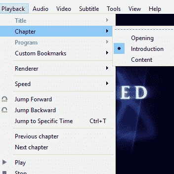

# 音频指纹识别可以可靠地跳过一个节目的介绍

> 原文：<https://hackaday.com/2020/11/25/audio-fingerprinting-skips-a-shows-intro-reliably/>

由于没有 DVD 光驱，[jg]只能看一堆。avi 视频文件。当然，当每一集都包含一个完整的介绍时，它只是一个时间问题，它会变得太烦人而无法耐着性子看完。

Chapter breaks reliably inserted around the intro, even when it doesn’t always occur in the same place.

跳过普通视频文件介绍的常用方法很简单:

1.  手动将回放向前拖过简介。
2.  哎呀太远了，拿回来。
3.  呃，倒过来太多了，向前推。
4.  好的，很好。

[jg]确信有更好的方法，解决方案是使用音频指纹插入章节分隔符。普通视频文件现在在介绍部分有一个章节，允许直接跳到内容。选择这种方法的原因很简单:节目介绍总是 52 秒长，但它并不总是在同一个地方。片头在一集的前两到五分钟内播放*的某个地方*，所以仅仅跳到一个特定的时间戳是不行的。

第一项工作是提取介绍序列的音频，以便它可以用于指纹识别。用`ffmpeg`导出前 15 分钟的音频很容易创建一个 wav 文件，可以用选择的音频编辑器进行修剪。这个片段作为一个签名被输入开源的[声音指纹](https://github.com/AddictedCS/soundfingerprinting)库，然后每个视频的音轨被导出，签名在其中被识别。因此，声音指纹技术可以检测出每个视频文件中介绍的位置(精确到秒)。

使用这些信息标记出章节符号在概念上很简单，但最终有点绕弯，因为它看起来。avi 文件没有简单的编码章节的方法。然而，。mkv 文件是另一回事。为了解决这个问题，[jg]首先转换每一个。avi to。使用`ffmpeg`的 mkv 然后用`mkvmerge`拼接章节中断。一个重要的因素是。阿维和。mkv 是在没有完全重新编码视频本身的情况下完成的，所以这是一个快速的过程。结果就是一堆。mkv 文件的介绍，无论它可能在哪里，有章节突破！

[这个脚本在这里](https://gist.github.com/jglim/0d8f8008b6d11258e56344020cf21364)可供任何人使用，并且[项目页面](http://jg.sn.sg/chapters/)是一个很好的学习参考，因为【jg】友好地提供了用于每个工具的所有命令行选项。有兴趣在自己的项目中使用音频指纹识别吗？别忘了还要看看 [Olaf，一种可以在嵌入式系统和网络浏览器中实现的超轻量声学指纹识别](https://hackaday.com/2020/08/30/olaf-lets-an-esp32-listen-to-the-music/)方法。